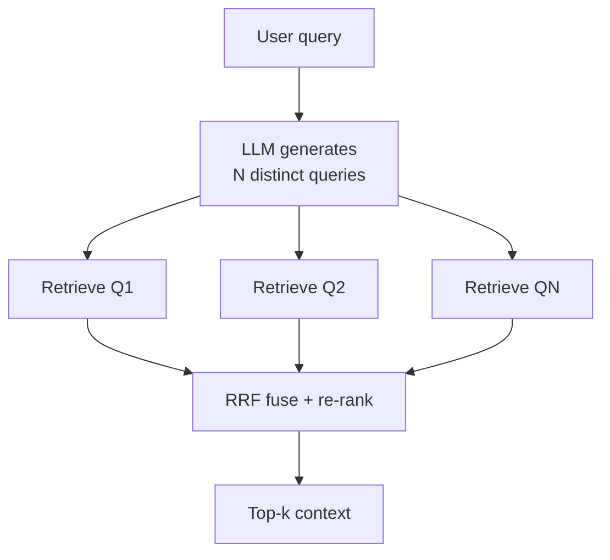
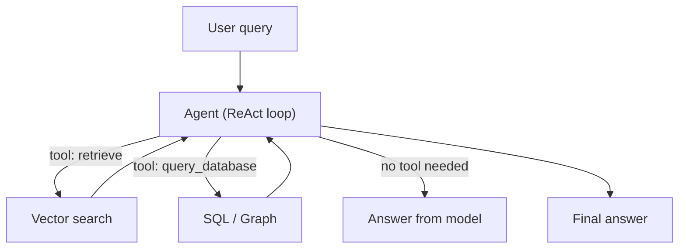
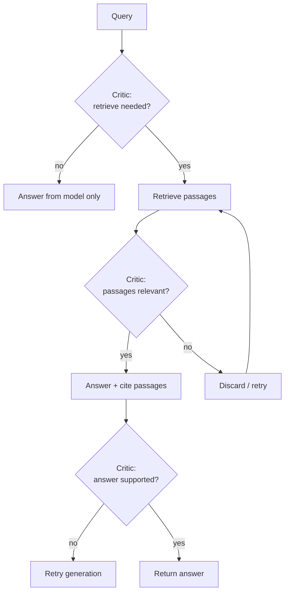

# Advanced RAG — Query Transformation & Adaptive Retrieval

Vanilla RAG embeds one query, runs k-NN, and hands the top-k chunks to the model. Advanced RAG makes the *retrieval step itself* smarter: reshaping the query before search, fusing several searches, and letting the model decide whether to retrieve at all.

## Table of contents

- [1. The two problems with vanilla retrieval](#1-the-two-problems-with-vanilla-retrieval)
- [2. Query transformation](#2-query-transformation)
  - [2.1 Query rewrite](#21-query-rewrite)
  - [2.2 Multi-query & RAG-Fusion](#22-multi-query--rag-fusion)
  - [2.3 HyDE](#23-hyde)
  - [2.4 Step-back prompting & query expansion](#24-step-back-prompting--query-expansion)
- [3. Adaptive / controlled retrieval](#3-adaptive--controlled-retrieval)
  - [3.1 Agentic RAG](#31-agentic-rag)
  - [3.2 Self-RAG](#32-self-rag)
  - [3.3 CRAG — Corrective RAG](#33-crag--corrective-rag)
  - [3.4 Routing & adaptive retrieval](#34-routing--adaptive-retrieval)
- [4. Choosing the right technique](#4-choosing-the-right-technique)
- [5. In practice in this workspace](#5-in-practice-in-this-workspace)
- [6. Concept → project map](#6-concept--project-map)
- [Further reading](#further-reading)

---

## 1. The two problems with vanilla retrieval

A single embed-query → k-NN pipeline assumes two things that often aren't true:

| Assumption | When it breaks |
|---|---|
| The user's wording matches the doc's wording | "How much does shipping cost?" vs. a doc about "delivery charges" |
| Retrieving is always useful | The answer is already in the model, or the top-k is full of noise |

Query transformation attacks the first; adaptive retrieval attacks the second.

---

## 2. Query transformation

The idea: the query you send to the vector store doesn't have to be the query the user typed. You can rewrite, multiply, or re-express it before embedding.

### 2.1 Query rewrite

Have the model (or a cheap heuristic) turn a conversational or keyword-sparse query into a self-contained, retrieval-friendly one.

```
User:  "what about the pdf one?"
Rewrite: "What are the supported document formats in the PDF ingestion pipeline?"
```

Best for: follow-up turns in a chat, terse or misspelled queries, terms that are common in speech but rare in docs. Cheapest option, adds one LLM call.

### 2.2 Multi-query & RAG-Fusion

Generate *several* paraphrases of the query, retrieve for each, then fuse the result lists. The milestone version is **RAG-Fusion**: generate N queries, retrieve for all, then combine using Reciprocal Rank Fusion (RRF) — the same fusion `rag-hybrid` uses to mix dense + BM25, here repurposed across queries.



Best for: recall-focused tasks where one phrasing might miss a doc. Cost is roughly N × a single retrieval, and you must deduplicate near-identical hits.

### 2.3 HyDE

**Hypothetical Document Embeddings.** Instead of embedding the query, ask the model to write a *hypothetical answer document* to the query, then embed *that* and search by similarity. A fake answer sits closer (in embedding space) to real answers than a question does.

Best for: when the query is a short keyword but the chunks are full prose — the classic query/document "lexical gap." Adds one generation call and can bloat the embedding with false detail, so prompt it to use neutral, factual language.

### 2.4 Step-back prompting & query expansion

- **Step-back**: ask a more abstract question first (e.g. "What scientific field studies X?") and use its answer to ground the specific retrieval and reasoning. Helps multi-hop and "too specific" queries.
- **Query expansion**: add related terms / synonyms / entities to the query (from a thesaurus, the corpus metadata, or the model) to widen recall.

---

## 3. Adaptive / controlled retrieval

Instead of always retrieving, decide *whether* to retrieve, *what* to retrieve from, and *when to stop*. This is the retrieval side of "let the model plan" — the same mindset as agentic tool-calling.

### 3.1 Agentic RAG

Expose retrieval as a **tool** the agent can call, and let the ReAct loop decide. The agent can do a first pass, notice the top-k was ambiguous, and retrieve again with a rewritten query — retrieval becomes iterative and model-controlled.



This is what `langgraph` / `mcp-client` already do with `queryDatabase` and GitHub MCP tools — retrieval is one tool among several. It's flexible but costs latency and tokens per loop iteration.

### 3.2 Self-RAG

A single model that emits **critic/reflection tokens** alongside its output: a **Retrieve** token (`retrieve` / `no-retrieve`), a **Relevance** token (`ISREL`), a **Support** token (`ISSUP`), and a **Utility** token (`ISUSE`). The model essentially self-evaluates: *was retrieval needed? were the passages relevant? does my answer use them?*



Best for: grounded answers that should cite sources, while skipping retrieval when the model already knows (saving cost). Needs a model trained/steered to emit the critic tokens.

### 3.3 CRAG — Corrective RAG

A **lightweight retrieval evaluator** (not the generation model) scores the top-k as *correct*, *ambiguous*, or *incorrect*:

- **correct** → refine the top-k (de-noise / rewrite) and augment the LLM with it.
- **ambiguous** → keep the retrieval but *also* run a fallback (e.g., web search) and fuse.
- **incorrect** → discard the retrieval entirely and search again (or fall back to a non-retrieval answer).

It's a clean guardrail against a noisy `chromadb`-style store: cheap to add, notably improves correctness when top-k is frequently off-target.

### 3.4 Routing & adaptive retrieval

A router (classifier) sends the query to the best engine *per query type* — dense vector search, BM25/keyword, hybrid, a knowledge graph, web search, or directly to the model with no retrieval.

| Route | Trigger | Engine |
|---|---|---|
| Dense | vague, semantic | `chromadb`, `rag-redis` |
| Keyword | exact technical terms, ids, error codes | BM25 (`rag-hybrid`) |
| Hybrid | default with a graph channel | `rag-hybrid`, `rag-graph` |
| No retrieval | small talk, calculations, known facts | the model directly |
| Web | fresh, outside the corpus | `rag-huggingface` fallback |

---

## 4. Choosing the right technique

| Technique | Adds | Cost | When it wins |
|---|---|---|---|
| Query rewrite | one LLM call | low | conversational, terse, misspelled queries |
| Multi-query + RAG-Fusion | N retrievals + RRF | medium | recall-heavy, one phrasing may miss |
| HyDE | one generation + embed | low | short keyword → long prose gap |
| Step-back | one abstract Q + retrieval | medium | multi-hop, too-specific queries |
| Agentic RAG | tool loop, iterative | high | follow-ups, tool-rich, mixed retrieval |
| Self-RAG | critic tokens | high | cost control + grounded, cited answers |
| CRAG | retrieval evaluator | high | correctness-critical, noisy store |
| Routing | a classifier | medium | heterogeneous query mix |

Rule of thumb: **roll out in this order** — rewrite → multi-query/RRF → routing → CRAG/agentic. Each step adds cost, so only add the next when the previous measurably improves the eval set (see [production-rag.md](production-rag.md#2-evaluation)).

---

## 5. In practice in this workspace

Almost none of this is implemented — it's the next layer beyond `rag-hybrid`.

| Technique | Workspace status |
|---|---|
| Hybrid dense + BM25 + RRF + rerank | ✓ implemented (`rag-hybrid`) |
| RAG-Fusion (multi-query) | ✗ missing — `rag-hybrid` fuses channels, not queries |
| Query rewrite / HyDE / step-back | ✗ missing |
| Agentic retrieval | partial — `langgraph`/`mcp-client` agent calls `queryDatabase` / MCP tools as a route |
| Self-RAG / CRAG | ✗ missing |
| Routing (classifier) | ✗ missing |
| Retrieval evaluator | ✗ missing (eval is demo-only in `production-rag.md`) |

The cheapest win: take `rag-hybrid`'s RRF fusion and feed it *N rewritten queries* instead of N channels — that's RAG-Fusion with the plumbing you already have.

---

## 6. Concept → project map

| Concept | Project(s) | Where it fits |
|---|---|---|
| Multi-query + RRF | `rag-hybrid` | reuse its RRF, feed query variants |
| Agentic retrieval | `langgraph`, `mcp-client` | retrieval as a tool in the ReAct loop |
| GraphRAG / multi-hop | `rag-graph` | the "graph" route a router might pick |
| Hybrid retrieval | `rag-hybrid` | the dense+keyword baseline to route around |
| Reranking (cross-encoder) | `rag-hybrid` | post-fusion re-rank step |

---

## Further reading

- [vector-search.md](vector-search.md) — the retrieval theory this builds on (embeddings, hybrid, RRF)
- [production-rag.md](production-rag.md) — evaluation, guardrails, and where adaptive retrieval pays off
- [rag-troubleshooting.md](rag-troubleshooting.md) — multi-hop and the diagnostic loop when answers go wrong
- [ai-agents.md](ai-agents.md) — the ReAct loop behind agentic RAG
- [ts/rag-hybrid/CONCEPTS.md](../ts/rag-hybrid/CONCEPTS.md) — the closest workspace implementation (hybrid + RRF + rerank)
- [RAG-Fusion: A New Take on Retrieval-Augmented Generation](https://towardsdatascience.com/forget-rag-the-future-of-rag-is-rag-fusion-1147298d8ad1) (Zackary Rackauckas)
- [Self-RAG: Learning to Retrieve, Generate, and Critique through Self-Reflection](https://arxiv.org/abs/2310.11511)
- [Corrective Retrieval Augmented Generation (CRAG)](https://arxiv.org/abs/2401.15884)
- [Precise Zero-Shot Dense Retrieval without Relevance Labels (HyDE)](https://arxiv.org/abs/2212.10496)
