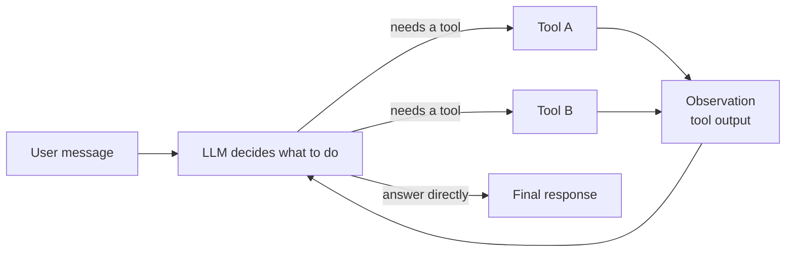
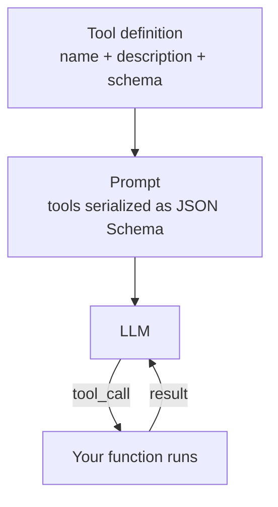
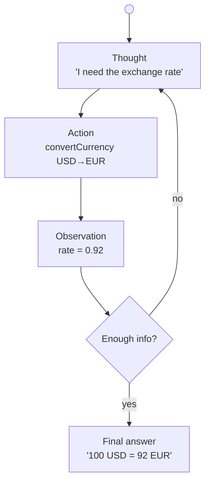

# AI Agents — ReAct, Tool Calling & LangGraph

Everything you need to know about building AI agents: what an agent is, the ReAct loop, how tool calling works, and how it maps to the `langgraph` and `mcp-client` projects in this workspace.

> Diagrams are [Mermaid](https://mermaid.js.org/) — rendered automatically on GitHub.

---

## Table of contents

1. [What is an agent?](#1-what-is-an-agent)
2. [Chains vs agents](#2-chains-vs-agents)
3. [Tool calling](#3-tool-calling)
4. [The ReAct loop](#4-the-react-loop)
5. [Tool schemas with Zod](#5-tool-schemas-with-zod)
6. [Agent memory & state](#6-agent-memory--state)
7. [MCP tools in an agent](#7-mcp-tools-in-an-agent)
8. [Concept → project map](#8-concept--project-map)

---

## 1. What is an agent?

An **agent** is an LLM that can *do things* — not just produce text. It is given a set of **tools** (callable functions), and it decides *which* tool to invoke, *when*, and with *what arguments*, based on the user's natural-language request.



A plain chat model turns text into text. An agent turns text into **a sequence of tool calls** and, from their results, into a final answer. This gives the model abilities it does not natively have: querying a database, converting currency, reading a file system, calling an API.

---

## 2. Chains vs agents

| | Chain | Agent |
|---|---|---|
| Control flow | Fixed, written by you | Decided by the LLM at runtime |
| Tools | None (or one hardcoded step) | Multiple, chosen dynamically |
| Good for | Deterministic pipelines (RAG) | Open-ended tasks, unknown paths |
| Example in repo | `rag-json` `RunnableSequence` | `langgraph`, `mcp-client` |

A chain is a recipe: *embed → retrieve → prompt → LLM*. An agent is a loop: *think → act → observe → repeat* until the model decides it is done. Agents build on chains — every tool call is itself a small chain.

---

## 3. Tool calling

For an LLM to use a tool, it must know the tool's **signature**. The model is given a JSON schema describing the tool's name, purpose, and parameters. When it wants to act, it emits a **tool call** — a structured request like `convertCurrency({ fromCurrency: "USD", toCurrency: "EUR", amount: 100 })` — which your code executes.

Two things make tool calling work well:

1. **A good description** — the model picks a tool based on its description, not its code. `"Convert currency to another currency"` is what the model sees in `currencyTool.ts`.
2. **A precise schema** — argument names and `.describe()` strings are the model's only guide to filling parameters. `"The amount to convert"` tells it `amount` expects a number.



---

## 4. The ReAct loop

**ReAct** (*Reason* + *Act*) is the pattern most agents implement: the model alternates between a *thought* about what to do next, an *action* (tool call), and an *observation* (the tool result), repeating until it produces a final answer.



In LangGraph this loop is hidden inside `createReactAgent` — you hand it an LLM and a list of tools, and it wires the *thought → action → observation* cycle for you:

```ts
// langgraph/agent.ts
const agent = createReactAgent({
  llm: model,
  tools: [convertCurrency, getDatabaseSchema, queryDatabase, ...mcpTools],
});
```

Why agents need a loop rather than a single pass: a question rarely maps to one tool call. *"Convert 100 USD to EUR and tell me the result in JPY"* needs two calls; *"what tables are in my DB?"* needs the schema tool *then* a query tool. The loop lets the model chain as many steps as the task requires.

---

## 5. Tool schemas with Zod

Tools are declared by wrapping a function with a **Zod schema** that both validates inputs and describes them to the model:

```ts
// langgraph/tools/currencyTool.ts
const currencySchema = z.object({
  fromCurrency: z.string().describe('The currency to convert from (e.g., USD, EUR)'),
  toCurrency: z.string().describe('The currency to convert to (e.g., USD, EUR)'),
  amount: z.number().positive().describe('The amount to convert'),
});

export const convertCurrency = tool(toolFunction, {
  name: 'convertCurrency',
  description: 'Convert currency to another currency',
  schema: currencySchema,
});
```

| Piece | What it does | Seen by the LLM? |
|---|---|---|
| `name` | stable identifier for the call | ✓ |
| `description` | *when* to use the tool | ✓ |
| `schema` (Zod) | argument names, types, constraints | ✓ (as JSON Schema) |
| function body | actually does the work | ✗ |

The same pattern appears in `voltagent` with `createTool({ name, description, parameters, execute })` — different framework, identical idea: *schema in, structured call out*.

A practical detail from `databaseTool.ts`: `queryDatabase` **guards its own input** (`if (!trimmed.startsWith('SELECT')) return 'Only SELECT queries are allowed…'`). Tool code is untrusted-ish — the model crafts SQL from natural language, so the tool enforces read-only access before executing.

---

## 6. Agent memory & state

By default an agent call is stateless. To remember prior turns you need to persist the **message list** between invocations. LangGraph does this with a **checkpointer** that saves graph state keyed by `thread_id`:

```ts
// langchain/chat.ts
const memory = new MemorySaver();
const appGraph = workflow.compile({ checkpointer: memory });

await appGraph.invoke(
  { skill, message },
  { configurable: { thread_id: 'assistant' } }, // state key
);
```

| Store | Persists across restarts? | Where |
|---|---|---|
| `MemorySaver` (in-memory) | ✗ — resets on restart | `langchain/chat.ts` |
| `SqliteSaver` / `PostgresSaver` | ✓ | swap-in for production |

`thread_id` is the conversation key: two requests with the same `thread_id` share history; different ids are independent sessions. The `langgraph` project sidesteps persistence by being single-shot — each `/agent` request builds a fresh `HumanMessage` with no checkpointer.

---

## 7. MCP tools in an agent

Agents aren't limited to hand-written tools. The Model Context Protocol ([what-is-mcp.md](what-is-mcp.md)) lets an agent discover tools from *external servers* at runtime:

```ts
// langgraph/agent.ts
const mcpClient = new MultiServerMCPClient({
  mcpServers: {
    github: { type: 'http', url: 'https://api.githubcopilot.com/mcp/', headers: { … } },
  },
});
const mcpTools = await mcpClient.getTools();   // "github_*" tools
const agent = createReactAgent({ llm: model, tools: […, ...mcpTools] });
```

`mcp-client/server.ts` connects to three stdio servers (filesystem, MongoDB, currency converter) and turns their advertised tools into LangChain tools in one call. The key idea: **tools are no longer code you own** — they are a capability surface negotiated over a protocol, then dropped into the same agent loop.

---

## 8. Concept → project map

| Concept | Where in this workspace |
|---|---|
| ReAct loop | `createReactAgent` in `langgraph/agent.ts`, `mcp-client/server.ts` |
| Tool with Zod schema | `langgraph/tools/currencyTool.ts`, `databaseTool.ts` |
| Tool schema validation | `z.object({ … }).describe(…)` |
| Read-only tool guard | `queryDatabase` `SELECT` check in `databaseTool.ts` |
| MCP tools into an agent | `MultiServerMCPClient.getTools()` in `langgraph/agent.ts`, `mcp-client/server.ts` |
| State persistence / `thread_id` | `MemorySaver` in `langchain/chat.ts` |
| Alternative tool API | `createTool()` in `voltagent/src/tools/*` |

---

## Further reading

- [what-is-mcp.md](what-is-mcp.md) — the protocol behind §7
- [multi-agent-orchestration.md](multi-agent-orchestration.md) — scaling one agent into many
- [ts/langgraph/README.md](../ts/langgraph/README.md) — the agent project in detail
- [LangGraph prebuilt agents](https://langchain-ai.github.io/langgraph/concepts/agentic_concepts/)
- [ReAct paper](https://arxiv.org/abs/2210.03629)
