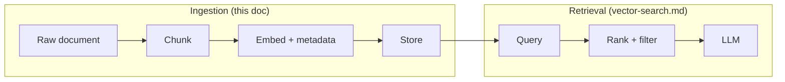
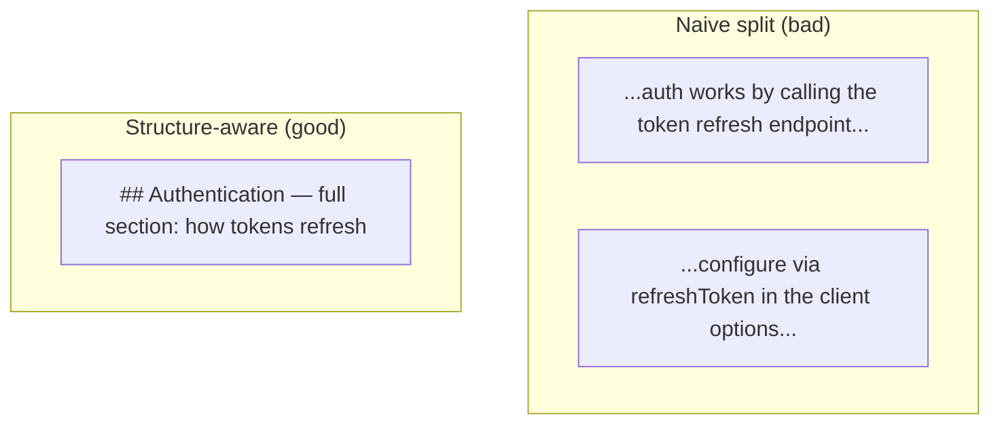
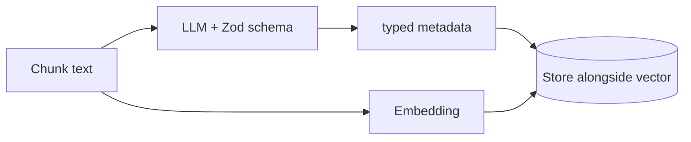
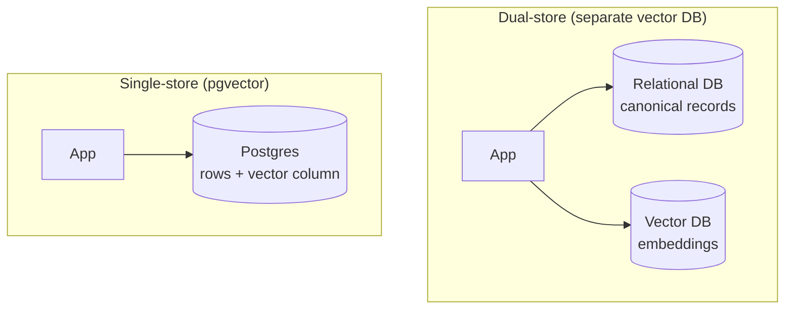
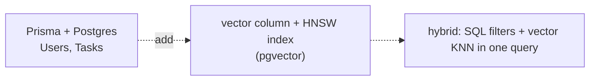

# Document Processing — Chunking, Enrichment & Storage

The ingestion half of RAG: how raw documents become searchable, *enriched* records. Covers structure-aware chunking, metadata creation, and the choice of where embeddings live (dedicated vector DB vs. your relational database).

> Diagrams are [Mermaid](https://mermaid.js.org/) — rendered automatically on GitHub.
> Companion docs: [vector-search.md](vector-search.md) (retrieval), [production-rag.md](production-rag.md) (the pipeline this feeds).

---

## Table of contents

1. [Where this fits](#1-where-this-fits)
2. [Structure-aware chunking](#2-structure-aware-chunking)
3. [Metadata creation & enrichment](#3-metadata-creation--enrichment)
4. [Embeddings + relational database](#4-embeddings--relational-database)
5. [Storage layout across projects](#5-storage-layout-across-projects)
6. [Concept → code map](#6-concept--code-map)

---

## 1. Where this fits

RAG has two phases. Retrieval quality is *capped* by the ingestion phase — no retriever can find a chunk that was never created, or filter on metadata that was never extracted.



If you get chunking and metadata wrong, the best retrieval stack in the world cannot save you. That is why this deserves its own attention.

---

## 2. Structure-aware chunking

### The spectrum

`vector-search.md` §8 lists the strategies. Here is the *progression* and the key idea: **chunk boundaries should follow the document's own structure**, not an arbitrary token count.

| Strategy | Splits on | Fails when |
|---|---|---|
| Fixed-size | every N tokens | cuts mid-sentence/mid-thought |
| Sentence-based | sentence boundaries | a paragraph is smaller than the chunk limit |
| Recursive | paragraphs → sentences → words | ignores document semantics |
| **Structure-aware** | headers / code ASTs / JSON keys / tables | requires knowing the format |

A naive chunker treats a markdown file as a uniform string of text. A structure-aware chunker sees `## H2` headers as natural boundaries, keeps a code function intact, and never splits a table row from its header.

### Why it matters



The naive split leaves two orphan fragments; the structure-aware chunk keeps a self-contained section whose embedding actually means something. A chunk that reads like a complete thought embeds well and, critically, *reads well to the LLM* when injected as context.

### In this workspace

| Project | Approach | Structure-aware? |
|---|---|---|
| `rag-graph` | `chunkText()` — sentence-based with overlap | no (flat text) |
| `rag-json` | `JSONLoader` with JSONPointer `/title`, `/genre`, `/actors`, `/year` | yes (per-JSON-key) |
| `rag-redis` | whole movie object as one record | yes (already structured data) |

`rag-json` is the cleanest example: instead of splitting text, it *extracts* `title`/`genre`/`actors`/`year` from `data/movie.json` as structured documents — the loader understands the schema. `rag-graph`'s `chunkText()` is deliberately simple, so it is the natural place to *add* structure-awareness as a next step.

---

## 3. Metadata creation & enrichment

### Metadata is retrieval's hidden superpower

`vector-search.md` §10 covers **filtering** on metadata. This section covers *where metadata comes from*. A vector captures *meaning*; metadata captures the *facts* the vector cannot be trusted with — dates, authorship, permissions, categories, entity names.

Three sources, in increasing cost and value:

| Source | Example | Cost |
|---|---|---|
| **Source metadata** | filename, path, timestamp, author | free |
| **Deterministic extraction** | regex for dates and IDs; JSON keys | free |
| **LLM extraction** | entities, sentiment, topics, tags | one LLM call per chunk |

### LLM extraction: the workspace's best example

`rag-graph/ingest.ts` runs each chunk through `model.withStructuredOutput(zodSchema)` to pull out typed entities and relationships:

```ts
const extractionSchema = z.object({
  entities: z.array(
    z.object({ name: z.string(), type: z.enum(['Person', 'Company', 'Technology', …]) }),
  ),
  relationships: z.array(
    z.object({ source: z.string(), target: z.string(), type: z.string() }),
  ),
});
const extractor = model.withStructuredOutput(extractionSchema, { name: 'extract_entities_and_relationships' });
```

The pattern generalizes beyond entities — the same `withStructuredOutput` + Zod shape extracts topics, sentiment, product codes, or a compliance category from any chunk:



### Why extract at ingest (not query) time?

- **One-time cost** — you pay for extraction once, not on every query.
- **Filterable** — metadata must exist *before* a pre-filter can use it (see `vector-search.md` §10).
- **Provenance** — `rag-graph` returns `via: 'vector' | 'graph'` per chunk, which only works because the graph (its metadata) was built at ingest.

---

## 4. Embeddings + relational database

The question: do embeddings belong in a **dedicated vector DB** (Chroma, Pinecone, Redis), or **inside your relational database** (Postgres + pgvector, SQLite + vec)?

### Two architectures



| | Dual-store | Single-store (pgvector) |
|---|---|---|
| Strength | best-in-class vector search (HNSW, hybrid, filters) | no sync, one transaction boundary |
| Cost | keep two systems consistent | vector search is slower at large scale |
| Best for | heavy search load, millions of chunks | small-to-mid scale, already on Postgres |
| Workspace | `chromadb`, `rag-redis`, `rag-huggingface`, `rag-graph` | *none yet* — see below |

The classic pitfall of dual-store is **drift**: the relational DB and the vector DB fall out of sync (a row deleted in one, still embedded in the other). pgvector sidesteps that by making the embedding just another column — it lives and dies with its row in a single `INSERT`/`DELETE`.

### The workspace gap — `langgraph`

`langgraph` is the project that *almost* demonstrates this: it has a Prisma/PostgreSQL database with a `User` and `Task` model, but stores **no embeddings** in it. That is the natural place to add pgvector and turn it into a "embeddings + relational DB" example — one `vector` column, one index, and the retrieval loop reuses the same connection it already has.



### When to colocate vs. separate

- **Colocate** when search is a feature of an existing app and scale is modest.
- **Separate** when search is the product, or you need specialized indexes/fusion that a general RDBMS does not offer (see `vector-search.md` §12).

---

## 5. Storage layout across projects

| Project | Chunking | Metadata | Embedding store |
|---|---|---|---|
| `langchain` | n/a (chat only) | `{skill}` prompt var | none |
| `rag-json` | JSONLoader per-key | title/genre/actors/year | none (in-process) |
| `chromadb` | none (whole docs) | `{ name, year }` | ChromaDB |
| `rag-huggingface` | none | metadata-only returns | Pinecone |
| `rag-redis` | whole movie object | genre/actors/year tags | Redis JSON + RediSearch |
| `rag-graph` | sentence + overlap | entities + relationships (LLM) | Neo4j vector index |
| `rag-hybrid` | whole docs, deterministic ids | title-year ids | Chroma (dense + BM25) |

---

## 6. Concept → code map

| Concept | Where |
|---|---|
| Sentence-based chunking with overlap | `chunkText()` in `ts/rag-graph/ingest.ts` |
| JSON-schema-aware loading | `JSONLoader` in `ts/rag-json/app/api/chat4/route.ts` |
| LLM metadata extraction (Zod) | `extractEntities()` in `ts/rag-graph/ingest.ts` |
| Metadata stored alongside vectors | `ts/rag-redis/server.ts` (genre/actors/year) |
| Deterministic record ids | `movieId()` in `ts/rag-hybrid/src/store.ts` |
| Relational DB (no vectors yet) | `prisma/schema.prisma` in `ts/langgraph` |

---

## Further reading

- `docs/vector-search.md` §8 (chunking strategies) and §10 (metadata filtering)
- `docs/production-rag.md` §6 (ingestion as a pipeline)
- `ts/rag-graph/CONCEPTS.md` — entity extraction in depth
- [pgvector](https://github.com/pgvector/pgvector) — embeddings in Postgres
