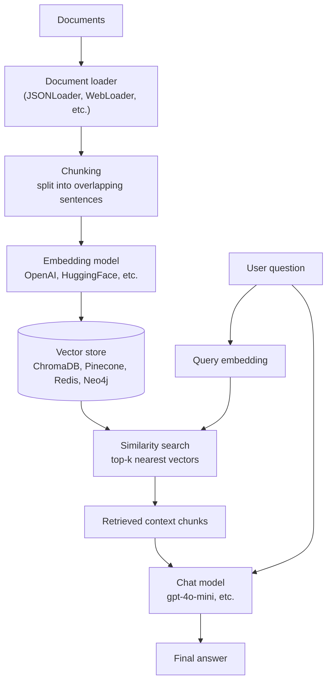

# Introduction to RAG

Retrieval-Augmented Generation (RAG) is a technique that grounds large language model responses in external, up-to-date context rather than relying solely on the model's training data.

## Why RAG?

- **Freshness**: Models train on a fixed snapshot; RAG can incorporate new documents any time.
- **Attribution**: Answers can reference specific sources, reducing hallucinations.
- **Domain adaptation**: Specialized knowledge (legal, medical, internal company wikis) can be injected without fine-tuning.

## The RAG Pipeline

## RAG Levels (from the `rag-json` project)

| Level | What it adds |
|---|---|
| **Basic chat** | No context; model answers from its own knowledge. |
| **Prompt template** | A system prompt sets the tone/instructions. |
| **Personalized** | System prompt references the user's history/preferences. |
| **RAG with JSONLoader** | Static documents are loaded, chunked, embedded, and injected as context via a `RunnableSequence`. The response is streamed with AI SDK v6 SSE. |

## Vector Databases in this workspace

| Project | DB | Embedding | Dims | Search |
|---|---|---|---|---|
| `chromadb` | ChromaDB (Docker) | OpenAI | 1536 | Collection query |
| `rag-huggingface` | Pinecone (serverless) | HuggingFace `all-MiniLM-L12-v2` | 384 | Index query |
| `rag-redis` | Redis + RediSearch | OpenAI `text-embedding-3-small` | 1536 | KNN on `idx:movies_json` |
| `rag-graph` | Neo4j (vector index) | OpenAI `text-embedding-3-small` | 1536 | KNN + graph traversal |

## When to use which?

- **Pure vector RAG** (`chromadb`, `rag-redis`, `rag-huggingface`): Good when the answer lives inside a single chunk that is semantically similar to the query.
- **GraphRAG** (`rag-graph`): Use when the answer requires connecting entities across multiple chunks (e.g., "Which technologies does X work with?").
- **Hybrid** (vector + graph traversal): The best of both worlds — vector finds the starting point, graph expands to related entities. For the full picture — including keyword/BM25 as a third channel and RRF fusion — see [Vector Search § Hybrid search](vector-search.md#6-hybrid-search).

---

# What is MCP?

**MCP** (Model Context Protocol) is a standardized way for AI applications to connect to external tools, data sources, and prompts. It defines a client–server protocol with three kinds of artifacts:

## Three artifact types

| Type | What it is | Example |
|---|---|---|
| **Tools** | Callable functions the LLM can invoke | `query`, `count`, `serverInfo` (MCP server for MongoDB) |
| **Resources** | Readable data or schemas | `mongodb://collections`, `mongodb://collections/{name}` |
| **Prompts** | Reusable prompt templates | `analyse-collection`, `query-helper`, `data-exploration` |

## Three transports

| Transport | How it works |
|---|---|
| **`stdio`** | Server runs as a subprocess; JSON-RPC over stdin/stdout. Good for local development and testing. |
| **`http`** | Server exposed over HTTP; JSON-RPC over POST requests. |
| **`sse`** | Server sends events over a persistent SSE connection; good for streaming responses. |

## MCP in this workspace

- **`mcp-server-mongo`** — an MCP server for MongoDB with 3 tools, 2 resources, and 5 prompts. Used as a subprocess by `mcp-client`.
- **`mcp-client`** — an Express app that connects to one or more MCP servers (filesystem, MongoDB, currency converter) and exposes their tools to a LangGraph ReAct agent.
- **`mcp-server-mongo-v2`** — a second MCP server implementation using the newer MCP SDK v2 API.

## When to use MCP

- When you want AI access to **local data** (files, databases) without hardcoding APIs.
- When you want **standardized** tool/schemas/prompts across different servers.
- When you want to **compose** multiple servers in a single agent (the `mcp-client` does this).

---

## Quick map: RAG concepts → Projects

| Concept | Project(s) |
|---|---|
| Chunking, prompt templates, session history | `langchain`, `rag-json` |
| Embeddings & vector stores | `chromadb`, `rag-huggingface`, `rag-redis`, `rag-graph` |
| RAG pipeline (4 levels) | `rag-json` |
| GraphRAG & knowledge graphs | `rag-graph` |
| Agents (ReAct loop) | `langgraph`, `mcp-client` |
| MCP client/server | `mcp-client`, `mcp-server-mongo` |
| Multi-agent orchestration | `voltagent` |

---

## Next steps

- Read the per-project **AGENTS.md** for how each concept is implemented.
- Browse the **CONCEPTS.md** in `ts/rag-graph/` for a deep dive on GraphRAG.
- Check the `docs/` folder for more overviews as they're added.