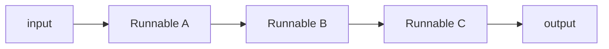
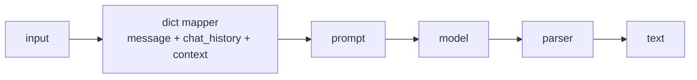

# LangChain Fundamentals — Chains, Prompts & LCEL

The core abstractions behind LangChain: prompt templates, message types, the Runnable interface (LCEL), output parsers, streaming, and structured output. Maps to the `langchain` and `rag-json` projects.

> Diagrams are [Mermaid](https://mermaid.js.org/) — rendered automatically on GitHub.

---

## Table of contents

1. [The core idea: composable runnables](#1-the-core-idea-composable-runnables)
2. [Prompt templates](#2-prompt-templates)
3. [Messages](#3-messages)
4. [LCEL: the `.pipe()` operator](#4-lcel-the-pipe-operator)
5. [Output parsers](#5-output-parsers)
6. [Structured output](#6-structured-output)
7. [Streaming](#7-streaming)
8. [Memory & history](#8-memory--history)
9. [Concept → project map](#9-concept--project-map)

---

## 1. The core idea: composable runnables

Everything in LangChain is a **runnable** — an object you can `.invoke()` with an input to get an output. A prompt is a runnable. A chat model is a runnable. A parser is a runnable. And crucially, runnables can be **composed** into larger runnables.



This composition is expressed with the `.pipe()` method (LCEL, the *LangChain Expression Language*):

```ts
const chain = prompt.pipe(model).pipe(parser);
```

`chain` is itself a runnable, so you can `.invoke()`, `.stream()`, or `.pipe()` it further. This uniform interface is why the same syntax builds a one-liner chat and a full RAG pipeline.

---

## 2. Prompt templates

A **prompt template** separates the *structure* of a prompt from the *values* injected at runtime. Variables are declared with `{curly_braces}` and filled on invoke:

```ts
const prompt = PromptTemplate.fromTemplate('You are an assistant good at {skill}');
// { skill: 'nodejs' }  →  "You are an assistant good at nodejs"
```

For chat models, `ChatPromptTemplate` builds a list of role-tagged messages:

```ts
const prompt = ChatPromptTemplate.fromMessages([
  ['system', 'You are an assistant who good at {skill}'],
  new MessagesPlaceholder('history'),
  ['user', '{message}'],
]);
```

| Feature | Purpose |
|---|---|
| `{variable}` | inject values at runtime |
| `['system', …]` / `['human', …]` | role-tagged message tuples |
| `MessagesPlaceholder('history')` | insert a *list* of prior messages at that position |

The `{skill}` default in `langchain/chat.ts` is `'nodejs'` — a trivial example, but the point is real: the same chain serves any skill just by changing a variable.

---

## 3. Messages

Chat models operate on **message objects**, not bare strings. Each carries a role and content:

| Type | Role | Used for |
|---|---|---|
| `HumanMessage` | user | the current or past user turns |
| `AIMessage` | assistant | model responses |
| `SystemMessage` | system | instructions (usually via the template) |

Why it matters: mixing history as one raw string lets the model treat everything as a continuous narrative. Typed messages preserve **role boundaries**, so the model knows what *it* said vs. what the *user* said:

```ts
// rag-json/app/api/chat3/route.ts
return m.role === 'user' ? new HumanMessage(text) : new AIMessage(text);
```

`AIMessage` also carries the extra fields agents need — most importantly **tool calls** (see [ai-agents.md](ai-agents.md)).

---

## 4. LCEL: the `.pipe()` operator

`prompt.pipe(model)` feeds a prompt's output into the model. A model that returns `AIMessage` can be piped into a **parser** that extracts just the text. A **dict step** can be inserted to shape inputs mid-chain:

```ts
// rag-json/app/api/chat4/route.ts
const chain = RunnableSequence.from([
  {
    message: (input) => input.message,
    chat_history: (input) => input.chat_history,
    context: () => formatDocumentsAsString(docs),   // static RAG context
  },
  prompt,
  model,
  parser,
]);
```

This is LCEL's real power: the RAG context is *injected by a plain function* into the template, without touching the model or the prompt. Each element only cares about its own input/output contract.



---

## 5. Output parsers

A chat model returns an `AIMessage`; a `StringOutputParser` reduces it to plain text. Parsers are the boundary between "model output object" and "the value your API returns":

```ts
const parser = new StringOutputParser();
const chain = prompt.pipe(model).pipe(parser);
// chain.invoke(…) → string
```

Other parsers do more: `JsonOutputParser` guarantees JSON, and structured-output parsing (below) guarantees a *schema*, not just a string.

---

## 6. Structured output

Sometimes you want a machine-readable shape, not prose. `withStructuredOutput(schema)` constrains the model to emit a known JSON schema:

```ts
// langchain/chat.ts
const schema = z.object({
  answer: z.string(),
  confidence: z.number(),
});
const model = new ChatOpenAI({ … }).withStructuredOutput(schema);
// invoke → { answer: string, confidence: number }
```

This is the same mechanism agents use to emit tool calls (see [ai-agents.md](ai-agents.md)) and `rag-graph` uses to extract entities as JSON. The theme: **typed in, typed out** — Zod on both ends.

---

## 7. Streaming

Runnables stream by default — `.stream()` yields tokens as they are generated. `rag-json/chat2` uses this to bridge LangChain's token stream into the AI SDK's SSE format:

```ts
const stream = await chain.stream({ message });
for await (const chunk of stream) {
  controller.enqueue({ type: 'text-delta', id, delta: chunk });
}
```

The pattern worth internalizing: **the chain is the same** — only the consumption differs (`.invoke()` for a single result, `.stream()` for tokens). Streaming is an *output mode*, not a different pipeline.

---

## 8. Memory & history

LangChain v2.0 replaced the deprecated `RunnableWithMessageHistory` with **LangGraph + a checkpointer**. State (including the message list) is persisted between invocations, keyed by `thread_id`:

```ts
const memory = new MemorySaver();
const appGraph = workflow.compile({ checkpointer: memory });
await appGraph.invoke({ … }, { configurable: { thread_id: 'assistant' } });
```

For the full picture on state and checkpointer choices, see [ai-agents.md §6](ai-agents.md#6-agent-memory--state).

---

## 9. Concept → project map

| Concept | Where in this workspace |
|---|---|
| `PromptTemplate` + `{skill}` | `langchain/chat.ts` |
| `ChatPromptTemplate` + `MessagesPlaceholder` | `langchain/chat.ts`, `rag-json/chat3`, `chat4` |
| LCEL `.pipe()` | `rag-json/chat2`, `chat3` |
| `RunnableSequence` with dict mapper | `rag-json/chat4` |
| `StringOutputParser` | `rag-json/chat2`–`chat4` |
| `withStructuredOutput` + Zod | `langchain/chat.ts` |
| Streaming (`chain.stream`) | `rag-json/chat2`–`chat4` |
| Memory (`MemorySaver`, `thread_id`) | `langchain/chat.ts` |

---

## Further reading

- `docs/ai-agents.md` — what sits on top of chains (ReAct, tools)
- `docs/introduction-to-rag.md` — the RAG levels built with these runnables
- `ts/rag-json/AGENTS.md` — the four routes in detail
- [LangChain expression language](https://python.langchain.com/docs/concepts/lcel/)
- [LangChain JS runnables](https://js.langchain.com/docs/concepts/runnables/)
