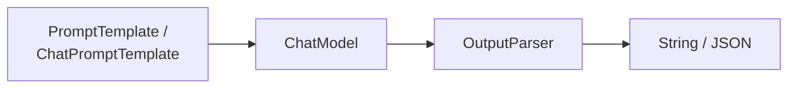
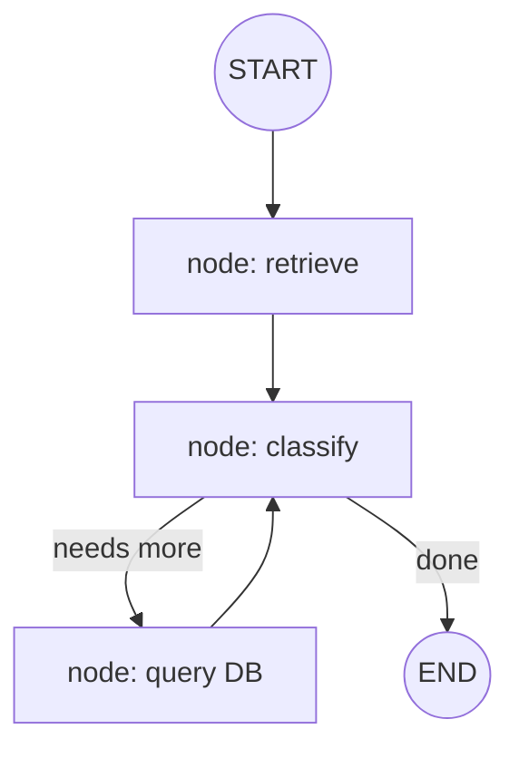
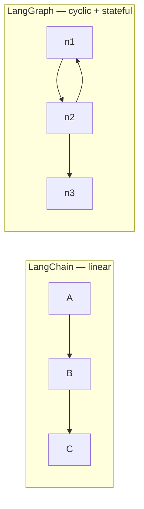
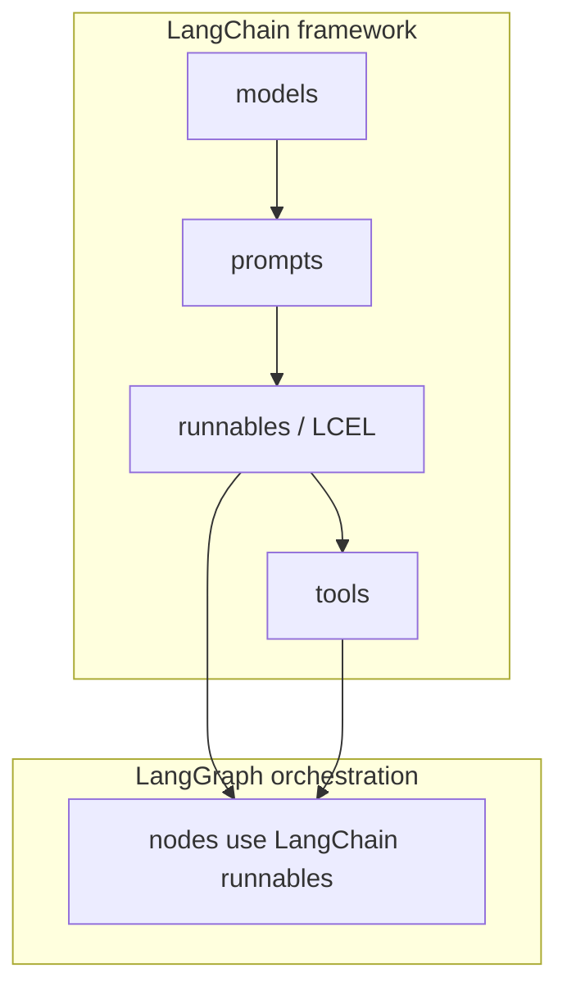

# LangChain vs LangGraph — Choosing the Right Layer

Two of the most confused terms in the LangChain ecosystem. This doc explains what the **LangChain framework** is, what the **LangGraph orchestration layer** is, how they relate, and — crucially — when to use each. Grounded in how the projects in this workspace actually use them.

> Diagrams are [Mermaid](https://mermaid.js.org/) — rendered automatically on GitHub.

---

## Table of contents

1. [TL;DR](#1-tldr)
2. [What LangChain is](#2-what-langchain-is)
3. [What LangGraph is](#3-what-langgraph-is)
4. [The core difference: linear vs stateful graph](#4-the-core-difference-linear-vs-stateful-graph)
5. [Side by side](#5-side-by-side)
6. [When to use LangChain](#6-when-to-use-langchain)
7. [When to use LangGraph](#7-when-to-use-langgraph)
8. [The v2.0 story: deprecations](#8-the-v20-story-deprecations)
9. [It's not either/or](#9-its-not-eitheror)
10. [Concept → project map](#10-concept--project-map)

---

## 1. TL;DR

**LangChain** is the framework of composable building blocks for LLM apps — models, prompts, output parsers, LCEL pipelines, tools. It builds **linear, predictable** flows. **LangGraph** is an orchestration layer for LLM apps that need **state, cycles, and persistence** — agents, multi-step workflows, human-in-the-loop. LangGraph is built _on top of_ LangChain, so it uses LangChain's models, prompts, and runnables.

- One-shot or fixed pipeline → **LangChain**
- Multi-step, self-determined, or long-running with memory → **LangGraph**

---

## 2. What LangChain is

LangChain provides the _building blocks_: a uniform runnable interface so you can compose `prompt → model → parser` with `.pipe()`, plus the message system, output parsers, tools, and integration packages (`@langchain/openai`, etc.).

It is the foundation the `langchain` project demonstrates: `/prompt`, `/chain`, `/lc`, `/structured`, `/messages`. Every route is a **chain** — a fixed sequence of steps you define.

| Building block                          | What it gives you                                        | Project route             |
| --------------------------------------- | -------------------------------------------------------- | ------------------------- |
| `PromptTemplate` / `ChatPromptTemplate` | inject variables, build role-tagged messages             | `/prompt`, `/chat-prompt` |
| Chat models                             | `ChatOpenAI` (temp, tools, structured output)            | all                       |
| LCEL (`.pipe()`, `RunnableSequence`)    | compose steps                                            | `/chain`, `/lc`           |
| Output parsers                          | `StringOutputParser`, `withStructuredOutput`             | `/structured`             |
| `@tool` + `bindTools`                   | function calling                                         | `/tools`                  |
| Messages                                | `HumanMessage`/`AIMessage`/`SystemMessage`/`ToolMessage` | `/messages`, `/tools`     |

---

## 3. What LangGraph is

LangGraph is orchestration for **stateful, graph-shaped** workflows. You model an app as a _graph of nodes and edges_; each node is a function that reads/writes **shared state**, and the graph decides which node runs next. Critically, it supports **cycles** (a node can run twice), and a **checkpointer** that persists state between invocations.

LangGraph is not a competitor to LangChain — it consumes LangChain. The `langchain/server.ts` memory route uses `StateGraph` + `MemorySaver` with a `ChatPromptTemplate` inside the node, and `langgraph/agent.ts` uses `createAgent` (the prebuilt agent from the `langchain` package, successor of `createReactAgent`) that takes a model and tools.

---

## 4. The core difference: linear vs stateful graph

The one question that decides everything: **is your control flow fixed or dynamic?**

|                   | LangChain (chain)            | LangGraph (graph)                  |
| ----------------- | ---------------------------- | ---------------------------------- |
| Control flow      | fixed, you write it          | the model/graph decides at runtime |
| Shape             | linear (A → B → C)           | cyclic (nodes can repeat)          |
| State             | passing inputs along         | shared, mutable state              |
| Persistence       | none built-in                | checkpointer (`thread_id`)         |
| Loops             | not native                   | native (cycle = loop)              |
| Human-in-the-loop | not native                   | interrupt/resume                   |
| Best at           | RAG, deterministic pipelines | agents, complex multi-step         |

A chain cannot "go back". A graph can — the `n2 → n1` edge is a loop, which is exactly what a ReAct agent needs (think → act → observe → repeat). That loop is the single most important thing LangGraph adds.

---

## 5. Side by side

| Dimension         | LangChain                              | LangGraph                                      |
| ----------------- | -------------------------------------- | ---------------------------------------------- |
| What it is        | framework (building blocks + LCEL)     | orchestration layer (graph runtime)            |
| Depends on        | `@langchain/core`                      | `@langchain/core` (and LangChain models/tools) |
| Unit of work      | a `Runnable` chain                     | a graph of nodes + state                       |
| Function calls    | help you build them                    | wire them into a loop                          |
| Memory            | manual (you pass history)              | built-in checkpointing                         |
| Streaming         | `chain.stream()`                       | per-node, includes intermediate steps          |
| Debuggability     | linear, easy to reason about           | richer; you must visualize the graph           |
| Package used here | `@langchain/core`, `@langchain/openai` | `@langchain/langgraph`                         |

---

## 6. When to use LangChain

Use LangChain alone when the flow is **predictable and you define it in advance**:

- **RAG** — load → embed → retrieve → prompt → answer. The order is always the same; there's no "decision."
- **Structured extraction** — one prompt in, validated JSON out (`/structured`).
- **Simple chat with a template** — a system prompt and a user message (`/chat-prompt`).
- **Single tool call** — the model calls one tool; no need for a graph.

In this workspace, `rag-json`, `chromadb`, `rag-redis` are essentially LangChain-style pipelines: retrieve, then generate. They are chains.

---

## 7. When to use LangGraph

Reach for LangGraph when any of these is true:

| Signal                                        | Why LangGraph                                                 |
| --------------------------------------------- | ------------------------------------------------------------- |
| **The model decides the path** (agent)        | needs a loop, not a fixed chain                               |
| **Did the task require multiple tool calls?** | "What is 4+6, then double it?" — needs observe-then-re-decide |
| **Need memory across requests**               | checkpointer keyed by `thread_id`                             |
| **Need human approval mid-process**           | interrupt/suspend, resume with input                          |
| **Multi-agent orchestration**                 | supervisor delegates to sub-agents                            |
| **Branching / conditional routes**            | graph edges encode conditions                                 |

In this workspace: `langgraph/agent.ts` uses `createAgent` and `mcp-client/server.ts` uses `createReactAgent` — the model _decides_ whether to call `convertCurrency`, `queryDatabase`, or GitHub tools. `voltagent` uses supervisor + sub-agents. These are graphs.

---

## 8. The v2.0 story: deprecations

This is why the workspace's `langchain/server.ts` memory route is written the way it is. LangChain v2.0 deprecated two things that used to be the _recommended_ pattern:

| Deprecated (v1.x)            | Replacement (v2.0)                                      |
| ---------------------------- | ------------------------------------------------------- |
| `RunnableWithMessageHistory` | LangGraph `StateGraph` + checkpointer                   |
| `AgentExecutor`              | LangGraph `createAgent` (originally `createReactAgent`) |

The `langchain/server.ts` comment spells this out: the old memory approach wrapped a runnable with message history; the new one is a `StateGraph` compiled with a `MemorySaver`, keyed by `thread_id`. Memory, in other words, **moved out of LangChain and into LangGraph**. This is why the `langchain` project itself imports `@langchain/langgraph` even though it's nominally a "LangChain" demo — the framework leaned on the graph layer the moment it needed to remember something.

---

## 9. It's not either/or

LangGraph consumes LangChain. It needs LangChain's models, messages, prompts, and tools. The practical relationship:

A LangGraph node is usually _just a LangChain chain_. The node in `langchain/server.ts` is `prompt.pipe(model)` — pure LangChain — wrapped in a node and given state via LangGraph. So the choice isn't "which library" but "**do I need a chain, or a chain wrapped in a stateful, looping graph?**"

---

## 10. Concept → project map

| Pattern                   | Project                                | Uses LangChain     | Uses LangGraph                          |
| ------------------------- | -------------------------------------- | ------------------ | --------------------------------------- |
| RAG pipeline (fixed)      | `rag-json`, `chromadb`, `rag-redis`    | ✅                 | —                                       |
| Prompt/chain/stream demos | `langchain` `/prompt`, `/chain`, `/lc` | ✅                 | —                                       |
| Memory across turns       | `langchain` `/memory`                  | ✅                 | ✅ (`StateGraph` + `MemorySaver`)       |
| ReAct agent with tools    | `langgraph`, `mcp-client`              | ✅ (model + tools) | ✅ (`createAgent` / `createReactAgent`) |
| Supervisor + sub-agents   | `voltagent`                            | —                  | ✅                                      |

---

## Further reading

- [langchain-fundamentals.md](langchain-fundamentals.md) — the LangChain building blocks
- [ai-agents.md](ai-agents.md) — what a graph enables (ReAct loop, tools, memory)
- [multi-agent-orchestration.md](multi-agent-orchestration.md) — graph-shaped delegation
- [`ts/langgraph/agent.ts`](../ts/langgraph/agent.ts) — `createAgent` in practice
- [LangGraph docs](https://langchain-ai.github.io/langgraph/concepts/)
