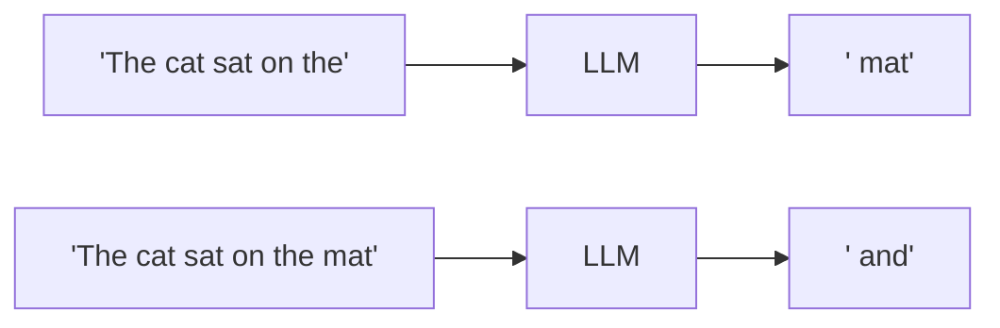
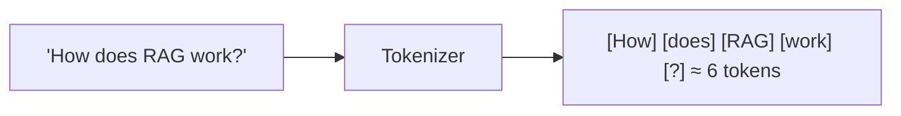
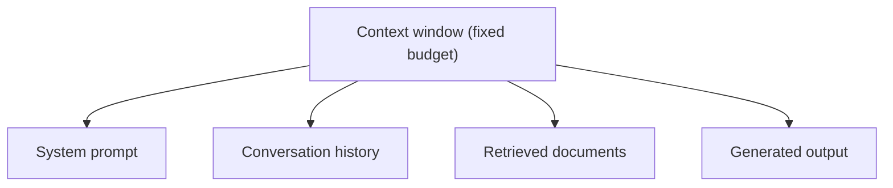

# LLM Fundamentals — Tokens, Context & Sampling

The base layer every other doc assumes you know: what an LLM actually is, how it reads text, and what the knobs (`temperature`, context window, messages) really do. Grounded in the concrete values used across this workspace.

> Diagrams are [Mermaid](https://mermaid.js.org/) — rendered automatically on GitHub.

---

## Table of contents

1. [What an LLM does](#1-what-an-llm-does)
2. [Tokens](#2-tokens)
3. [The context window](#3-the-context-window)
4. [Messages & roles](#4-messages--roles)
5. [Sampling: temperature & friends](#5-sampling-temperature--friends)
6. [Cost & latency](#6-cost--latency)
7. [Why this matters for RAG/agents](#7-why-this-matters-for-ragagents)

---

## 1. What an LLM does

A large language model is a function that, given a sequence of text, predicts the next piece of text. Strip away everything else and that is the whole trick: **next-token prediction**, done repeatedly.

"Generate a full answer" is just this loop run hundreds of times — each predicted token is appended to the input, and the model predicts again. Everything the docs describe (RAG, agents, tool calling) is built on top of this single primitive.

Two important corollaries:

- The model has **no memory** between calls. Every request is self-contained; "conversation" is you re-sending the whole history each time (see §3).
- The model **does not know things** — it predicts plausible text. That plausibility is why it can be confident *and wrong*, which is the root cause of hallucinations.

---

## 2. Tokens

A **token** is the unit the model reads and charges for — roughly a word or a sub-word. "unbelievable" might be `un` + `believable`; "cat" is one token. Not characters, not words.

Why tokens matter:

- **Limits** — the context window (below) is measured in tokens.
- **Cost** — providers bill per token in + token out.
- **Speed** — more tokens = more compute = slower response.

Different models tokenize differently, so "6 tokens" is model-specific — but the mental model ("a few thousand words fit in a window") is stable. You do not need exact counts; you need to know the constraint *exists*.

---

## 3. The context window

The **context window** is the maximum number of tokens the model can see in a single request — input + output combined. The model has no memory beyond what is inside this window. A window of 128k tokens means roughly "a few hundred pages of text can be considered at once."

This is *the* constraint behind RAG:

| What eats the budget | Notes |
|---|---|
| System prompt | instructions, tool schemas |
| History | grows every turn |
| Retrieved context | the RAG part — capped by how much you retrieve |
| Output | generated tokens count against the same window |

Three consequences:

1. **You cannot stuff everything in** — that is precisely why RAG exists: retrieve the relevant few chunks instead of the whole corpus.
2. **History is finite** — long conversations must be trimmed/summarized or they overflow the window.
3. **Context is a budget** — `production-rag.md` and `vector-search.md` both warn to "cap total context tokens" because fusion can over-recall.

---

## 4. Messages & roles

Chat models receive a list of **messages**, each tagged with a role. The roles are not cosmetic — they tell the model who said what, which changes how it should respond:

| Role | Meaning | Workspace example |
|---|---|---|
| `system` | instructions; sets behavior | `"You are an assistant who good at {skill}"` |
| `user` / `human` | the person's turns | `"Convert 100 USD to EUR"` |
| `assistant` / `ai` | the model's own prior turns | prior answers fed back as history |
| `tool` | result of a tool call | the observation in the ReAct loop |

LangChain models these as `HumanMessage`, `AIMessage`, `SystemMessage` (`langchain-fundamentals.md` §3). The key practical point — repeated in `rag-json/chat3`'s comments — is that **role boundaries matter**: if you flatten the whole conversation into one raw string, the model treats it as one continuous narrative instead of a dialogue, and behaves worse.

---

## 5. Sampling: temperature & friends

The model does not "pick" the next token deterministically — it outputs a probability distribution over the whole vocabulary, and a **sampling** strategy decides which token actually gets chosen.

**Temperature** is the main knob (0 to ~2):

| Value | Behavior | Use case |
|---|---|---|
| `0` | always pick the highest-probability token (deterministic) | tool calling, structured output, RAG answers |
| `0.7` | mild randomness | chat |
| `1.5+` | very creative, prone to nonsense | brainstorming |

This is why the workspace uses *both* ends:

- `mcp-client/server.ts` sets `temperature: 0` — because tool-call *format* must be deterministic.
- `langchain/chat.ts` sets `temperature: 0.7` — because a chat companion should vary.
- `rag-graph/ingest.ts` sets `temperature: 0` — entity extraction must be stable.

Other related knobs: `top_p` (nucleus sampling — only consider the smallest set of tokens covering p probability), `max_tokens` (hard cap on output length), and `stop` sequences.

**Rule of thumb:** anything where the *shape* matters more than the *wording* (tool calls, JSON, extraction) → low/zero temperature. Anything where *expressiveness* matters → higher temperature.

---

## 6. Cost & latency

Three dials, always in tension:

| Dial | Cheaper/faster when |
|---|---|
| **Model size** | small models (`gpt-4o-mini`) vs large (`gpt-4o`) |
| **Tokens in** | shorter context, fewer retrieved chunks |
| **Tokens out** | shorter answers, `max_tokens` caps |

The workspace shows the pattern: `gpt-4o-mini` is the default for agents and extraction (cheap, fast), `gpt-4o` reserved for final answer quality where it matters. `production-rag.md` §5 extends this with caching to skip the expensive call entirely.

Latency is dominated by **output tokens** (each generated token is a serial step) — so a 500-token answer takes noticeably longer than a 50-token one. Reranking's "feed the LLM the *right* 5 chunks instead of 50 loosely-related ones" (`vector-search.md` §9) is a cost optimization as much as a quality one.

---

## 7. Why this matters for RAG/agents

Every higher-level doc reduces to these primitives:

- **RAG** = fitting a tiny relevant slice into the context window instead of the corpus (§3).
- **Chunking** = deciding what those slices are, sized for the window (§2, `document-processing.md`).
- **Agents** = sampling tuned deterministic + `tool` messages in the loop (§4–5, `ai-agents.md`).
- **Streaming** = exposing tokens as they're sampled, rather than at the end (§2).

If you internalize tokens, the window, and temperature, the rest of the knowledge base is just strategies arranged on top of them.

---

## Further reading

- `docs/langchain-fundamentals.md` — prompts, messages, LCEL
- `docs/ai-agents.md` — what runs on top of the model
- `docs/production-rag.md` — cost, caching, and reliability in practice
- [OpenAI tokenizer](https://platform.openai.com/tokenizer) — see tokens interactively
