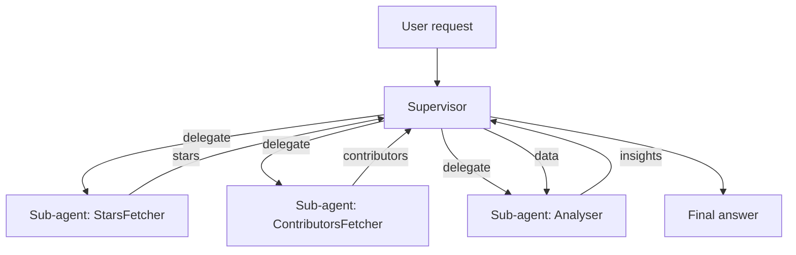
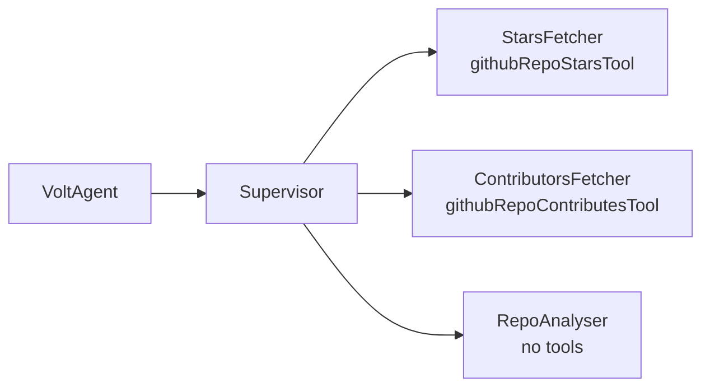
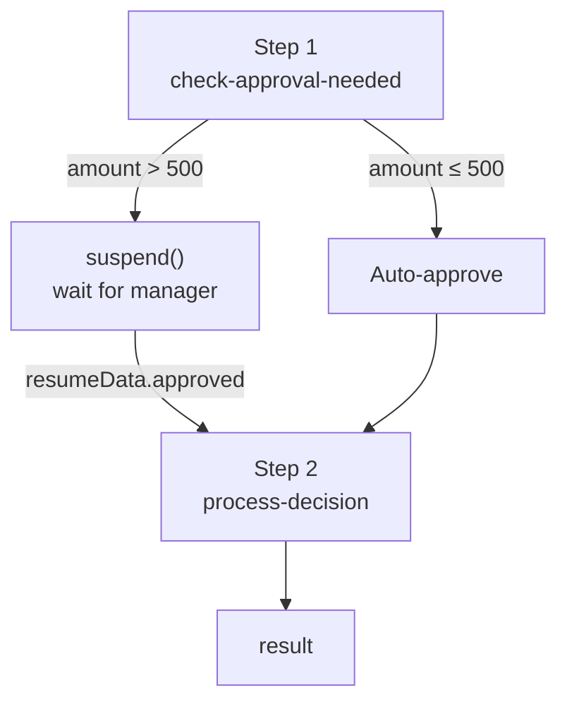

# Multi-Agent Orchestration — Supervisor & Sub-Agents

What happens when one agent isn't enough: splitting work across multiple specialized agents, coordinating them, and — for long-running jobs — pausing for human input. Maps to the `voltagent` project.

> Diagrams are [Mermaid](https://mermaid.js.org/) — rendered automatically on GitHub.

---

## Table of contents

1. [Why multiple agents?](#1-why-multiple-agents)
2. [The supervisor pattern](#2-the-supervisor-pattern)
3. [Supervisor + sub-agents in VoltAgent](#3-supervisor--sub-agents-in-voltagent)
4. [Orchestration patterns compared](#4-orchestration-patterns-compared)
5. [Workflows: multi-step with human-in-the-loop](#5-workflows-multi-step-with-human-in-the-loop)
6. [Concept → project map](#6-concept--project-map)

---

## 1. Why multiple agents?

A single agent with every tool loaded has two problems:

- **Context bloat** — every tool's schema and description consumes prompt tokens, even for tools never used in a given turn.
- **Prompt conflict** — one giant system prompt telling a model to "be an analyst *and* a fetcher *and* a summarizer" weakens focus on each role.

Multi-agent systems split the work: each agent has a narrow role, a focused instruction, and only the tools it needs. A **supervisor** decides which sub-agent to invoke and stitches their outputs together.



---

## 2. The supervisor pattern

The supervisor is an agent whose "tools" are *other agents*. It does not do the work itself; it decomposes the request, assigns sub-tasks, and aggregates results.

| Agent | Responsibility | Has tools? |
|---|---|---|
| **Supervisor** | plan, delegate, assemble | sub-agents only |
| **Sub-agents** | one job each | yes (their own tools) |
| **Analyser** | reason over results | no — pure reasoning |

Key insight: the **analyser agent has no tools at all**. It exists because *reasoning over gathered data* is a distinct role from *fetching* data. Splitting "fetch" from "reason" keeps each prompt small and focused.

---

## 3. Supervisor + sub-agents in VoltAgent

In `voltagent/src/index.ts`, four agents are declared with distinct roles:

```ts
const starsFetcherAgent = new Agent({
  name: 'StarsFetcher',
  description: 'Fetches the number of stars for a GitHub repository using a tool.',
  llm: new VercelAIProvider(),
  model: openai('gpt-4o-mini'),
  tools: [githubRepoStarsTool],
});

const supervisorAgent = new Agent({
  name: 'Supervisor',
  description: `…1. Extract owner/repo. 2. Use StarsFetcher… 3. Use ContributorsFetcher… 4. Pass data to RepoAnalyzer. 5. Return analysis.`,
  llm: new VercelAIProvider(),
  model: openai('gpt-4o-mini'),
  subAgents: [starsFetcherAgent, contributorsFetcherAgent, analyserAgent],
});

new VoltAgent({ agents: { supervisor: supervisorAgent } });
```

Notice:

- Each fetcher has **exactly one tool** — no context bloat.
- The supervisor's `description` is itself the orchestration plan, written as a numbered checklist the model follows.
- Only the supervisor is exposed via `VoltAgent({ agents: { supervisor } })`; sub-agents are called *through* it, never directly.

The delegation is **dynamic**: the supervisor chooses which sub-agent to call at runtime based on the request, rather than following a hardcoded sequence.



---

## 4. Orchestration patterns compared

| Pattern | Control flow | Best for |
|---|---|---|
| **Single agent + tools** | LLM decides which tool | one domain, moderate tool count |
| **Supervisor + sub-agents** | LLM routes to agents | distinct roles, clean separation of concerns |
| **Fixed workflow (pipeline)** | you define the order | deterministic, auditable steps |
| **Hierarchy of supervisors** | supervisors call supervisors | very large, nested task graphs |

`langgraph`/`mcp-client` are single-agent; `voltagent` is supervisor + sub-agents; `voltagent`'s workflow (below) is a fixed pipeline. The right pattern tracks how *uncertain* the path is: more uncertainty → more autonomy.

---

## 5. Workflows: multi-step with human-in-the-loop

A **workflow** is orchestration where *you* define the steps, not the LLM. VoltAgent's `createWorkflowChain` chains typed steps and supports **suspend/resume** — pausing mid-flow to wait for a human decision:

```ts
// voltagent/src/workflows/index.ts
export const expenseApprovalWorkflow = createWorkflowChain({
  input: z.object({ employeeId: z.string(), amount: z.number(), … }),
  result: z.object({ status: z.enum(['approved', 'rejected']), … }),
})
  .andThen({
    id: 'check-approval-needed',
    resumeSchema: z.object({ approved: z.boolean(), managerId: z.string(), … }),
    execute: async ({ data, suspend, resumeData }) => {
      if (resumeData) return { …data, approved: resumeData.approved, … }; // resumed
      if (data.amount > 500) await suspend('Manager approval required', { … });
      return { …data, approved: true, approvedBy: 'system' }; // auto-approve
    },
  })
  .andThen({ id: 'process-decision', execute: async ({ data }) => ({ … }) });
```

This is a fundamentally different shape from the ReAct loop:



| Agent (ReAct) | Workflow |
|---|---|
| Model decides the path | You define the path |
| Loops until done | Linear steps (possibly suspending) |
| Good for open-ended tasks | Good for regulated, auditable processes |

The expense workflow encodes a business rule — *expenses over $500 need a manager* — as explicit code with a typed `resumeSchema`, so a human can inject `{ approved, managerId, adjustedAmount }` and the flow continues. This is where AI meets process automation: deterministic control flow, LLM-powered steps.

---

## 6. Concept → project map

| Concept | Where in this workspace |
|---|---|
| Supervisor agent with `subAgents` | `voltagent/src/index.ts` |
| Specialized single-tool sub-agents | `StarsFetcher`, `ContributorsFetcher` in `index.ts` |
| Tool-less reasoning agent | `RepoAnalyser` in `index.ts` |
| Tool declaration | `createTool()` in `voltagent/src/tools/*` |
| Workflow with `suspend`/`resume` | `expenseApprovalWorkflow` in `voltagent/src/workflows/index.ts` |
| HTTP exposure (`/chat`, `/workflow`) | `voltagent/src/api.ts` |

---

## Further reading

- `docs/ai-agents.md` — the single-agent ReAct loop this builds on
- `ts/voltagent/AGENTS.md` — project setup, lint, typecheck
- [VoltAgent](https://voltagent.ai/) — the framework used here
- [Multi-agent systems](https://langchain-ai.github.io/langgraph/concepts/multi_agent/) (LangGraph) — the same idea in a different framework
