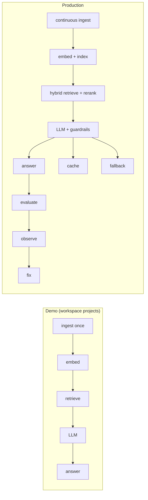
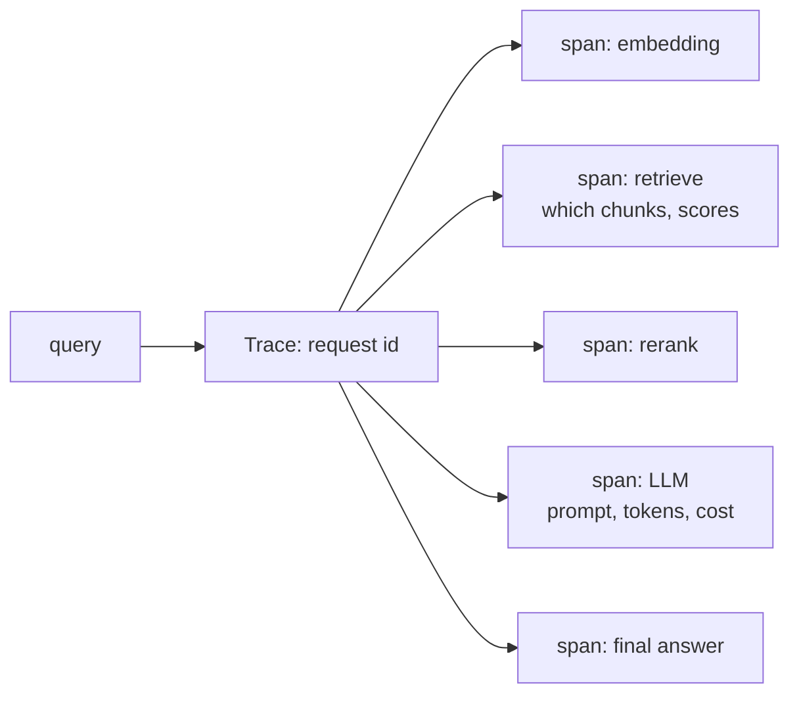
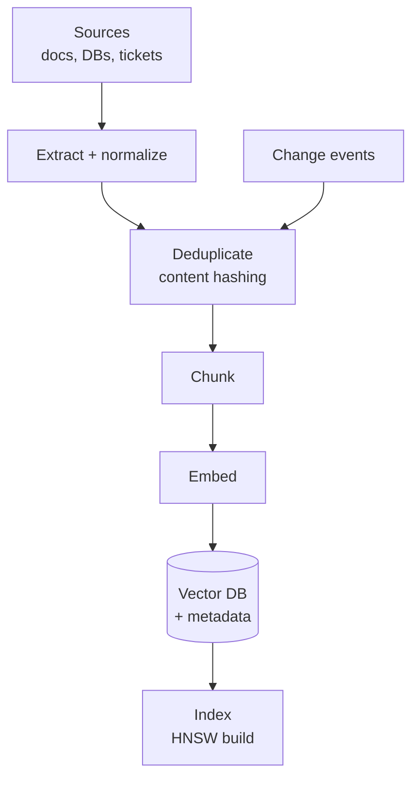
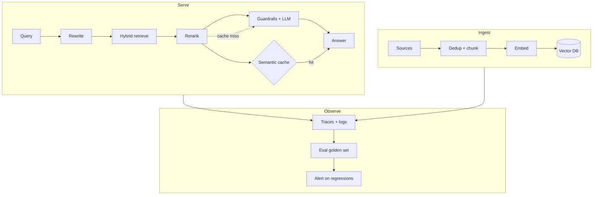

# Production-Grade RAG — From Demo to Deployment

The `docs/` so far covers *how* RAG works. This doc covers *what it takes to ship it*: evaluation, observability, caching, ingestion, guardrails, and reliability. The workspace projects are excellent at teaching the mechanics; this fills in what separates a `/chat` endpoint from a system you can trust in production.

> Diagrams are [Mermaid](https://mermaid.js.org/) — rendered automatically on GitHub.

---

## Table of contents

1. [The demo → production gap](#1-the-demo--production-gap)
2. [Evaluation](#2-evaluation)
3. [Retrieval quality](#3-retrieval-quality)
4. [Observability](#4-observability)
5. [Caching & cost control](#5-caching--cost-control)
6. [Ingestion pipeline](#6-ingestion-pipeline)
7. [Guardrails & safety](#7-guardrails--safety)
8. [Reliability patterns](#8-reliability-patterns)
9. [Reference architecture](#9-reference-architecture)
10. [Concept → workspace map](#10-concept--workspace-map)

---

## 1. The demo → production gap

A demo RAG answers one question correctly in a script. A production RAG answers thousands correctly *reliably, safely, and cheaply*, and **tells you when it doesn't**. The gap is everything that isn't the happy path:



The workspace intentionally skips the right-hand side — there are **no unit tests, no CI, no evaluation, and in-memory session state** (see `AGENTS.md`). That is fine for learning and wrong for production. Each section below names the gap and the fix.

---

## 2. Evaluation

You cannot improve a RAG system you cannot measure. Production teams gate every change on offline evaluation before it reaches users.

### The three things to score

| Dimension | Question | Metric |
|---|---|---|
| **Retrieval** | did we surface the right chunks? | recall@k, MRR, nDCG |
| **Generation** | is the answer faithful & relevant? | faithfulness, answer relevance |
| **End-to-end** | did the user get a correct answer? | human/LLM-as-judge |

### Retrieval metrics

- **Recall@k** — fraction of queries where the gold chunk is in the top-k. *"Did we find it at all?"*
- **MRR** (Mean Reciprocal Rank) — `1/rank` of the first correct hit, averaged. Rewards getting it right *early*.
- **nDCG** — graded relevance, so "sort of relevant" counts for less than "perfect".

Build a **golden set**: 50–200 real queries paired with the known-good chunk(s) and answer. Run it on every change to chunking, embeddings, or fusion weights.

### Generation metrics (LLM-as-judge)

- **Faithfulness** — does the answer contradict the retrieved context? (hallucination check)
- **Answer relevance** — does the answer actually address the question?
- **Context precision** — of the chunks provided, how many were relevant?

The judge prompt pattern: *"Given this context and this answer, is every claim in the answer supported by the context?"* — an LLM scores it 1–5, often with a rubric. Nothing in the workspace does this today; it is the single highest-leverage addition for going to production.

```mermaid
flowchart TD
    Q[Golden query] --> R[Retriever] --> C[top-k chunks]
    C --> G[LLM] --> A[answer]
    C --> RM[Recall@k / nDCG]
    A --> GJ[LLM judge<br/>faithfulness, relevance]
```

---

## 3. Retrieval quality

The theory is in [vector-search.md](vector-search.md); here is the production checklist, in order of impact:

| # | Lever | Typical impact |
|---|---|---|
| 1 | **Hybrid** (dense + BM25/SPARSE) + RRF | rescues exact codes/names |
| 2 | **Reranking** (cross-encoder) top-50 → top-5 | biggest precision win |
| 3 | **Chunking tuned** to the data | caps everything else |
| 4 | **Metadata filtering** (pre-filter) | correctness for permissions/dates |
| 5 | **Query rewriting / HyDE** | fixes the "user asks vaguely" problem |

The workspace already demonstrates 1–4 (`rag-hybrid` does dense + BM25 + RRF + rerank end to end). What it lacks is **tuning against a golden set** — the same pipeline with numbers proving each knob matters.

Rule of thumb: retrieval quality issues look like *generation* issues in production. A wrong answer is usually a retrieval miss, not a bad LLM. Diagnose retrieval first.

---

## 4. Observability

When a user reports a bad answer, you need to reconstruct *why*. Every RAG request should emit a trace:



| Signal | What it reveals |
|---|---|
| Retrieved chunk ids + scores | was it a retrieval miss? |
| Prompt sent to the LLM | context truncation, injection |
| Token counts + latency | cost and speed regressions |
| Per-user request id | replay any single failure |

Tools: LangSmith, Langfuse, OpenTelemetry, or structured logs. The workspace's `console.log` calls in tools are the seed of this — the production step is making them *structured, correlated, and queryable*.

---

## 5. Caching & cost control

Every RAG call has two expensive operations: an embedding call and an LLM call. Cache both.

| Layer | What to cache | Key | Invalidation |
|---|---|---|---|
| **Semantic cache** | whole answer | embedding of the query | similarity threshold, not exact match |
| **Embedding cache** | chunk vectors | hash of chunk text | on document change |
| **LLM cache** | identical prompt | prompt hash | n/a (immutable) |

**Semantic caching** returns a stored answer when a new query is within a similarity threshold of a previously answered one ("what's our refund policy" ≈ "how do I get my money back"). It is the difference between a 3s/$0.01 answer and a 50ms/$0 answer on repeat traffic. The workspace has no caching layer — note it does not even persist embeddings across restarts for some projects.

---

## 6. Ingestion pipeline

Demo ingestion is "load a JSON, embed, done". Production ingestion is a data pipeline:



| Concern | Why it matters |
|---|---|
| **Incremental updates** | re-embedding everything on each change is untenable at scale |
| **Deterministic ids + upsert** | re-running ingest must not duplicate records (`rag-hybrid` already does `title-year` ids; `chromadb`'s `/add` does *not*, and duplicates) |
| **Deduplication** | the same content arrives from many sources |
| **Versioning** | roll back a bad index; track which embedding model built it |
| **Embedding-model pinning** | you cannot mix models in one index (see [vector-search.md](vector-search.md)) |

The workspace touches the edges of this — `rag-hybrid` has idempotent ids, `rag-graph` `MERGE`s entities — but none of it is a real pipeline.

---

## 7. Guardrails & safety

RAG widens the attack surface: retrieved context and user input are both untrusted-ish.

| Threat | Mitigation |
|---|---|
| **Prompt injection** (malicious content in retrieved docs) | treat context as *data*, never instructions; delimit clearly; validate output against a schema |
| **PII leakage** | redact before embedding and before sending to the LLM |
| **Jailbroken output** | output guardrails — block/replace disallowed content |
| **Prompt leaking** (system prompt extraction) | assume the system prompt is public; keep secrets out of it |

The `chat4` route already does the most important thing — `"Answer based only on the following context… Do not mention that you retrieve data"` — but production adds *validation on the other side*: is the answer a string of the expected shape? Is it on-topic? Structured output (`withStructuredOutput`) is a guardrail as much as a convenience.

---

## 8. Reliability patterns

LLM and vector-DB calls fail, stall, and rate-limit. Production code wraps them:

| Pattern | Purpose |
|---|---|
| **Retries with backoff** | transient API/network failures |
| **Timeouts** | a hung embedding call must not hang the request |
| **Fallbacks** | primary model down → cheaper model → graceful error |
| **Degradation** | retrieval slow → skip rerank and serve top-k directly |
| **Rate limiting / circuit breaker** | protect upstream providers |

The workspace tools call `fetch` and the OpenAI SDK directly with no retry or timeout strategy — one hung `freecurrencyapi.com` call stalls the whole agent turn.

---

## 9. Reference architecture

Pulling it together, a production RAG service has clear seams between *ingest*, *serve*, and *observe*:



The workspace gives you every *Serve* box. Ingest and Observe are the two you build to go from demo to production.

---

## 10. Concept → workspace map

| Production concern | Workspace status |
|---|---|
| Hybrid retrieval + RRF + rerank | ✓ implemented (`rag-hybrid`) |
| Metadata filtering | ✓ implemented (`rag-redis`, `chromadb`) |
| GraphRAG / multi-hop | ✓ implemented (`rag-graph`) |
| Streaming answers | ✓ implemented (`rag-json`) |
| Idempotent ingestion | partial (`rag-hybrid` ids; not `chromadb` `/add`) |
| Evaluation (golden set, metrics) | ✗ missing |
| Observability / tracing | ✗ missing (`console.log` only) |
| Caching (semantic/embedding/LLM) | ✗ missing |
| Guardrails (injection, PII, output) | partial (prompt wording only) |
| Retries / timeouts / fallbacks | ✗ missing |
| Persistent session state | ✗ mostly in-memory |

---

## Further reading

- `docs/vector-search.md` — the retrieval theory behind §3
- `docs/ai-agents.md` — the ReAct loop a production RAG agent would use
- `ts/rag-hybrid/CONCEPTS.md` — the closest workspace project to production retrieval
- [RAGAS](https://docs.ragas.io/) — open-source evaluation framework
- [Langfuse](https://langfuse.com/) / [LangSmith](https://smith.langchain.com/) — tracing & eval platforms
- [OWASP LLM Top 10](https://genai.owasp.org/) — the safety checklist behind §7
