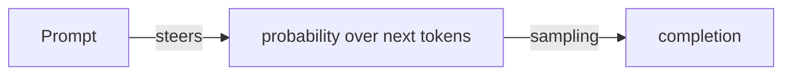

# Prompt Engineering — Writing Prompts That Work

The *craft* behind the prompt templates already in this workspace. `langchain-fundamentals.md` shows the mechanics (`ChatPromptTemplate`, variables); this doc shows *why* certain prompts work and the techniques you can apply today.

> Diagrams are [Mermaid](https://mermaid.js.org/) — rendered automatically on GitHub.

---

## Table of contents

1. [What a prompt is really doing](#1-what-a-prompt-is-really-doing)
2. [The anatomy of a good prompt](#2-the-anatomy-of-a-good-prompt)
3. [Role & instruction](#3-role--instruction)
4. [Grounding & delimiters](#4-grounding--delimiters)
5. [Few-shot prompting](#5-few-shot-prompting)
6. [Chain-of-thought](#6-chain-of-thought)
7. [Output formatting](#7-output-formatting)
8. [The workspace, scored](#8-the-workspace-scored)

---

## 1. What a prompt is really doing

Recall from [llm-fundamentals.md](llm-fundamentals.md): the model predicts plausible next tokens. A prompt does not "program" the model — it *steers the distribution* of what comes next. The craft is choosing words that make the correct completion the most plausible one.



Every technique below is just a way to make the right answer more likely — by providing context, constraints, examples, or structure. There is no magic; there is only making the task unambiguous.

---

## 2. The anatomy of a good prompt

A strong prompt usually has most of these pieces:

| Part | Purpose | Example |
|---|---|---|
| **Role** | set the persona/tone | "You are a movie expert." |
| **Instruction** | the task | "Convert 100 USD to EUR." |
| **Context** | the material to use | retrieved RAG chunks |
| **Constraints** | boundaries | "Answer only from context." |
| **Output format** | shape of the reply | "Return valid JSON." |

Not every prompt needs all five — but when a prompt is failing, the fix is usually a *missing* part, not a missing word.

---

## 3. Role & instruction

A short role line does disproportionate work, because it seeds the model's internal "voice" for the entire response:

```
You are the movie expert. All responses must be in the form of a movie review.
```

This is from `rag-json/chat3`. Two things happen: the model adopts a movie-critic register, and — more importantly — it now has a *definition of good output* to aim at. "All responses must be…" is a constraint, not decoration.

Rules of thumb:

- Make the role **specific** ("a senior Python reviewer" > "an assistant").
- State the **task as an imperative** ("Explain", "List", "Convert") — verb-first prompts are clearer targets.
- Keep role and instruction *separate* from the data (next section).

---

## 4. Grounding & delimiters

The most important technique in this workspace — and the heart of RAG:

```
Answer the user's questions based only on the following context.
If the answer is not in the context, reply politely that you do not have that information.
Do not mention that you retrieved data from context.
===================
Context: {context}
===================
```

(from `rag-json/chat4` and `rag-redis/chat`). Three ideas working together:

1. **Grounding** — "based *only* on the following context" ties the answer to the retrieved material, the anti-hallucination move.
2. **An explicit escape hatch** — "if not in the context, say you don't know" *gives the model permission to not know*, which dramatically reduces invented answers.
3. **Delimiters** — the `===================` fences separate *instructions* from *data*. This matters both for clarity and for security (it isolates injected content — see `production-rag.md` §7).

The delimiter pattern is worth stealing for any prompt that mixes instructions with user- or document-provided text:

```
Summarize the text between the <doc> tags:
<doc>
{text}
</doc>
```

---

## 5. Few-shot prompting

When the desired output has a hard-to-describe *shape*, show examples instead of explaining:

```
Classify the sentiment:
"great movie" → positive
"boring" → negative
"meh" → neutral
"absolutely loved it" →
```

The model infers the task from the examples and continues the pattern. Few-shot is at its best when:

- The task is fuzzy to describe but obvious from examples.
- You need a specific *tone or format*.
- A plain instruction keeps producing wrong shapes.

Tradeoff: examples consume context-window tokens, so a couple are usually enough. The workspace does not use few-shot explicitly today — it relies on Zod schemas for shape instead (next two sections), which is the structured, more reliable cousin of few-shot.

---

## 6. Chain-of-thought

For multi-step reasoning, telling the model to *think step by step* (or structuring the steps yourself) measurably improves accuracy:

```
Solve this step by step, showing your reasoning.
```

Why it works: each reasoning step is an intermediate completion whose plausibility the model can "lock in" before moving on — errors are less likely to cascade. You see the same *idea* in `ai-agents.md`: the ReAct loop's "thought → action → observation" is chain-of-thought made explicit, with the observation *grounding* each step in real data.

When to reach for it: arithmetic, comparisons, multi-constraint tasks, and anything where the answer must be *derived* rather than *recalled*. For simple lookups it just wastes tokens.

---

## 7. Output formatting

The most reliable way to get structured output is not to ask politely — it is to hand the model a schema. Two approaches:

**Prompt-level** (soft) — works anywhere:

```
Return JSON with keys: "answer" (string) and "confidence" (number 0-1).
```

**Schema-level** (hard) — the workspace's preferred way:

```ts
const schema = z.object({ answer: z.string(), confidence: z.number() });
const model = new ChatOpenAI({ … }).withStructuredOutput(schema);
```

`langchain/chat.ts` does the latter. The reason schema beats prose: the model's tool-calling machinery is trained to emit *valid JSON matching a schema*, whereas "please return JSON" only gets you valid JSON *most* of the time. Prefer structured output whenever the consumer is code, not a human.

This is also how tool calling works at all — a tool's Zod schema *is* a prompt, telling the model exactly what arguments to produce (`ai-agents.md` §5).

---

## 8. The workspace, scored

| Prompt | Technique | Verdict |
|---|---|---|
| `rag-json/chat4` | grounding + escape hatch + delimiters | the reference example — copy this pattern |
| `rag-redis/chat` | same, inline | good |
| `rag-json/chat3` | role + constraint | good, simple |
| `langchain/chat` | role + `{skill}` variable | minimal but fine for a demo |
| `langgraph` tool descriptions | verb-first + `.describe()` hints | solid; the descriptions *are* the prompt |
| `voltagent` supervisor | numbered checklist | good use of explicit multi-step structure |

The through-line: the strongest prompts in this repo combine a clear role, an explicit constraint, and a delimited context — and delegate anything structural to a Zod schema rather than to prose.

---

## Further reading

- `docs/llm-fundamentals.md` — why prompts steer probabilities, and temperature
- `docs/langchain-fundamentals.md` — the template mechanics
- `docs/ai-agents.md` §5 — tool schemas as prompts
- `docs/production-rag.md` §7 — prompt injection, the failure mode of §4
- [OpenAI prompt engineering guide](https://platform.openai.com/docs/guides/prompt-engineering)
