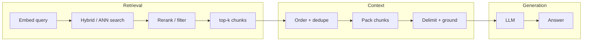
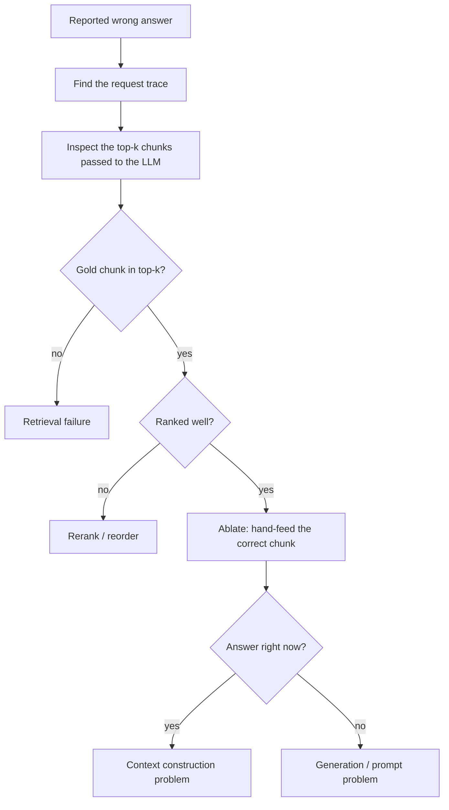
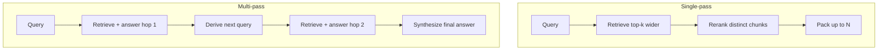
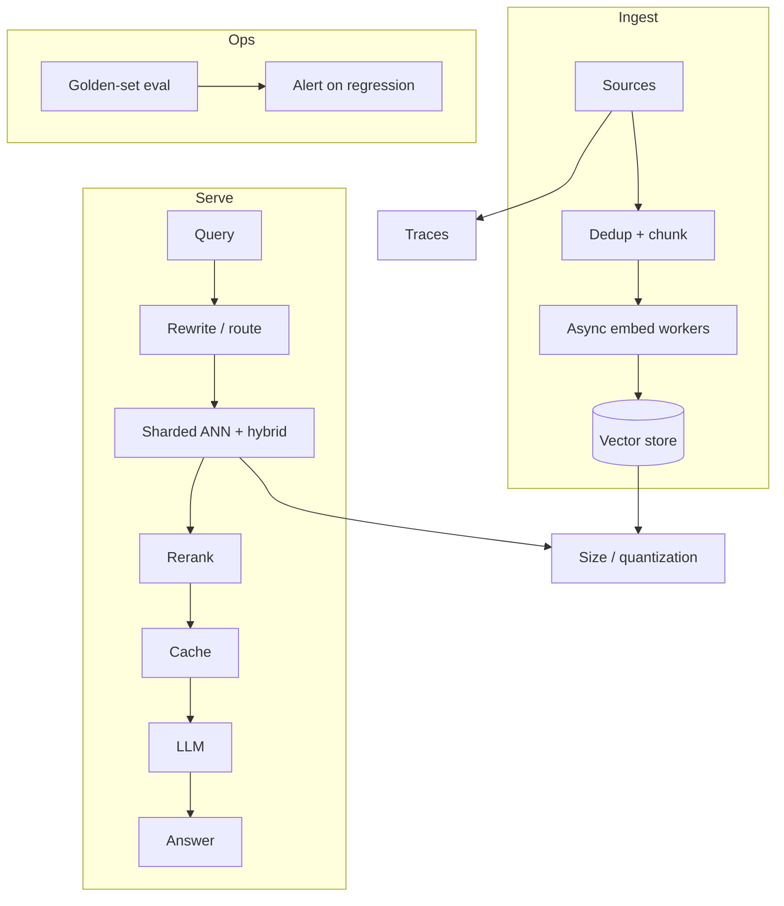

# RAG Troubleshooting — Diagnosing Failures, Context Assembly & Scaling

A RAG system rarely fails in a clean, obvious place. Most incidents are a bad retrieval, a bad context assembly, a bad prompt, or a bad embedding change — and they all *look* like "the model is wrong." This doc is the diagnostic playbook: how to locate the seam, prove the root cause, close the retrieval→generation gap, handle multi-hop questions, and scale from thousands to millions of documents.

## Table of contents

- [1. The mental model: three seams](#1-the-mental-model-three-seams)
- [2. Answers suddenly turn wrong](#2-answers-suddenly-turn-wrong)
  - [2.1 The diagnostic loop](#21-the-diagnostic-loop)
  - [2.2 Symptom → hypothesis table](#22-symptom--hypothesis-table)
- [3. Retrieval → generation: context construction](#3-retrieval--generation-context-construction)
  - [3.1 The failure modes](#31-the-failure-modes)
  - [3.2 Rules for assembling context](#32-rules-for-assembling-context)
- [4. Proving a change actually helped](#4-proving-a-change-actually-helped)
- [5. Multi-hop: answers spanning many documents](#5-multi-hop-answers-spanning-many-documents)
- [6. Scaling 10k → 1M documents](#6-scaling-10k--1m-documents)
- [7. The one-page playbook](#7-the-one-page-playbook)
- [8. Concept → project map](#8-concept--project-map)
- [Further reading](#further-reading)

---

## 1. The mental model: three seams

Stop debugging "the RAG system" as one thing. It is three stages, and every symptom belongs to one of them:

| Seam | Owns the failure | Doc |
|---|---|---|
| **Retrieval** | the right chunk isn't found, or is buried | [vector-search.md](vector-search.md) |
| **Context construction** | the right chunk is found but drowned, mis-ordered, or over-packed | *this doc, §3* |
| **Generation** | the model ignores, contradicts, or doesn't use the context | [prompt-engineering.md](prompt-engineering.md) |

The trap: **a retrieval failure and a generation failure produce the same user-facing symptom** — a bad answer. So you must pin the seam before you fix anything.

---

## 2. Answers suddenly turn wrong

The doc's rule of thumb: *"A wrong answer is usually a retrieval miss, not a bad LLM. Diagnose retrieval first."* — [production-rag.md §3](production-rag.md#3-retrieval-quality).

### 2.1 The diagnostic loop

A wrong answer is a *regression* — something changed (index, embeddings, chunking, prompt, doc set, or a vendor model). Walk this loop, from cheapest to most expensive:

Each decision is a **controlled test**, not a guess:

| Step | Question you're proving | Action |
|---|---|---|
| Inspect top-k | Was the correct chunk even retrieved? | Re-run the query, log the actual chunks sent |
| `recall@k` | Does retrieval find it *at all*? | Run the golden set, check recall@k/[MRR](production-rag.md#2-evaluation) |
| Hand-feed the chunk | If retrieval were perfect, would the answer be correct? | Prompt the LLM with only the known-good chunk |
| Compare | Did the change regress or improve, or is it a one-off? | Probe the same query before/after, or across the golden set |

**The proof is the ablation.** Hand-feed the correct chunk to the LLM. Answer correct → retrieval. Answer still wrong → context construction or generation. That single test splits the space cleanly.

### 2.2 Symptom → hypothesis table

| Symptom | First hypothesis | Confirmation |
|---|---|---|
| Correct answer form, wrong facts | retrieval miss | gold chunk absent from top-k |
| Answer is vague / partial | chunk not ranked high enough | [rerank](vector-search.md#9-reranking) lifts it |
| Answer reads correct but isn't cited | generation ignores context | [faithfulness](production-rag.md#2-evaluation) score low |
| Started after a deploy | a specific config regressed | re-run golden set on the diff |
| Started after new docs ingested | bad/large chunk poisoned prompt | inspect that chunk, [guardrails](production-rag.md#7-guardrails--safety) |

---

## 3. Retrieval → generation: context construction

Retrieval returned the right chunk, yet the answer is still poor. The failure is the handoff — how the chunks are **assembled into a prompt**.

### 3.1 The failure modes

| Failure mode | What goes wrong | Fix |
|---|---|---|
| **Context pollution** | too many chunks; the correct one is diluted | tighten top-k; rerank; drop irrelevant chunks ([rerank](vector-search.md#9-reranking)) |
| **Context overflow** | the window is full and the model truncates the start/end | fewer, better chunks; [context window](llm-fundamentals.md#3-the-context-window) budgeting |
| **Wrong granularity** | a 2k-token chunk buries the answer inside prose | chunking tuned to the data ([document-processing §2](document-processing.md#2-structure-aware-chunking)) |
| **Bad ordering** | the decisive evidence is last | order by relevance; strongest first |
| **No grounding** | the model isn't told to answer only from context | instructions + delimiters ([prompt-engineering §4](prompt-engineering.md#4-grounding--delimiters)) |
| **Duplicates** | the same content appears in several chunks and wastes budget | dedupe near-identical chunks |
| **Instruction confusion** | retrieved prose is read as an instruction | treat context as data, delimit clearly ([guardrails §7](production-rag.md#7-guardrails--safety)) |

### 3.2 Rules for assembling context

1. **Retrieve for precision, then assemble.** Rerank sharpens the top-k before you pack it.
2. **Order by strength of evidence**, most relevant first — the model is more likely to use what it sees early.
3. **Budget the window.** Estimate tokens per chunk; never silently overflow ([llm-fundamentals §3](llm-fundamentals.md#3-the-context-window)).
4. **Delimit hard.** Wrap blocks so the model can't mistake content for instructions ([prompt-engineering §4](prompt-engineering.md#4-grounding--delimiters)).
5. **Add a lead instruction** that names the task, the grounding rule, and the expected output shape ([prompt-engineering §7](prompt-engineering.md#7-output-formatting)).

This step has no dedicated code in the workspace — it's the seam between `rag-hybrid` (retrieval) and the LLM. It is the single most common cause of "retrieval looks fine, answers are bad."

---

## 4. Proving a change actually helped

If you swap embedding models and want to claim it "improved RAG," you must prove it. Anecdotes aren't evidence.

**The method** ([production-rag §2](production-rag.md#2-evaluation)): freeze a **golden set** (50–200 real queries with known-good chunks and answers) and run it before and after *every* change — chunking, embeddings, fusion weights, reranker. The golden set is the only variable-free measurement.

| Metric | Does the change… | Typical movement |
|---|---|---|
| `recall@k` | retrieve the gold chunk at all? | moves early, sensitive |
| `MRR` / `nDCG` | rank it higher / more relevant? | moves before generation |
| `faithfulness` | keep the answer grounded? | detects hallucination |
| end-to-end LLM judge | produce a better answer overall? | the final arbiter |

**Hold constant:** the queries, the judge prompt, the answer form, the top-k. Change only the variable under test. Run the same set on the old vs. new model and compare — don't rerun on new questions, or you've measured noise.

**Pitfall:** evaluating on a *new* golden set after the change measures nothing — you lose the baseline. The baseline is the whole point. Reuse it.

---

## 5. Multi-hop: answers spanning many documents

Some questions need evidence from several documents. Two approaches, not mutually exclusive:

### 5.1 Retrieval strategy

- **GraphRAG** — vector finds the start, the graph expands to connected entities across chunks ([`ts/rag-graph/CONCEPTS.md`](../ts/rag-graph/CONCEPTS.md)). Best when the answer *depends on relationships* ("which technologies work with X?").
- **Multi-query + RAG-Fusion** — generate several phrasings, retrieve each, fuse with RRF. Broadens coverage when one phrasing misses a doc ([advanced-rag §2](advanced-rag.md#2-query-transformation)).
- **Adapters (query rewriting)** — if the question is vague, rewrite or decompose it first ([advanced-rag §2](advanced-rag.md#2-query-transformation)).

### 5.2 Context construction for multi-hop

Dilution is the danger: all 5 chunks at once, and the model uses the wrong 2. Two patterns:

- **Single-pass, wider + rerank:** retrieve a bigger top-k, **dedupe** near-identical hits and **rerank** to keep only the *distinct, relevant* chunks, then pack the strongest N. Simple, but the window caps how many docs you can genuinely use.
- **Multi-pass (agentic):** retrieve → answer that hop → derive the next query → retrieve again. Each hop keeps the context small ([advanced-rag §3](advanced-rag.md#3-adaptive--controlled-retrieval)). Costs more latency but handles arbitrarily many sources.

| Approach | Correctness | Latency | When |
|---|---|---|---|
| Single-pass wider + rerank | good to ~5 chunks | low | moderate multi-doc |
| GraphRAG | best at relationship joins | medium | across many entities |
| Multi-pass agentic | unbounded | high | deep chains, mixed sources |

**Design rule:** retrieval gives you candidate evidence; reranking and dedupe give you *the* evidence; the assembly strategy decides how much you can truly use. Don't pack more than the model can attend to.

---

## 6. Scaling 10k → 1M documents

Going from 10k to 1M is an order-of-magnitude × 100. The *architecture* doesn't break — the **cost and latency** do, and in a predictable order.

### 6.1 What breaks first (in order)

| Priority | What breaks | Why | Doc |
|---|---|---|---|
| 1 | **Retrieval latency/recall** | linear scan is too slow; ANN recall degrades as the index grows | [ANN indexes](vector-search.md#7-ann-indexes) |
| 2 | **Ingestion throughput** | embedding 1M docs is a days-long, costly job | [ingestion pipeline](production-rag.md#6-ingestion-pipeline) |
| 3 | **Memory / storage** | 1M dense vectors dominate RAM and cost | [quantization](vector-search.md#11-storage-optimization-quantization) |
| 4 | **Metadata filtering** | pre-filters over 1M rows get expensive | [metadata filtering](vector-search.md#10-metadata-filtering) |
| 5 | **Staleness + updates** | re-embedding and dedup on a growing corpus | [ingestion pipeline](production-rag.md#6-ingestion-pipeline) |

### 6.2 The redesign

| 10k documents | 1M documents |
|---|---|
| Any vector DB, single node | distributed / sharded store, [hybrid](vector-search.md#6-hybrid-search) |
| brute-force or small HNSW | [HNSW + quantization](vector-search.md#11-storage-optimization-quantization) |
| sync, batch ingestion | async, idempotent ingestion workers ([reliability §8](production-rag.md#8-reliability-patterns)) |
| no cache needed | [semantic + LLM cache](production-rag.md#5-caching--cost-control) |
| small golden set | gated, continuously re-run golden-set eval |

**Non-negotiables at scale:** quantization + ANN, hybrid/rerank to keep precision, async idempotent ingestion with retries/backoff, caching, and **re-running the golden set at every step** — scale changes recall, so every scale-up must be validated, not assumed.

---

## 7. The one-page playbook

| You see… | Go to | Do this |
|---|---|---|
| Wrong answers appeared | [§2.1](#21-the-diagnostic-loop) | trace → inspect top-k → ablate with the correct chunk |
| Correct doc retrieved, bad answer | [§3](#3-retrieval--generation-context-construction) | rerank, dedupe, order, delimit, budget the window |
| "Our embeddings got better" | [§4](#4-proving-a-change-actually-helped) | re-run the frozen golden set, compare metrics |
| Question spans many docs | [§5](#5-multi-hop-answers-spanning-many-documents) | wider+rerank, GraphRAG, or multi-pass agentic |
| Corpus scaled ×100 | [§6](#6-scaling-10k--1m-documents) | ANN+quantization, async ingest, hybrid, cache, re-eval |

---

## 8. Concept → project map

| Concept | Project(s) |
|---|---|
| Hybrid dense + BM25 + RRF + rerank | `rag-hybrid` |
| GraphRAG / multi-hop | `rag-graph` |
| Query transformation / RAG-Fusion | conceptual — `advanced-rag.md` |
| Agentic / adaptive retrieval | `langgraph`, `mcp-client` (retrieval as a tool) |
| Structure-aware chunking | `document-processing.md` |
| Ingestion & ingest concerns | `production-rag.md` §6 |
| Observability / eval (missing here) | `production-rag.md` §2, §4 |

---

## Further reading

- [production-rag.md](production-rag.md) — evaluation, observability, guardrails, reliability (the production checklist)
- [vector-search.md](vector-search.md) — retrieval theory: embeddings, hybrid, ANN, reranking, quantization
- [advanced-rag.md](advanced-rag.md) — query transformation, self-RAG/CRAG, agentic retrieval
- [document-processing.md](document-processing.md) — chunking and metadata at ingest
- [prompt-engineering.md](prompt-engineering.md) — grounding, delimiters, output formatting
- [ts/rag-hybrid/CONCEPTS.md](../ts/rag-hybrid/CONCEPTS.md) — the closest working retrieval implementation
- [ts/rag-graph/CONCEPTS.md](../ts/rag-graph/CONCEPTS.md) — multi-hop/graph retrieval in depth
