# Vector Search — Complete Guide

Everything you need to know about vector search for Gen AI: embeddings, dense vs sparse retrieval, ANN indexes, hybrid search, reranking, and how it all maps to the projects in this workspace.

> Diagrams are [Mermaid](https://mermaid.js.org/) — rendered automatically on GitHub.

---

## Table of contents

1. [Why vector search exists](#1-why-vector-search-exists)
2. [Embeddings](#2-embeddings)
3. [Similarity metrics](#3-similarity-metrics)
4. [Dense vector search (semantic search)](#4-dense-vector-search-semantic-search)
5. [Sparse vector search (keyword search)](#5-sparse-vector-search-keyword-search)
6. [Hybrid search](#6-hybrid-search)
7. [ANN indexes](#7-ann-indexes)
8. [Chunking strategies](#8-chunking-strategies)
9. [Reranking](#9-reranking)
10. [Metadata filtering](#10-metadata-filtering)
11. [Storage optimization: quantization](#11-storage-optimization-quantization)
12. [Vector database landscape](#12-vector-database-landscape)
13. [Concept → project map](#13-concept--project-map)

---

## 1. Why vector search exists

Traditional keyword search fails when wording differs from meaning:

| Query | Document | Keyword match? | Semantic match? |
|---|---|---|---|
| "car insurance" | "auto coverage policy" | ✗ no shared words | ✓ same meaning |
| "how to quit vim" | "exiting the vim editor" | partial | ✓ |
| "K8s node down" | "Kubernetes worker failure" | ✗ | ✓ |

Vector search solves this by comparing **meaning**, not words. Text is mapped to points in a high-dimensional space where *distance ≈ dissimilarity of meaning*.

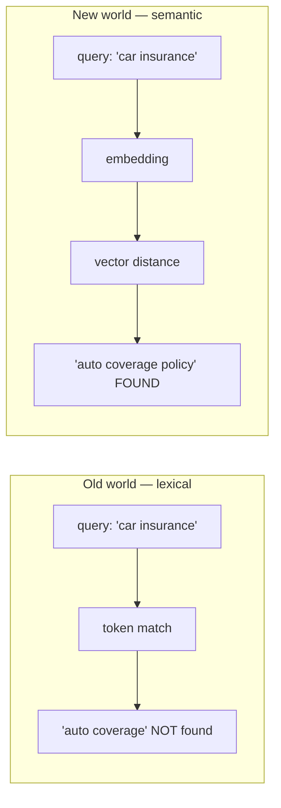

---

## 2. Embeddings

An **embedding model** converts text into a fixed-length vector of floats. Trained on massive corpora, these models place semantically similar texts close together in vector space.

```
"The cat sat on the mat"  →  [0.021, -0.113, 0.887, ..., 0.042]   (1536 numbers)
"A feline rested on rug"  →  [0.019, -0.108, 0.901, ..., 0.038]   ← very close!
"Quarterly tax report"    →  [-0.442, 0.201, -0.077, ..., 0.551]  ← far away
```

### Key properties

- **Fixed dimensionality** — every vector from a given model has the same length. You cannot mix models: a 1536-dim OpenAI vector cannot be compared to a 384-dim MiniLM vector.
- **Meaning lives in direction** — after normalization, two vectors pointing the same way mean the same thing.
- **Contextual** — modern embedding models are transformers; "bank" near "river" embeds differently than "bank" near "loan".

### Common embedding models

| Model | Dims | Cost | Notes |
|---|---|---|---|
| OpenAI `text-embedding-3-small` | 1536 | paid | Great default; supports Matryoshka truncation |
| OpenAI `text-embedding-3-large` | 3072 | paid | Higher accuracy, bigger cost |
| `sentence-transformers/all-MiniLM-L6-v2` | 384 | free | Fast, runs anywhere |
| `sentence-transformers/all-MiniLM-L12-v2` | 384 | free | Used in `rag-huggingface` |
| `BAAI/bge-large-en-v1.5` | 1024 | free | Strong open-source option |
| Cohere `embed-v3` | 1024 | paid | Multilingual, int8/binary variants |

### Matryoshka embeddings

Some models (OpenAI v3 series) train embeddings so that the *first N dimensions* already form a usable smaller vector. You can truncate 1536 → 512 dims and trade a little recall for big storage savings.

---

## 3. Similarity metrics

Given a query vector **q** and document vector **d**:

| Metric | Formula | Range | Sensitive to magnitude? | Use when |
|---|---|---|---|---|
| **Cosine** | q·d / (\|q\|\|d\|) | [-1, 1], higher = closer | No | Default for text |
| **Dot product** | q·d | (-∞, ∞), higher = closer | Yes | Recommenders; normalized vectors |
| **Euclidean (L2)** | √Σ(qᵢ-dᵢ)² | [0, ∞), lower = closer | Yes | Clustering, image features |

**Key insight:** if all vectors are L2-normalized (length = 1), then cosine similarity and dot product give identical rankings. Most text pipelines normalize embeddings and use dot product because it's cheaper to compute.

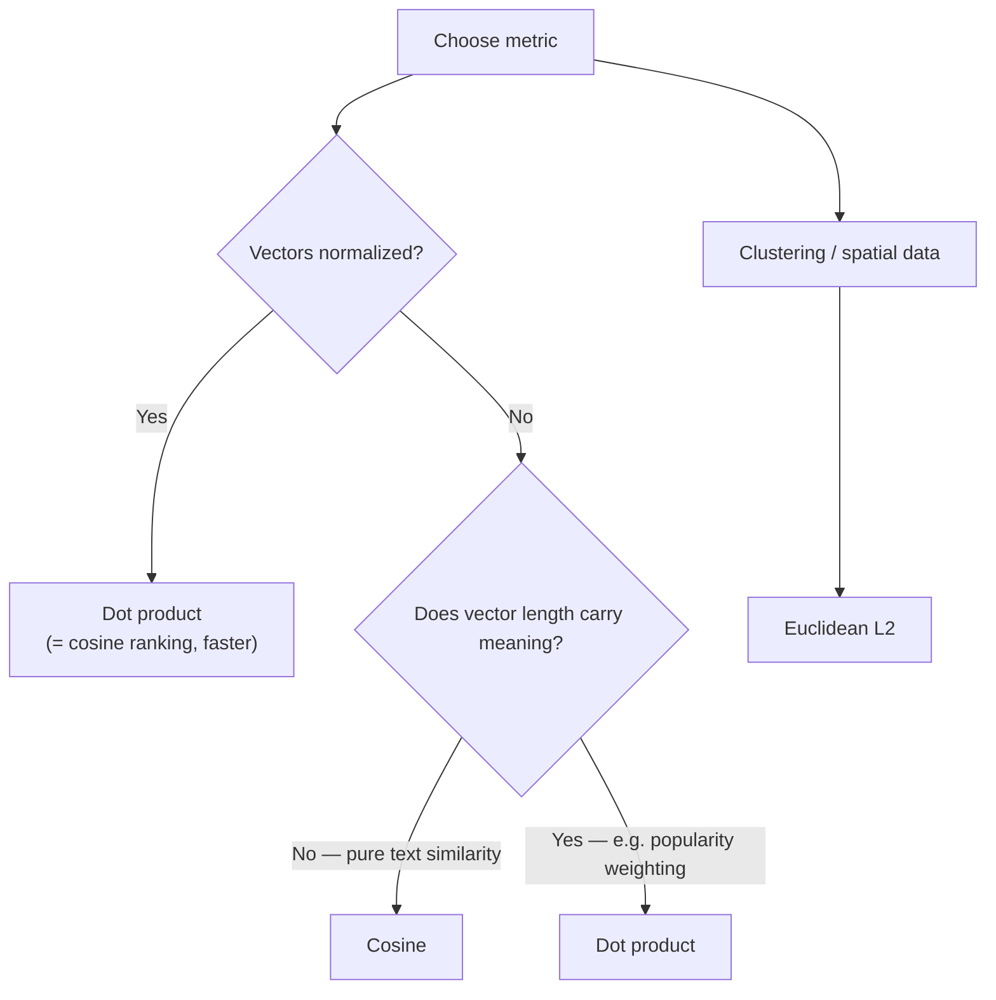

All four workspace projects use **cosine** (`rag-redis`, `chromadb`, `rag-huggingface`, `rag-graph`).

---

## 4. Dense vector search (semantic search)

**Dense vectors** = every dimension holds a value (mostly non-zero). All meaning is compressed into those ~hundreds/thousands of floats. This is what people usually mean by "vector search".

### The flow

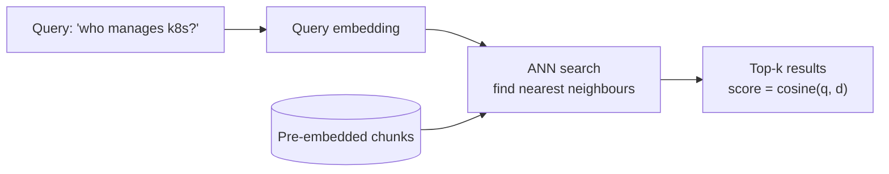

### Strengths & weaknesses

| ✓ Strengths | ✗ Weaknesses |
|---|---|
| Understands synonyms & paraphrase | Misses exact keywords: product codes ("ERR_4021"), names, jargon |
| One number array per doc — simple | Opaque scores — no explanation why something matched |
| Works cross-lingually (multilingual models) | Needs an embedding model at query time |
| Handles long-tail phrasing | Domain drift: medical/legal slang may need fine-tuned models |

---

## 5. Sparse vector search (keyword search)

**Sparse vectors** have one dimension per vocabulary term (~30k–100k dims), almost all zero. A document about "kubernetes clusters" activates only the dimensions for those words.

### Classic: TF-IDF and BM25

- **TF-IDF** — weight a term by how often it appears in the document (TF) × how rare it is across all documents (IDF).
- **BM25** — the industry-standard ranking function (used by Elasticsearch, Redis Search, Postgres FTS). Improves TF-IDF with term-frequency saturation and document-length normalization.

```
BM25(q, d) = Σ  IDF(term) · (tf·(k₁+1)) / (tf + k₁·(1-b+b·|d|/avgdl))
             k₁ ≈ 1.2–2.0 controls TF saturation, b ≈ 0.75 controls length normalization
```

### Learned sparse: SPLADE & friends

Modern models (SPLADE, ELSER, uniCOIL) use a transformer to produce sparse vectors too — but they can **activate terms that don't literally appear** ("k8s" also activates "kubernetes"), giving sparse search some semantic power while keeping exact-match precision.

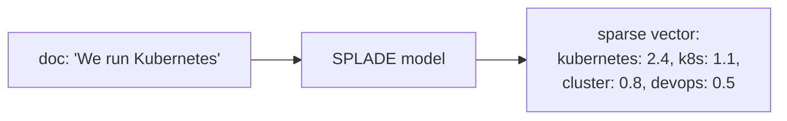

### Dense vs sparse head-to-head

| Aspect | Dense (semantic) | Sparse (keyword/BM25) |
|---|---|---|
| Matches | Meaning | Exact terms |
| Synonyms ("car" ↔ "auto") | ✓ yes | ✗ no |
| Exact identifiers ("GPT-4o", "ERR_4021") | ✗ often missed | ✓ excellent |
| Rare/jargon terms | Weak (underrepresented in training) | Strong (IDF boosts them) |
| New unseen words | Unknown token → poor | Indexed instantly |
| Explainability | Low | High ("matched: kubernetes ×3") |
| Index size | Compact (fixed dims) | Large (vocab-sized) |

**Rule of thumb:** if users search for codes, names, SKUs, error strings, or highly technical jargon — you *need* sparse in the mix.

---

## 6. Hybrid search

Run **both** retrievers and fuse the result lists. This is what production RAG systems converge on.

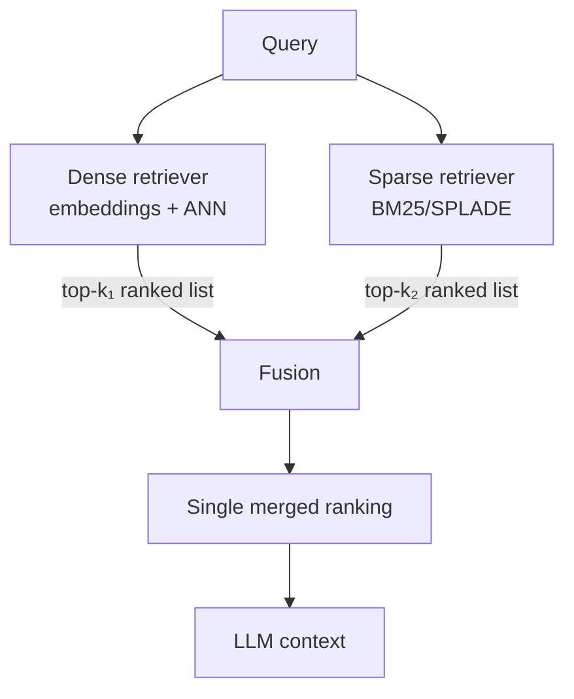

### Fusion methods

**Reciprocal Rank Fusion (RRF)** — the simplest robust choice. Uses only *ranks*, so no score normalization is needed between incomparable metrics (cosine ∈ [-1,1] vs BM25 ∈ [0,∞]):

```
RRF_score(doc) = Σ_over_lists  1 / (k + rank_in_list)        k ≈ 60
```

Example — doc appears 1st in dense, 3rd in sparse:
`1/(60+1) + 1/(60+3) = 0.01639 + 0.01587 = 0.03226`

**Weighted linear combination** — `α·norm(dense_score) + (1-α)·norm(sparse_score)`. More control, but you must normalize scores (min-max or z-score) first, and tune α (typically 0.3–0.7).

| Method | Pros | Cons |
|---|---|---|
| RRF | No tuning, no normalization, robust default | Ignores absolute scores |
| Weighted sum | Tunable to your data | Needs normalization + tuning per dataset |

Redis (RediSearch), Elasticsearch, Weaviate, Qdrant, and Pinecone all ship hybrid search with RRF built in.

### Three-way hybrid: vector + keyword + graph

Add a **graph channel** and you cover all three ways a chunk can be relevant: *semantically similar* (dense), *lexically matching* (sparse), and *relationally connected* (graph).

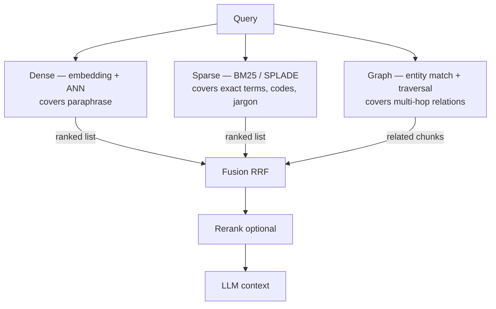

Each channel rescues the others' blind spots:

| Query type | Dense | Sparse | Graph |
|---|---|---|---|
| "how to scale k8s pods" (paraphrase) | ✓ finds it | ✗ if doc says "Kubernetes" | – |
| "ERR_4021 meaning" (exact code) | ✗ weak | ✓ nails it | – |
| "who works on Project Borealis?" (relations) | partial | partial | ✓ traverses people→projects→tech |

### Two patterns for adding the graph channel

**1. Graph as an independent retriever** — extract entities from the query itself, match them against the knowledge graph, pull their chunks. Runs in parallel with dense/sparse; results fused by RRF like any other list.

**2. Graph as post-expansion** *(what `rag-graph` implements)* — vector search first, then walk `RELATES_TO` edges 1–2 hops from the matched chunks' entities to pull neighbouring chunks.

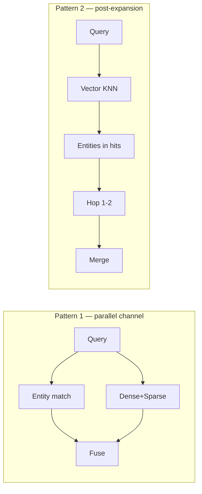

Pattern 1 gives the graph equal voting power; Pattern 2 is simpler and keeps the graph anchored to already-relevant context. Practical tips either way:

- Deduplicate merged chunks by id (a chunk can arrive via multiple channels).
- Cap total context tokens — fusion can over-recall.
- Keep per-channel provenance (`via: 'vector' | 'graph'`) for debugging — `rag-graph` returns this in `/query`.

---

## 7. ANN indexes

Exact nearest-neighbour search compares the query against *every* vector — O(N·d). Fine for thousands, impossible for millions. **Approximate Nearest Neighbour (ANN)** indexes trade a little recall for orders-of-magnitude speedup.

### HNSW — Hierarchical Navigable Small World *(what most systems use)*

A multi-layer graph, like a skip-list: top layers are sparse "highways", bottom layer contains everything.

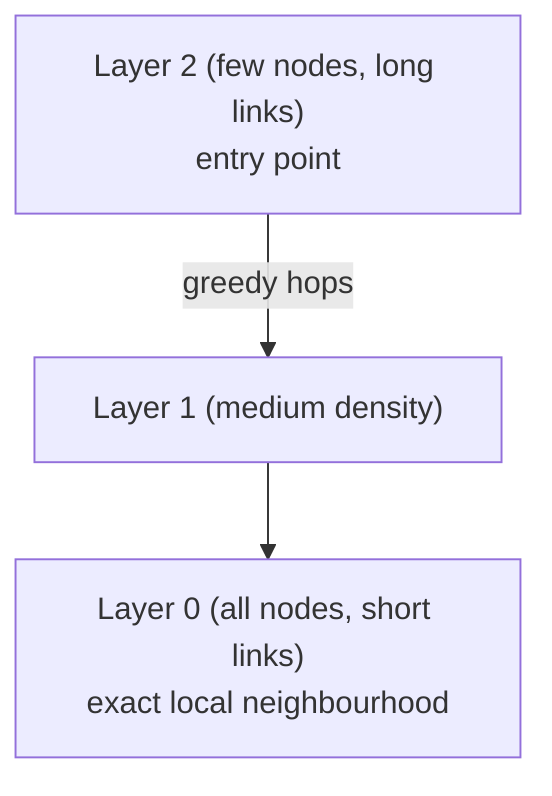

Search: start at the top, greedily move to the neighbour closest to the query, descend a layer when no closer neighbour exists. Result: ~O(log N) queries with 95–99% recall.

| Parameter | Effect |
|---|---|
| `M` (links per node) | ↑ = better recall, more memory |
| `ef_construction` | build-time quality/speed tradeoff |
| `ef_search` | ↑ = better recall, slower queries |

Used by: Redis RediSearch, ChromaDB, Neo4j vector index, Qdrant, pgvector, Milvus.

### IVF — Inverted File Index

Cluster vectors into `nlist` cells with k-means. At query time, compare only against the `nprobe` closest cells.

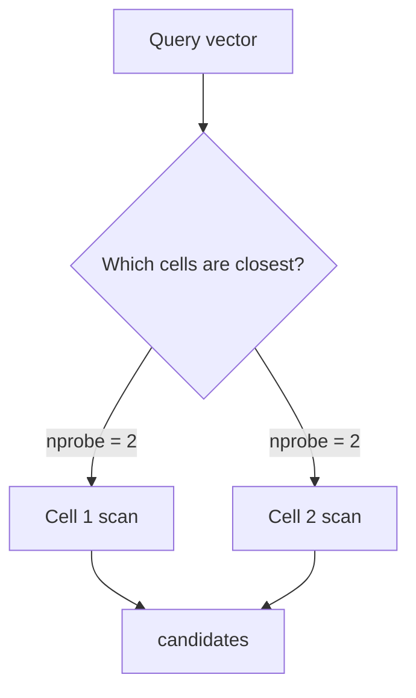

↑`nprobe` = ↑recall, ↑latency. Often combined with PQ for compression (IVF-PQ, used by FAISS at billion scale).

### Quick comparison

| Index | Recall | Speed | Memory | Best for |
|---|---|---|---|---|
| **Flat (brute force)** | 100% | slow at scale | full | <100k vectors, ground truth |
| **HNSW** | 95–99% | very fast | high (graph edges) | default choice |
| **IVF** | tunable | fast | medium | very large datasets |
| **PQ (compression)** | lower | fast | tiny (10–30× less) | memory-constrained, billion-scale |
| **DiskANN** | high | fast | disk-friendly | SSD-backed billion-scale |

---

## 8. Chunking strategies

Retrieval quality is capped by chunk quality. An embedding of a 20-page blob is meaningless mush; a 50-token sliver lacks context.

| Strategy | How | Tradeoff |
|---|---|---|
| **Fixed-size** | split every N tokens, overlap M | simple, predictable; can cut mid-sentence |
| **Sentence-based** | group sentences up to a max size | respects grammar; needs overlap to bridge topics |
| **Recursive** | try paragraphs → sentences → words → chars until fits | LangChain default; good generalist |
| **Semantic** | embed sentences, cut where similarity between adjacent sentences drops | highest quality; costs extra embedding calls |
| **Document-aware** | split on markdown headers / code functions / JSON keys | best for structured docs |

Rules of thumb:

- **Overlap 10–20%** of chunk size so entities at boundaries survive.
- **256–1024 tokens** is the sweet spot for most RAG.
- Chunk size should match what the *answer* needs, not the document's structure.
- `rag-graph` uses sentence-based chunking with overlap (`chunkText()` in `ingest.ts`).

---

## 9. Reranking

Retrieval optimizes for *speed* over a million documents; reranking optimizes for *precision* over the top few dozen.

### Bi-encoder vs cross-encoder

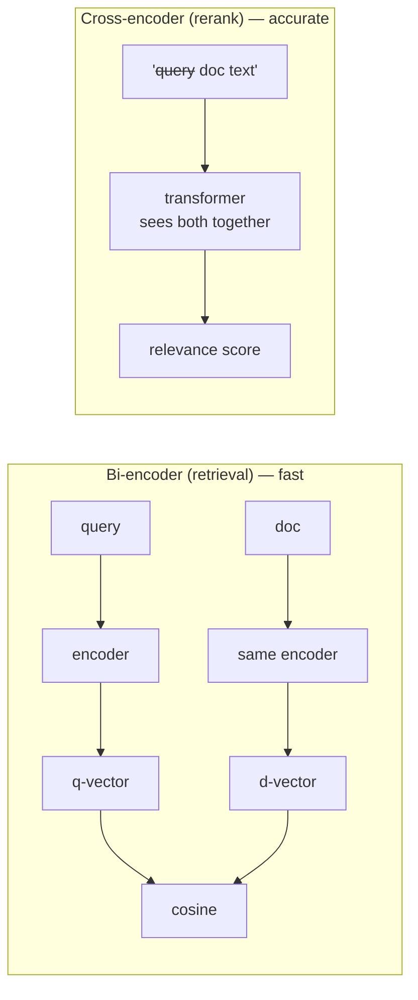

The cross-encoder reads query and document *together* through every attention layer, so it catches interactions bi-encoders can't — but it must run once per candidate, making it far too slow for full-corpus search.

### The production pattern

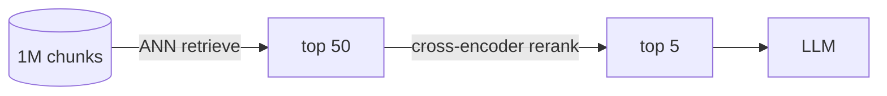

Typical gain: feeding the LLM the *right* 5 chunks instead of 5 loosely-related ones — fewer hallucinations, lower token cost. Models: `cohere-rerank`, `bge-reranker`, `ms-marco-MiniLM-L-6-v2`.

---

## 10. Metadata filtering

Pure similarity knows nothing about permissions, dates, or categories. Real systems combine vector search with structured filters.

| Approach | How | Problem |
|---|---|---|
| **Post-filter** | ANN search → filter results afterwards | may return fewer than k results (or none) |
| **Pre-filter** | filter candidates first → ANN within subset | correct, needs index support |
| **Filtered HNSW** | traverse graph but only keep allowed nodes | best of both; supported by Qdrant, Redis, Pinecone |

```
// Redis example (rag-redis pattern)
FT.SEARCH idx:movies '@genre:{Thriller} =>[KNN 10 @embedding $vec AS score]'
//            └── pre-filter          └── KNN within filtered set
```

---

## 11. Storage optimization: quantization

At 1536 dims × float32, one vector = 6 KB. Ten million chunks = **~60 GB** before metadata. Quantization shrinks that:

| Technique | Bits/dim | Compression | Recall hit |
|---|---|---|---|
| float32 (baseline) | 32 | 1× | — |
| **Scalar int8** | 8 | 4× | minimal |
| **Binary** | 1 | 32× | noticeable; rescore with originals |
| **Product quantization** | ~4–8 effective | 10–30× | moderate |

Common pattern: store binary/int8 vectors in the index for fast coarse search, then re-rank the shortlist against original float32 vectors.

---

## 12. Vector database landscape

| Database | Type | Hybrid? | Notes |
|---|---|---|---|
| **ChromaDB** | embedded/server | ✓ (BM25/SPLADE sparse + server-side RRF via `Search()` API) | simplest start; used in `chromadb`, `rag-hybrid` |
| **Pinecone** | managed cloud | ✓ | serverless, zero ops; used in `rag-huggingface` |
| **Redis + RediSearch** | in-memory | ✓ (RRF built-in) | microsecond latency; used in `rag-redis` |
| **Neo4j** | graph + vector | via Cypher | vector index + graph traversal; used in `rag-graph` |
| **pgvector** | Postgres extension | ✓ | reuse existing Postgres ops |
| **Qdrant** | open-source | ✓ | strong filtering, quantization |
| **Weaviate** | open-source/cloud | ✓ | modular embedding integration |
| **Milvus** | distributed | ✓ | billion-scale |
| **FAISS** | library (not a DB) | ✗ | raw speed; you build the rest |

**Selection heuristic:** prototype with Chroma/pgvector → scale to Redis/Qdrant/Pinecone → Neo4j when relationships matter as much as similarity.

---

## 13. Concept → project map

| Concept | Where in this workspace |
|---|---|
| Dense embeddings (1536d, cosine) | `rag-redis`, `chromadb`, `rag-graph` |
| Free embeddings (384d MiniLM) | `rag-huggingface` |
| HNSW vector index | `rag-redis` (RediSearch), `rag-graph` (Neo4j), `chromadb` |
| KNN query | `rag-redis` `ft.search ... [KNN 10]`, `rag-graph` `db.index.vector.queryNodes` |
| Hybrid retrieval (vector + graph expansion) | `rag-graph` |
| Chunking with overlap | `rag-graph` `chunkText()` |
| Metadata fields alongside vectors | `rag-redis` (genre/year/actors tags) |
| Vector + LLM generation | all RAG projects |

---

## Further reading

- `ts/rag-graph/CONCEPTS.md` — GraphRAG deep dive
- `docs/introduction-to-rag.md` — RAG pipeline basics
- [OpenAI embeddings guide](https://platform.openai.com/docs/guides/embeddings)
- [HNSW paper](https://arxiv.org/abs/1603.09320) · [BM25 explained](https://www.elastic.co/blog/practical-bm25-part-2-the-bm25-algorithm-and-its-variables) · [SPLADE paper](https://arxiv.org/abs/2107.05720)