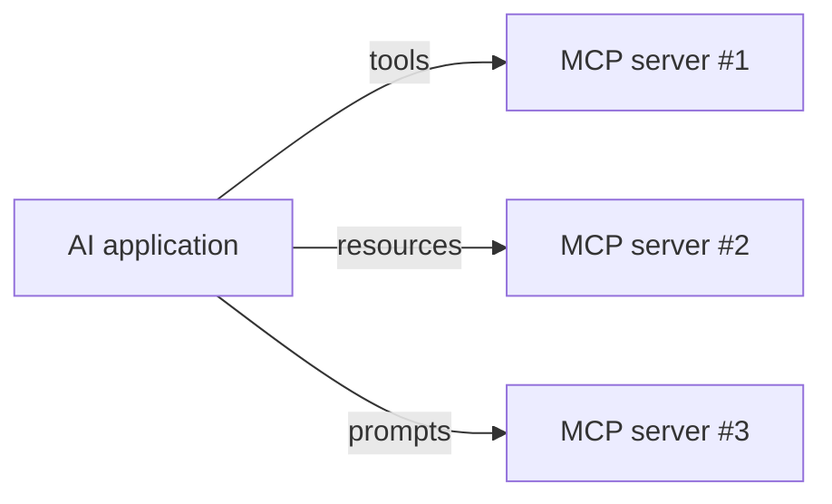

# What is MCP?

**MCP** (Model Context Protocol) is a standardized protocol for connecting AI applications to external tools, data sources, and prompts. It defines a client–server protocol with three kinds of artifacts: **tools**, **resources**, and **prompts**, and three transports: **`stdio`**, **`http`**, and **`sse`**.

## Why MCP?

- **Standardization**: Instead of each integration having its own API, MCP provides a common contract.
- **Composability**: Multiple servers can be connected to a single agent (the `mcp-client` connects to 3 servers at once).
- **Local-first**: Servers can run as subprocesses (`stdio`), keeping data on-premises and avoiding API keys for simple use cases.

## Three artifact types

| Type | What it is | Purpose |
|---|---|---|
| **Tools** | Callable functions the LLM can invoke | Perform actions: query a DB, convert currency, read a file |
| **Resources** | Readable data or schemas | Expose a database schema, a directory of files, a config reference |
| **Prompts** | Reusable prompt templates | Pre-built prompt structures the LLM can use without engineering |

## Three transports

| Transport | How it works | When to use |
|---|---|---|
| **`stdio`** | Server runs as a subprocess; JSON-RPC over stdin/stdout. | Local development, testing, on-premises data. |
| **`http`** | Server exposed over HTTP; JSON-RPC over POST requests. | Remote servers, production, language-agnostic clients. |
| **`sse`** | Server sends events over a persistent SSE connection; good for streaming. | Real-time feedback, streaming responses. |

## MCP in this workspace

| Project | Role | Tools | Resources | Prompts |
|---|---|---|---|---|
| `mcp-server-mongo` | MCP server for MongoDB | `query`, `count`, `serverInfo` | `mongodb://collections`, `mongodb://collections/{name}` | `analyse-collection`, `query-helper`, `data-exploration`, `performance-review`, `find-recent` |
| `mcp-client` | MCP client (Express) | Connects to 3 servers (filesystem, MongoDB, currency converter) | — | — |
| `mcp-server-mongo-v2` | Newer MCP server impl. | — | — | — |

## Quick comparison

| Feature | `stdio` | `http` / `sse` |
|---|---|---|
| Setup | `command + args` in config | URL + API key |
| Data locality | Data stays on the machine running the subprocess | Data lives on the remote server |
| Debugging | Easy — stdout/stderr visible | Requires network inspection |
| Production readiness | Good for local/cli tools | Better for remote/hosted services |

## Quick map: MCP → Projects

| Project | Role |
|---|---|
| `mcp-client` | Client connecting to MCP servers over stdio/http |
| `mcp-server-mongo` | MCP server for MongoDB (3 tools, 2 resources, 5 prompts) |
| `mcp-server-mongo-v2` | MCP server using the newer SDK v2 API |

---

## Next steps

- Read `mcp-client/server.ts` to see how the client connects to servers.
- Read `mcp-server-mongo/server.ts` to see the server implementation.
- Check the `docs/` folder for more overviews as they're added.