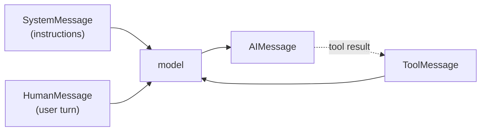
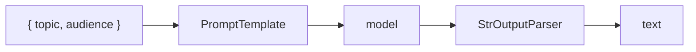
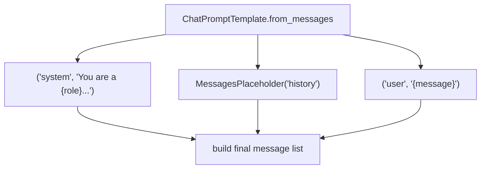
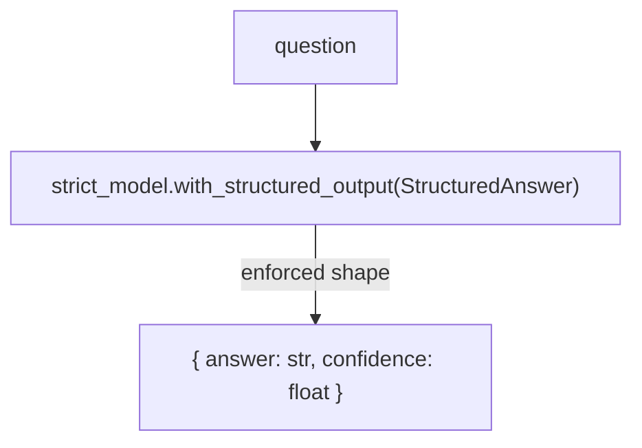
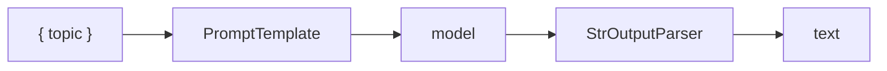
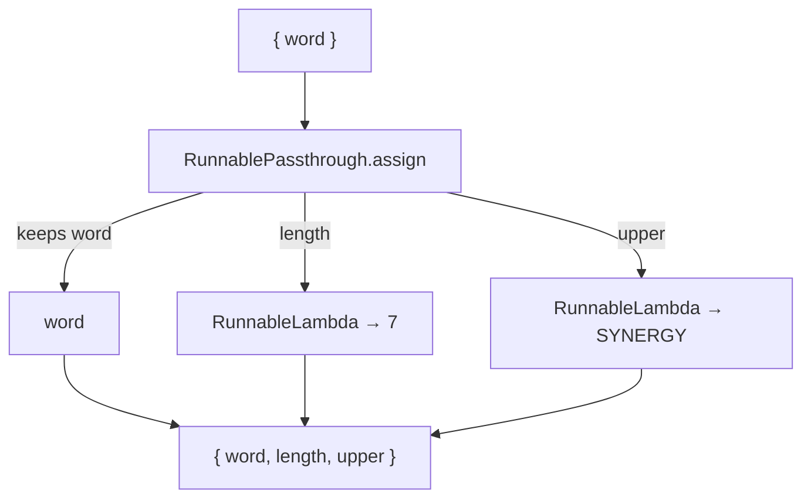
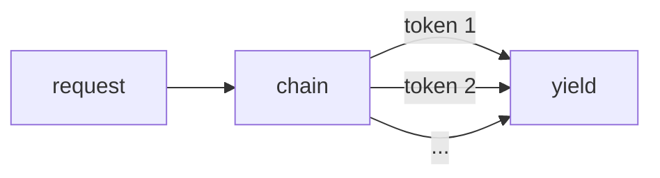
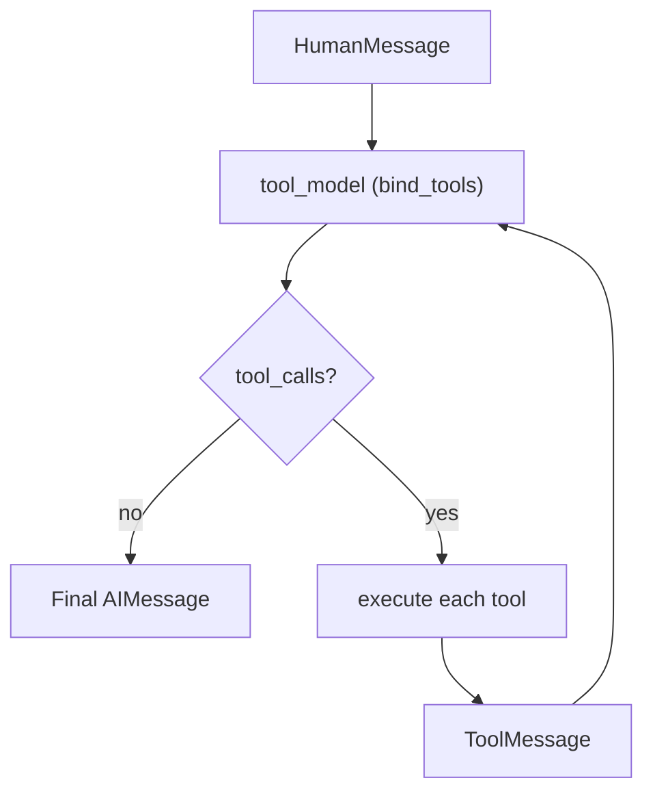
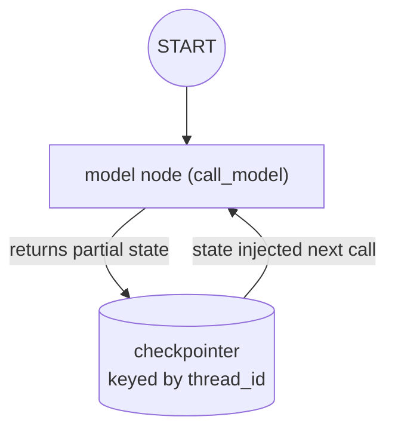
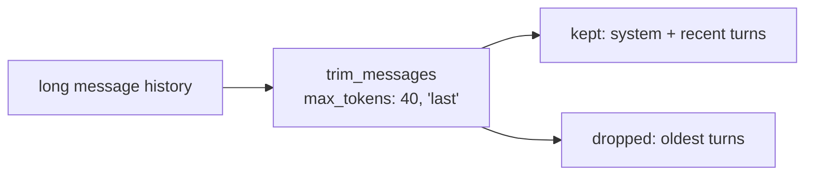

# langchain (Python) — Concepts

The concepts behind this project, with diagrams. Read this to understand *what* each major LangChain building block is, *why* it exists, and *how* this project uses it — and how it maps to the TypeScript [`ts/langchain`](../../ts/langchain) sibling.

> Diagrams are [Mermaid](https://mermaid.js.org/) — rendered automatically on GitHub.
> For the underlying theory (tokens, temperature, context), see [`docs/llm-fundamentals.md`](../../docs/llm-fundamentals.md) at the repo root.

---

## Table of contents

1. [The two models](#1-the-two-models)
2. [Message roles](#2-message-roles)
3. [`PromptTemplate`](#3-prompttemplate)
4. [`ChatPromptTemplate` + `MessagesPlaceholder`](#4-chatprompttemplate--messagesplaceholder)
5. [Structured output](#5-structured-output)
6. [LCEL: the `|` operator](#6-lcel-the--operator)
7. [Runnable primitives](#7-runnable-primitives)
8. [Streaming](#8-streaming)
9. [Tool calling](#9-tool-calling)
10. [LangGraph state & memory](#10-langgraph-state--memory)
11. [Message trimming](#11-message-trimming)
12. [Concept → code map](#12-concept--code-map)

---

## 1. The two models

Like the TS sibling, the app builds **two** `ChatOpenAI` instances — same model, different temperature ([llm-fundamentals.md §5](../../docs/llm-fundamentals.md#5-sampling-temperature--friends)):

```python
model = ChatOpenAI(model="gpt-4o", temperature=0.7)        # chat — creative
strict_model = ChatOpenAI(model="gpt-4o", temperature=0)   # tools/structured — deterministic
```

| Model | Temp | Used by | Why |
|---|---|---|---|
| `model` | 0.7 | `/messages`, `/prompt`, `/chat-prompt`, `/memory` | chat should vary in tone |
| `strict_model` | 0 | `/structured`, `/stream`, `/tools` | the *shape* of the output must be stable |

Rule of thumb: **format matters more than wording** (JSON, tool args, extraction) → `temperature: 0`. **Expressiveness matters** → higher.

---

## 2. Message roles

`/messages`

Chat models read a **list of typed messages**, and roles are not cosmetic. The model uses them to know who said what.

| Role | Class | Meaning |
|---|---|---|
| `system` | `SystemMessage` | instructions / persona |
| `user` | `HumanMessage` | the person's turns |
| `assistant` | `AIMessage` | the model's own turns (fed back as history) |
| `tool` | `ToolMessage` | result of a tool call |



The `/messages` route is the minimal example: a `SystemMessage` plus a `HumanMessage` passed straight to `await model.ainvoke(messages)`. The route returns the class names so you can see the roles in action.

---

## 3. `PromptTemplate`

`/prompt`

A text string with `{variable}` placeholders filled at invoke time.

```python
prompt = PromptTemplate.from_template(
    "Write a short intro to {topic} for {audience}. Keep it to three sentences."
)
output = await (prompt | model | StrOutputParser()).ainvoke({"topic": topic, "audience": audience})
```



Two things to notice:

- **Structural separation** — the template declares *what varies* and the invoke fills it.
- **It composes** — `prompt | model | parser` is the LCEL chain (see §6); the route also echoes the rendered prompt via `prompt.format(...)`.

---

## 4. `ChatPromptTemplate` + `MessagesPlaceholder`

`/chat-prompt`

For chat, `ChatPromptTemplate` builds **role-tagged messages**, and `MessagesPlaceholder` is the seam that injects prior conversation.

```python
prompt = ChatPromptTemplate.from_messages(
    [
        ("system", "You are a {role} who explains with an analogy."),
        MessagesPlaceholder("history"),
        ("user", "{message}"),
    ]
)
```



The `{role}` variable changes the persona. The `MessagesPlaceholder('history')` is where prior messages go — what turns a one-shot prompt into a conversation. `/chat-prompt` passes `history: []` for simplicity; `/memory` (§10) shows it filled for real.

---

## 5. Structured output

`/structured`

`with_structured_output` forces the model to return a value matching a **Pydantic model** — the most reliable way to get machine-readable output. (Zod in TypeScript ↔ Pydantic in Python.)

```python
class StructuredAnswer(BaseModel):
    answer: str
    confidence: float

structured_model = strict_model.with_structured_output(StructuredAnswer)
response = await structured_model.ainvoke(question)
# => StructuredAnswer(answer='...', confidence=0.95)
```



Why it works: the model's tool-calling machinery is trained to emit **valid JSON matching a schema**, whereas prose instructions rely on the model's goodwill. This is also the mechanism behind tool calling (§9) — a tool's schema *is* a prompt.

---

## 6. LCEL: the `|` operator

`/chain`

The LangChain Expression Language (LCEL) is the composition syntax: build a pipeline of runnables with `|`, then `.ainvoke()` / `.astream()` it. In Python, `|` replaces the TS `.pipe()`.

```python
chain = prompt | model | StrOutputParser()
output = await chain.ainvoke({"topic": topic})
```



`prompt | model | parser` and TS `prompt.pipe(model).pipe(parser)` are equivalent — the choice is language style. The key idea: **everything is a runnable**, so you compose small pieces into a larger one that's itself runnable.

---

## 7. Runnable primitives

`/lc`

Two composition primitives for building up data inside a chain — no model call involved:

| Primitive | What it does |
|---|---|
| `RunnablePassthrough` | passes a value through unchanged; `.assign()` adds computed fields |
| `RunnableLambda` | wraps your own function as a runnable |

```python
echo_and_count = RunnablePassthrough.assign(
    length=RunnableLambda(lambda i: len(i["word"])),
    upper=RunnableLambda(lambda i: i["word"].upper()),
)
result = await echo_and_count.ainvoke({"word": "synergy"})
# => {"word": "synergy", "length": 7, "upper": "SYNERGY"}
```



`.assign()` adds keys to the input dict, so you derive new values alongside the original data. `RunnableLambda` is how you write your own chain step. In Python these take a `lambda` instead of TS's `RunnableLambda.from(fn)`.

---

## 8. Streaming

`/stream`

`.astream()` yields tokens as they are generated rather than waiting for the full answer. Because latency is dominated by output tokens (each is a serial step), this is how a response *feels* fast. The chain is identical — only the consumption differs.

```python
async def token_stream() -> AsyncIterator[str]:
    async for chunk in chain.astream({"message": req.message}):
        yield chunk

return StreamingResponse(token_stream(), media_type="text/plain; charset=utf-8")
```



This route streams plain text. In TS this is done with `res.write`; in FastAPI it's a `StreamingResponse` over an async generator. For a browser UI you'd wrap the same chain in SSE — the point is that streaming is an **output mode**, not a different pipeline.

---

## 9. Tool calling

`/tools`

Tools give the model the ability to *do something* — a function with a docstring (the description), and typed args. The model decides when to call one and fills the args from natural language.

```python
@tool
def multiply(a: int, b: int) -> str:
    """Multiply two numbers. Call this when the user asks for a product."""
    return str(a * b)

tools = [multiply, add]
tool_model = strict_model.bind_tools(tools)
```

Tool calling requires a **loop**: the model returns tool calls (arguments, not results), you execute each, feed the `ToolMessage` back, and the model re-decides — until it produces a final answer with no tool calls.



```python
for step in range(10):
    ai_message = await tool_model.ainvoke(messages)
    messages.append(ai_message)
    if not ai_message.tool_calls:
        return {"messages": len(messages), "steps": step + 1, "answer": ai_message.content}
    for call in ai_message.tool_calls:
        found = next((t for t in tools if t.name == call["name"]), None)
        result = await found.ainvoke(call["args"]) if found else "unknown tool"
        messages.append(ToolMessage(tool_call_id=call["id"], content=str(result)))
```

Why the loop matters: *"What is 4 plus 6, then double the result?"* needs **two** tool calls (add → multiply). The loop lets the model chain as many calls as the task requires. The `steps` count shows how many model turns it took.

> In TS the docstring equivalent is the tool `description` and a Zod `schema`. In Python `@tool` derives both from the function's docstring and type hints.

---

## 10. LangGraph state & memory

`/memory`

The modern replacement for the deprecated `RunnableWithMessageHistory` is a **LangGraph `StateGraph` with a checkpointer**. State is persisted keyed by `thread_id`.

```python
class GraphState(TypedDict):
    messages: Annotated[list, add_messages]
    skill: str
    message: str

def call_model(state: GraphState) -> dict:
    prompt = ChatPromptTemplate.from_messages([
        ("system", "You are an assistant who is good at {skill}."),
        MessagesPlaceholder("messages"),
    ])
    chain = prompt | model
    response = chain.invoke({"skill": state["skill"], "messages": state["messages"]})
    return {"messages": [AIMessage(content=response.content)]}

workflow = StateGraph(GraphState)
workflow.add_node("model", call_model)
workflow.add_edge(START, "model")
memory_graph = workflow.compile(checkpointer=MemorySaver())
```



Two ideas:

- **State** — a node receives the current state and returns a *partial* update; LangGraph merges it and persists. `Annotated[list, add_messages]` is the reducer that makes the `messages` list *accumulate* across turns (also what `MessagesAnnotation.spec` handles in TS).
- **Checkpointer** — `MemorySaver` keeps state in-process, so history resets on restart. Swap for `SqliteSaver` / `PostgresSaver` for durability.

The `thread_id` is the conversation key: two requests with the same `thread_id` share history. This is what makes *"My name is Dilum"* followed by *"What is my name?"* recall correctly.

---

## 11. Message trimming

`/trim`

Long conversations overflow the context window. `trim_messages` keeps only the most recent tokens within a budget.

```python
trimmed = trim_messages(
    messages,
    max_tokens=40,
    strategy="last",
    token_counter=token_counter,
    include_system=True,
    start_on="human",
    allow_partial=True,
)
```



The route uses a simple `token_counter` (chars ÷ 4) as a stand-in for a real tokenizer. In production you'd use a model tokenizer — see [`ai-agents.md`](../../docs/ai-agents.md) and [`llm-fundamentals.md`](../../docs/llm-fundamentals.md#3-the-context-window).

---

## 12. Concept → code map

| Concept | Where |
|---|---|
| Two models (temp 0.7 vs 0) | top of `src/langchain_python/main.py` (`model`, `strict_model`) |
| Message roles | `/messages` handler |
| `PromptTemplate` + variable | `/prompt` handler |
| `ChatPromptTemplate` + `MessagesPlaceholder` | `/chat-prompt` handler |
| `with_structured_output` + Pydantic | `/structured` handler + `StructuredAnswer` |
| LCEL `|` operator | `/chain` handler |
| Runnable primitives (`Passthrough`/`Lambda`) | `/lc` handler |
| Streaming (`astream`) | `/stream` handler |
| `bind_tools` loop | `/tools` handler + `multiply`/`add` |
| `StateGraph` + `MemorySaver` | `call_model`, `GraphState`, `workflow` |
| `thread_id` persistence | `/memory` handler |
| `trim_messages` | `/trim` handler |

---

## Further reading

- [langchain-fundamentals.md](../../docs/langchain-fundamentals.md) — prompts, messages, LCEL in depth
- [langchain-vs-langgraph.md](../../docs/langchain-vs-langgraph.md) — chains vs graphs, and the v2.0 deprecations
- [ai-agents.md](../../docs/ai-agents.md) — the ReAct loop this project's tool-calling section scaffolds
- [`../ts/langchain/CONCEPTS.md`](../ts/langchain/CONCEPTS.md) — the TypeScript sibling
- `src/langchain_python/main.py` — the working implementation
