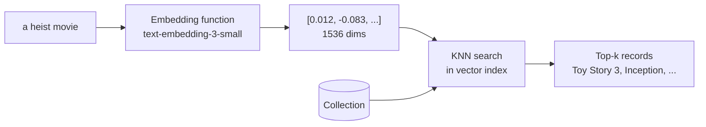
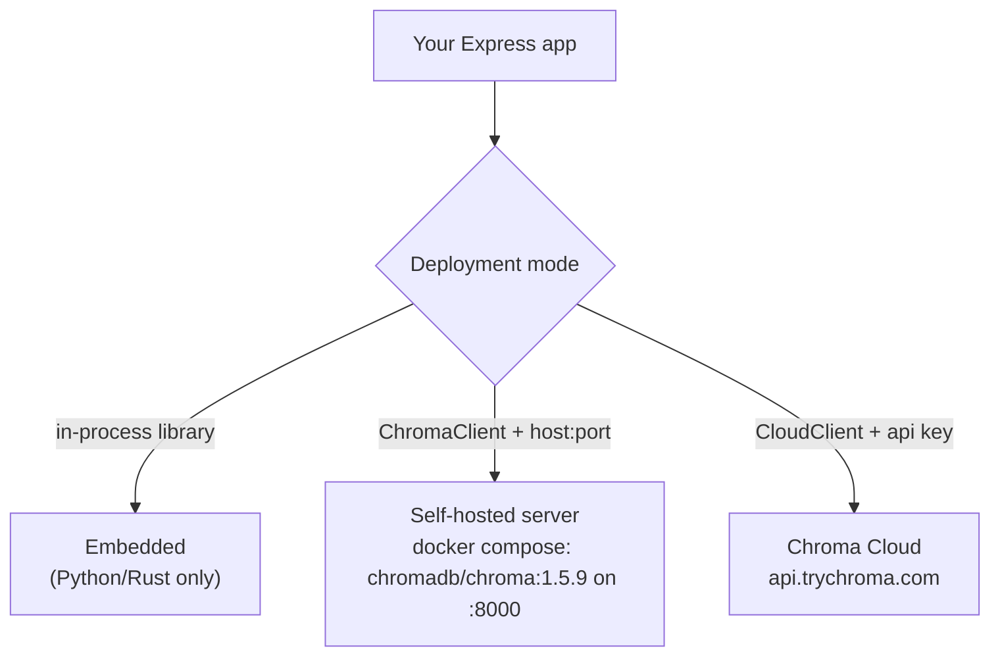
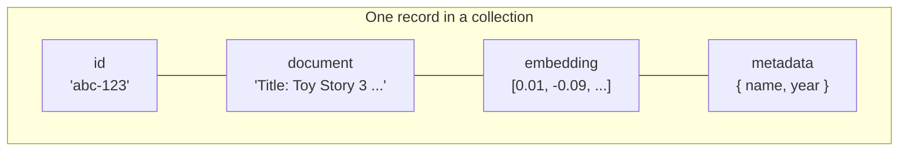
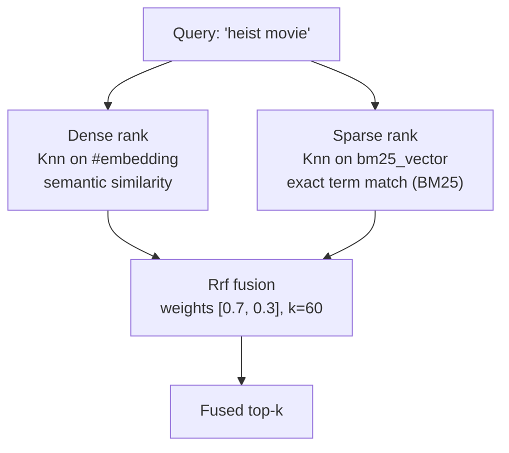
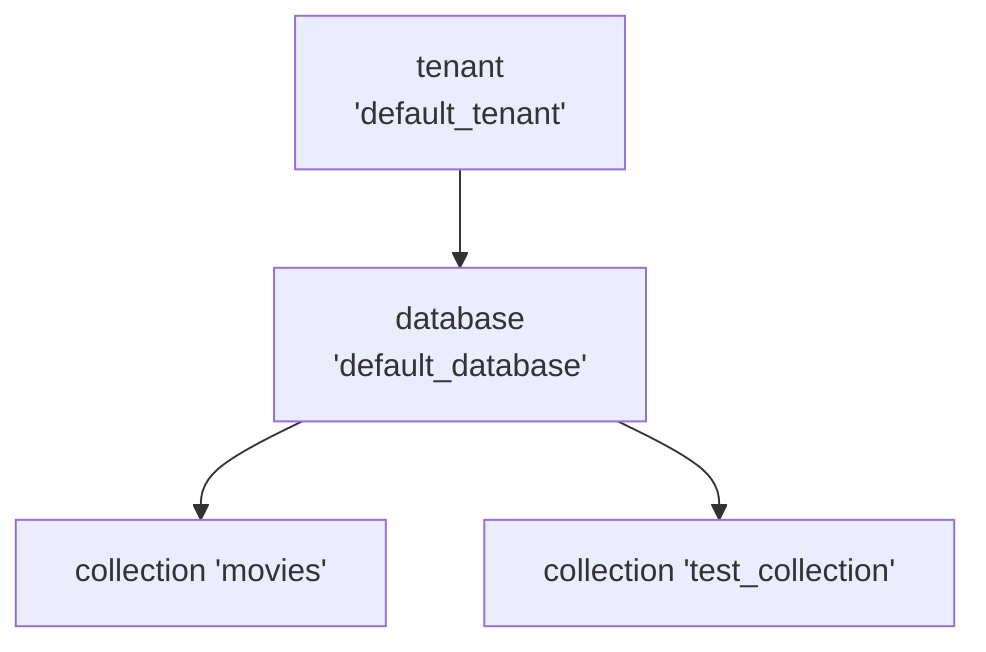

# chromadb — Concepts

The concepts behind ChromaDB, with diagrams. Read this to understand *what* an embedding database is, *how* Chroma stores and searches data, and *how* this project uses it.

> Diagrams are [Mermaid](https://mermaid.js.org/) — rendered automatically on GitHub.
> For the underlying theory (ANN, HNSW, BM25, RRF), see [`docs/vector-search.md`](../../docs/vector-search.md) at the repo root.

---

## 1. ChromaDB in one sentence

ChromaDB is an **embedding database**: you give it text, it stores the text alongside its vector embedding and metadata, and later finds records whose *meaning* is closest to a query — not just records containing matching keywords.



"Similar meaning" means *close in vector space*: "a heist movie" lands near "criminal mastermind adopts orphans to carry out the biggest heist in history", even though they share almost no words.

---

## 2. Three ways to run it

Same API surface, three deployment targets — only the client constructor changes:



This project defaults to **Cloud** (`CloudClient` in `server.ts`); for Docker you swap one commented block. Everything else — collections, queries, chat — is identical.

- **Heartbeat** — `client.heartbeat()` is the liveness probe; this project calls it at startup and in `GET /health`.
- **Identity** — `getUserIdentity()` reveals which tenant/databases your credentials resolve to.

---

## 3. The data model

Everything lives inside a **collection** (think: table + namespace). A record has four parts:



| Part | Type | Required | Role |
|---|---|---|---|
| `id` | string | ✓ | unique key; upserting by id overwrites |
| `document` | string | optional | raw text; embedded automatically if no vector given |
| `embedding` | number[] | optional | pre-computed vector; skips client-side embedding |
| `metadata` | object | optional | scalar JSON (`string`/`number`/`bool`) used for **filtering** |

Key rule: **the embedding is derived from the document** by the collection's embedding function — you rarely pass vectors by hand.

---

## 4. Embedding functions

An embedding function is the pluggable bridge between text and vectors:

```ts
const embedder = new OpenAIEmbeddingFunction({
  apiKey: process.env.OPENAI_API_KEY,
  modelName: 'text-embedding-3-small', // 1536 dimensions
});

const collection = await client.createCollection({
  name: 'test_collection',
  embeddingFunction: embedder,
});
```

What it does implicitly:

- `collection.add({ documents })` → embeds each document before storing
- `collection.query({ queryTexts })` → embeds each query before searching

Two gotchas:

1. **Consistency** — ingest and query must use the *same model*. Vectors from different models live in incompatible spaces; mixing them silently returns garbage.
2. **Binding time** — the function is attached when the collection is created and remembered in its config. Later handles fetched via `getCollection` must be given the same function.

---

## 5. Similarity search

Under the hood a collection maintains an ANN index (**HNSW**) over the embeddings. A query becomes: embed → traverse the graph of vectors → return k nearest neighbours with their distances.

| Distance | 0 means | Range | This project |
|---|---|---|---|
| `cosine` | identical direction (same meaning) | 0–2 | default choice |
| `l2` | identical point | 0–∞ | |
| `ip` | maximally aligned (inner product) | −∞–∞ | |

The API returns **distances**, not similarity scores — smaller is better. For cosine, similarity ≈ `1 - distance`.

Classic query shape:

```ts
const results = await collection.query({
  queryTexts: ['1971 movies?'],
  nResults: 1,
});
// results.ids / documents / metadatas / distances — one array per query text
```

---

## 6. Filtering

Vector search answers *"what is similar?"*; filters answer *"of those, what matches these facts?"*. Two independent filter axes:

**Metadata filter** (`where`) — exact scalars:

| Operator | Meaning | Example |
|---|---|---|
| `$eq` / `$ne` | equals / not equals | `{ year: { $eq: 2010 } }` |
| `$gt` `$gte` `$lt` `$lte` | numeric comparison | `{ year: { $gt: 2000 } }` |
| `$in` / `$nin` | membership | `{ genre: { $in: ['Comedy'] } }` |
| `$and` / `$or` | combine clauses | `{ $and: [{...}, {...}] }` |

**Document filter** (`where_document`) — text-level:

| Operator | Meaning |
|---|---|
| `$contains` | substring match |
| `$not_contains` | exclusion |
| `$regex` | pattern match |

Both compose with any query: `query({ queryTexts, where: { year: 2010 }, where_document: { $contains: 'Animation' } })`.

> Note: `$contains` is a *filter*, not ranked keyword search — that's what sparse/BM25 indexes are for (§8).

---

## 7. Write path

Four write operations, distinguished by how they treat existing ids:

| Operation | Existing id | Missing id | Use case |
|---|---|---|---|
| `add` | ❌ error | insert | append-only logs |
| `update` | patch | ❌ silent skip | touch known rows |
| `upsert` | overwrite | insert | idempotent sync ← usually right |
| `delete` | remove | — | cleanup, by ids or filter |

This project's `/add` endpoint generates a random id per call (`Date.now()` + random suffix) — so re-running `test.rest` request 3 **duplicates** documents instead of updating them. Deterministic ids (e.g. slugified titles) + `upsert` would make ingestion idempotent.

---

## 8. The new Search API & hybrid search

Beyond classic `query()`, recent Chroma versions expose a schema system and a composable `Search()` API — the foundation for **hybrid search** (dense + sparse in one engine):



Building blocks (all exported by the `chromadb` npm package):

| Piece | Purpose |
|---|---|
| `Schema().createIndex(config, key?)` | declare indexes on a collection |
| `VectorIndexConfig` | dense index (HNSW, cosine/l2/ip) + embedding fn |
| `SparseVectorIndexConfig` | sparse index — `bm25: true`, or SPLADE (cloud) |
| `Knn({ query, key?, limit? })` | one ranking channel; `query` can be text (auto-embedded) or a vector |
| `Rrf({ ranks, weights, k })` | server-side Reciprocal Rank Fusion of channels |
| `Search().where().rank().limit().select()` | builder executed via `collection.search(...)` |

```ts
const search = new Search()
  .rank(Rrf({
    ranks: [
      Knn({ query, limit: 30, returnRank: true }),
      Knn({ query, key: 'bm25_vector', limit: 30, returnRank: true }),
    ],
    weights: [0.7, 0.3],
    k: 60,
  }))
  .limit(5)
  .select(K.DOCUMENT, K.METADATA, K.SCORE);

const result = await collection.search(search);
result.rows()[0]; // [{ id, document, metadata, score }]
```

Why it matters: pure dense search misses exact tokens (titles, codes, names); pure keyword misses paraphrases. Fusion rescues both blind spots — see [vector-search.md §6](../../docs/vector-search.md).

> The upcoming `rag-hybrid` project builds exactly this on top of the same Docker image.

---

## 9. Tenants, databases, persistence



- **Tenant → database → collection** is the isolation hierarchy. Cloud tenants come from your API key; self-hosted defaults are shown above.
- **Persistence** — the Docker container writes to `/data`; the compose file bind-mounts `./chromadb-data` so data survives restarts (`IS_PERSISTENT=true`).
- **In-memory things die with the process** — Chroma persists collections, but this project's chat history (`Map` in `server.ts`) does not survive restarts.

---

## 10. Concept → code map

| Concept | Where |
|---|---|
| Cloud vs self-hosted clients | `server.ts` (top, commented blocks) |
| Embedding function binding | `embedder` in `server.ts` |
| Collection creation | `POST /collections` handler |
| Write path (random-id gotcha) | `POST /collections/:name/add` handler |
| Vector query (top-1) | `POST /collections/:name/query` handler |
| RAG chain (retrieve → prompt → LLM) | `POST /chat` handler |
| Session history (in-memory) | `chatHistories` Map in `server.ts` |
| Liveness probe | `GET /health` + startup heartbeat |
