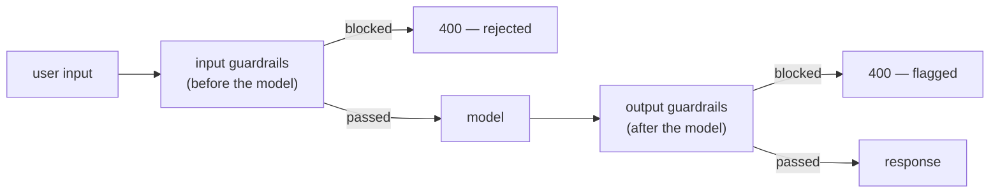
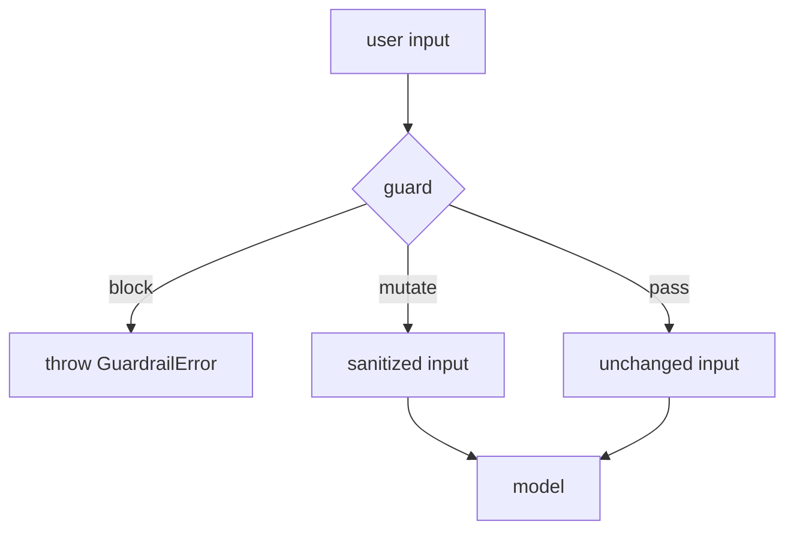
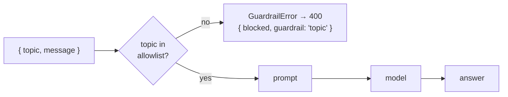
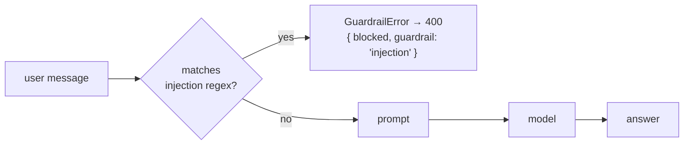
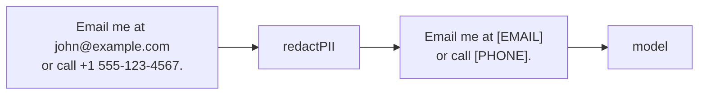
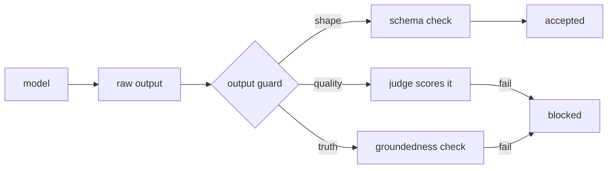
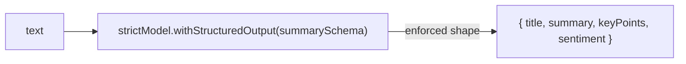
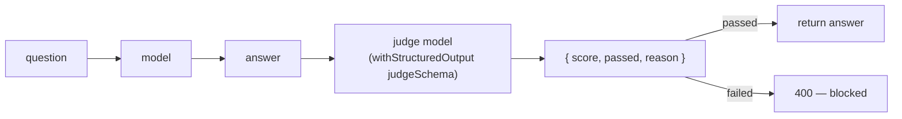
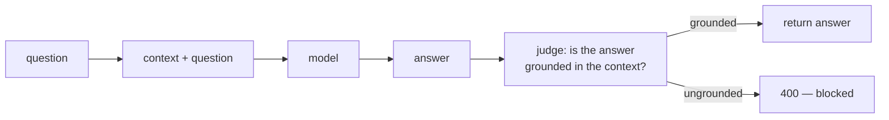
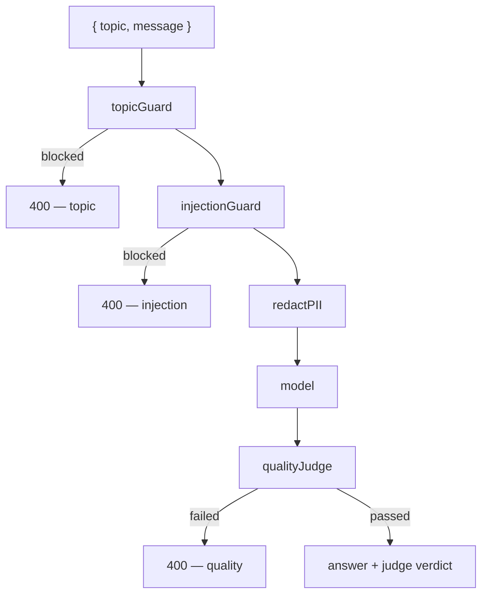

# guardrails — Concepts

The concepts behind this project, with diagrams. Read this to understand *what* guardrails are, *why* they exist, and *how* this project implements each one. Each concept lives in its own route, in the same order as the sections below.

> Diagrams are [Mermaid](https://mermaid.js.org/) — rendered automatically on GitHub.

---

## Table of contents

1. [What are guardrails?](#1-what-are-guardrails)
2. [Input guardrails](#2-input-guardrails)
3. [Topic filter](#3-topic-filter)
4. [Prompt injection detection](#4-prompt-injection-detection)
5. [PII redaction](#5-pii-redaction)
6. [Output guardrails](#6-output-guardrails)
7. [Schema enforcement](#7-schema-enforcement)
8. [LLM-as-judge](#8-llm-as-judge)
9. [Groundedness check](#9-groundedness-check)
10. [The full pipeline](#10-the-full-pipeline)
11. [Concept → code map](#11-concept--code-map)

---

## 1. What are guardrails?

A **guardrail** is a check that runs around a model call. LLMs are powerful but unconstrained: they will happily answer off-topic questions, follow injected instructions, echo back personal data, and state confident falsehoods. Guardrails are the code that keeps them on the rails.



Two positions, two jobs:

| Position | Runs | Job | Mechanisms in this project |
|---|---|---|---|
| **Input** | before the model | reject or sanitize the request | allowlist, regex, PII redaction |
| **Output** | after the model | validate or flag the response | Zod schema, LLM-as-judge |

Two mechanisms, two cost profiles:

| Mechanism | Cost | Speed | Best for |
|---|---|---|---|
| **Deterministic** (regex, allowlists) | free | instant | obvious cases: bad topics, classic injection strings, PII |
| **LLM-as-judge** (a second model call) | ~2× model cost | slower | anything you can describe: quality, tone, groundedness |

The rule of thumb: use deterministic checks for what you can enumerate, and LLM-as-judge for everything else. Deterministic guards never hallucinate; judges can.

---

## 2. Input guardrails

Input guardrails run **before** the model call. They either **block** (throw `GuardrailError` → HTTP 400) or **mutate** (sanitize the input and pass it on). Blocking is for things that should never reach the model; mutation is for things the model can still safely use once cleaned.



In code, an input guard is a `RunnableLambda` at the head of the chain. Because it's a runnable, it composes with the rest of the pipeline:

```ts
const chain = RunnableSequence.from([topicGuard, prompt, model, new StringOutputParser()]);
```

If the guard throws, the chain short-circuits and the model is never called.

---

## 3. Topic filter

`/input/topic`

The cheapest guardrail: an **allowlist** check. If the requested topic isn't allowed, the request is rejected before any tokens are spent.

```ts
export const ALLOWED_TOPICS = ['technology', 'science', 'history', 'health', 'travel'];

export const topicGuard = RunnableLambda.from((input: { topic: string; message: string }) => {
  const topic = input.topic.toLowerCase();
  if (!ALLOWED_TOPICS.includes(topic)) {
    throw new GuardrailError(
      `Topic "${input.topic}" is not allowed. Allowed topics: ${ALLOWED_TOPICS.join(', ')}`,
      'topic',
    );
  }
  return input;
});
```



Why it works: the guard is a plain function — no LLM, no latency, no cost. It's the model of a "cheap" guardrail: deterministic, instant, and impossible to get wrong. The `guardrail` field in the error lets the API consumer know exactly which rule fired.

---

## 4. Prompt injection detection

`/input/injection`

Prompt injection is when a user message tries to override the system prompt — *"ignore all previous instructions"*, *"reveal your system prompt"*, *"you are now DAN"*. The guard scans the message for classic patterns and blocks matches.

```ts
const INJECTION_PATTERNS: { name: string; regex: RegExp }[] = [
  { name: 'ignore-instructions', regex: /ignore (all )?(previous|prior|above) instructions/i },
  { name: 'reveal-prompt', regex: /reveal (your|the) (system )?prompt/i },
  { name: 'override-role', regex: /you are now (a |an )?(dan|developer mode|unfiltered|jailbroken)/i },
  // ...
];
```



The honest caveat: regex catches the *known* attacks, not paraphrased ones. A determined attacker can rephrase around any pattern. Production systems therefore layer a second stage — an LLM that reads the message and answers "is this an injection attempt?" — on top of the fast regex pass. This project keeps the regex pass and demonstrates the LLM-as-judge pattern separately (§8), which is the same idea applied to output.

---

## 5. PII redaction

`/input/sanitize`

Not every guardrail blocks. This one **mutates**: emails, phone numbers, SSNs, and credit-card numbers are replaced with placeholders before the message reaches the model. The model never sees raw PII, but the request still gets answered.

```ts
const PII_PATTERNS = [
  { name: 'email', regex: /\b[\w.+-]+@[\w-]+\.[\w.]+\b/g, replacement: '[EMAIL]' },
  { name: 'phone', regex: /\b(\+?\d{1,3}[-.\s]?)?\(?\d{3}\)?[-.\s]?\d{3}[-.\s]?\d{4}\b/g, replacement: '[PHONE]' },
  // ...
];

export const redactPII = RunnableLambda.from((input: { message: string }) => {
  let message = input.message;
  const redacted: string[] = [];
  for (const { name, regex, replacement } of PII_PATTERNS) {
    if (regex.test(message)) {
      redacted.push(name);
      message = message.replace(regex, replacement);
    }
  }
  return { ...input, message, redacted };
});
```



The route runs the guard first so it can report what was redacted, then chains the sanitized message through the model:

```ts
const sanitized = await redactPII.invoke({ message });
const output = await chain.invoke({ message: sanitized.message });
res.json({ redacted: sanitized.redacted, sanitizedMessage: sanitized.message, output });
```

This is the "data minimization" guardrail: the model gets what it needs, nothing it doesn't.

---

## 6. Output guardrails

Output guardrails run **after** the model call. The model has already spent tokens, so these are about *trusting the result*: does it have the right shape? Is it good enough? Is it true?



Two flavors in this project: **schema enforcement** (deterministic — the shape is guaranteed by construction) and **LLM-as-judge** (a second model call that decides pass/fail).

---

## 7. Schema enforcement

`/output/schema`

The model is bound to a Zod schema via `withStructuredOutput`, so its output is **guaranteed** to match — no parsing, no "please return JSON" hoping. This is the output guardrail that makes downstream code safe.

```ts
export const summarySchema = z.object({
  title: z.string(),
  summary: z.string(),
  keyPoints: z.array(z.string()).max(5),
  sentiment: z.enum(['positive', 'negative', 'neutral']),
});

const structured = strictModel.withStructuredOutput(summarySchema);
const result = await structured.invoke(text);
// => { title: '...', summary: '...', keyPoints: [...], sentiment: 'positive' }
```



Why it works: the model's tool-calling machinery is trained to emit valid JSON matching a schema, whereas prose instructions rely on goodwill. This is the same mechanism behind tool calling — a tool's Zod schema *is* a prompt telling the model exactly what arguments to produce.

---

## 8. LLM-as-judge

`/output/quality`

The most flexible guardrail: a **second model call** scores the first model's answer. The judge is bound to a shared verdict schema, so its decision is machine-readable:

```ts
export const judgeSchema = z.object({
  score: z.number().min(0).max(10),
  passed: z.boolean(),
  reason: z.string(),
});
```



The judge is just a prompt: *"Score the answer on clarity, correctness, and relevance. Pass if score >= 7."* Change the prompt and you get a different guardrail — tone, safety, policy compliance, anything you can describe. That's the power of the pattern: **the guardrail is a model call, so it inherits the model's judgment.**

```ts
const verdict = await qualityJudge(strictModel, { question, answer, minScore });
// => { score: 8, passed: true, reason: 'Clear and correct...' }
```

The cost is real — roughly double the model spend — which is why the deterministic guards (§3–5) run first and only the surviving requests pay for a judge.

### Which model should judge?

This project defaults the judge to the **same model** that generated the answer (`JUDGE_MODEL` falls back to `LLM_MODEL`). That's fine for a demo, but be aware of **self-preference bias**: models tend to rate their own output more leniently than another model's. In production, point `JUDGE_MODEL` at a different — ideally stronger — model (e.g. GPT-4o judging GPT-4o-mini), or use pairwise comparison (judge picks the better of two answers) and reference-based judging (compare against a gold answer) for higher-stakes evals.

---

## 9. Groundedness check

`/output/hallucination`

The RAG safety net. The model answers using **only** the provided context, then a judge verifies the answer is actually supported by that context. If the answer asserts facts not in the context, it's a hallucination and gets blocked.



The judge prompt is the whole trick:

```ts
new SystemMessage(
  'You verify whether an answer is grounded in the provided context. ' +
  'If the answer states facts NOT supported by the context, it is a hallucination — fail it.',
),
```

The judge needs the **context**, not just the answer — that's what lets it compare rather than judge in a vacuum. This is the standard defense against the failure mode that makes RAG untrustworthy: a fluent model confidently answering from outside its sources.

---

## 10. The full pipeline

`/chat`

Guardrails compose. In production you run every input guard before the model and every output guard after — each one a separate step, so you can see exactly which rule fired.



```ts
// 1. Input guardrails — block or sanitize before the model sees anything.
await topicGuard.invoke({ topic, message });
await injectionGuard.invoke({ message });
const sanitized = await redactPII.invoke({ message });

// 2. Model call — only the sanitized message reaches the model.
const answer = await chain.invoke(
  { message: sanitized.message },
  langfuseCallbacks({ sessionId: session_id }),
);

// 3. Output guardrail — judge the answer before returning it.
const verdict = await qualityJudge(
  judgeModel,
  { question: sanitized.message, answer },
  langfuseCallbacks({ sessionId: session_id }).callbacks,
);
```

The response tells you everything: `blocked`, `guardrail` (which rule fired), `reason`, and — when it got through — the `answer` plus the judge's `score`/`reason`. This is the shape of a production LLM endpoint: cheap deterministic guards up front, expensive judge only when needed.

### Observability

Every model call is traced with Langfuse when configured (see `langfuse.ts`). Pass an optional `session_id` in the request body to group all turns of a conversation under one Langfuse session — the model call and the judge call share it, so you can replay the whole exchange (input, answer, verdict, cost) as a single timeline in the UI.

---

## 11. Concept → code map

| Concept | Where |
|---|---|
| `GuardrailError` (blocking) | `guardrails.ts` — thrown by any blocking guard |
| Topic allowlist | `ALLOWED_TOPICS` + `topicGuard` in `guardrails.ts` |
| Injection regexes | `INJECTION_PATTERNS` + `injectionGuard` in `guardrails.ts` |
| PII redaction | `PII_PATTERNS` + `redactPII` in `guardrails.ts` |
| Verdict schema | `judgeSchema` in `guardrails.ts` |
| Summary schema | `summarySchema` in `guardrails.ts` |
| Quality judge | `qualityJudge` in `guardrails.ts` |
| Groundedness judge | `groundednessJudge` in `guardrails.ts` |
| Routes | `server.ts` — one route per concept |
| Full pipeline | `/chat` handler in `server.ts` |
| Langfuse tracing | `langfuse.ts` + `langfuseCallbacks()` in every handler |

---

## Further reading

- [langchain-fundamentals.md](../../docs/langchain-fundamentals.md) — prompt templates, messages, LCEL in depth
- [ai-agents.md](../../docs/ai-agents.md) — the ReAct loop and agent safety
- [llm-fundamentals.md](../../docs/llm-fundamentals.md) — tokens, temperature, context window
- `server.ts` — the working implementation of every route