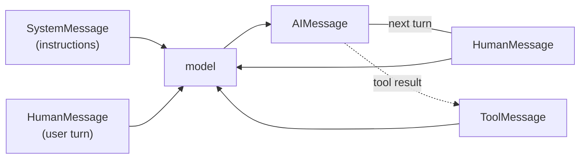
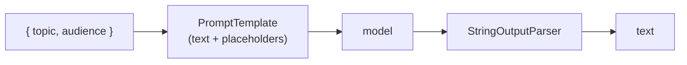
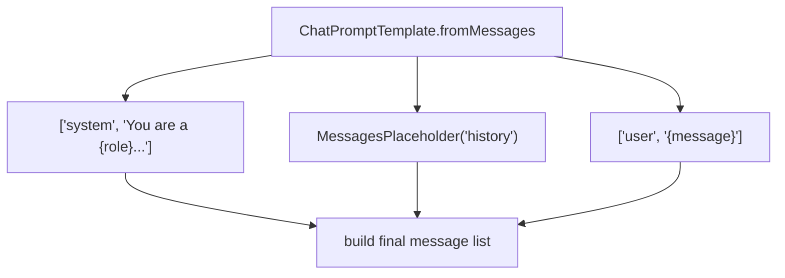
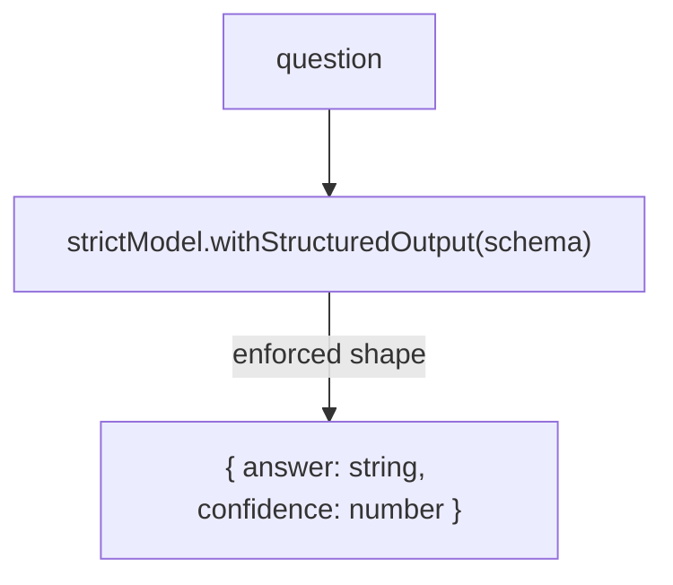
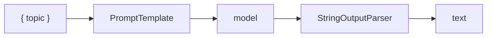
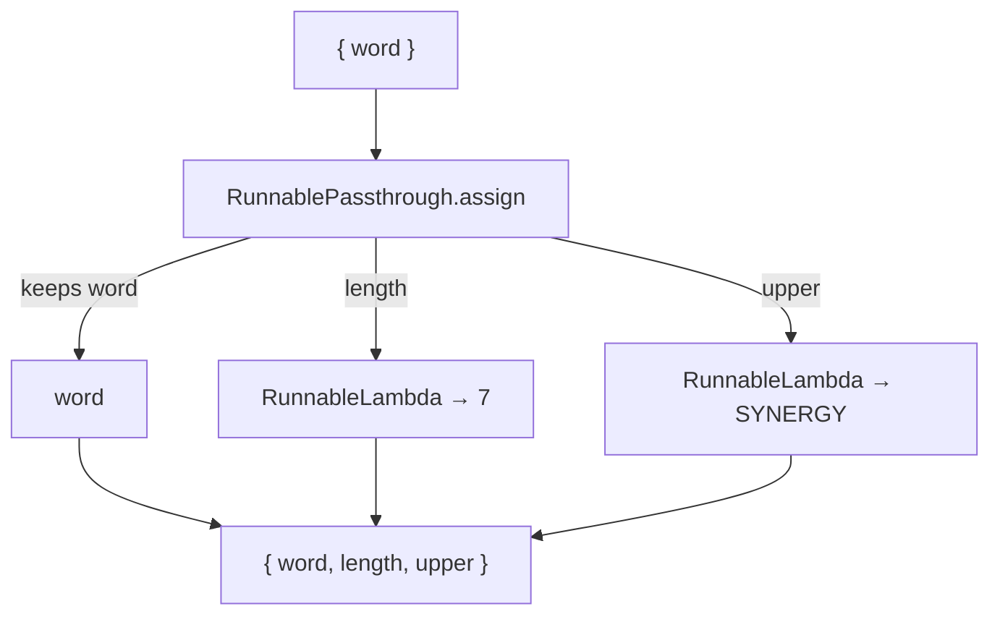
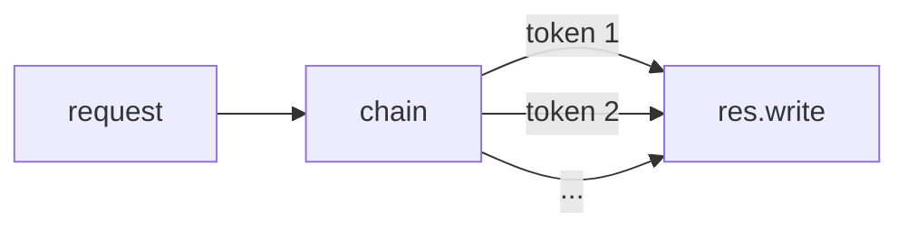
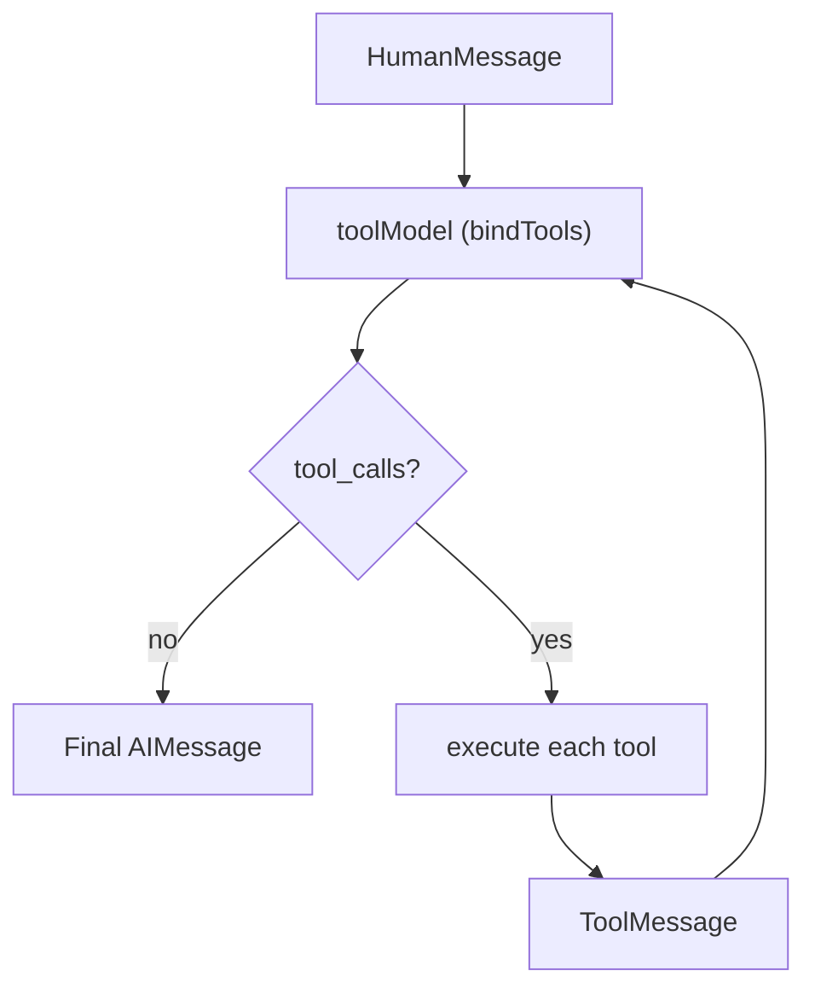
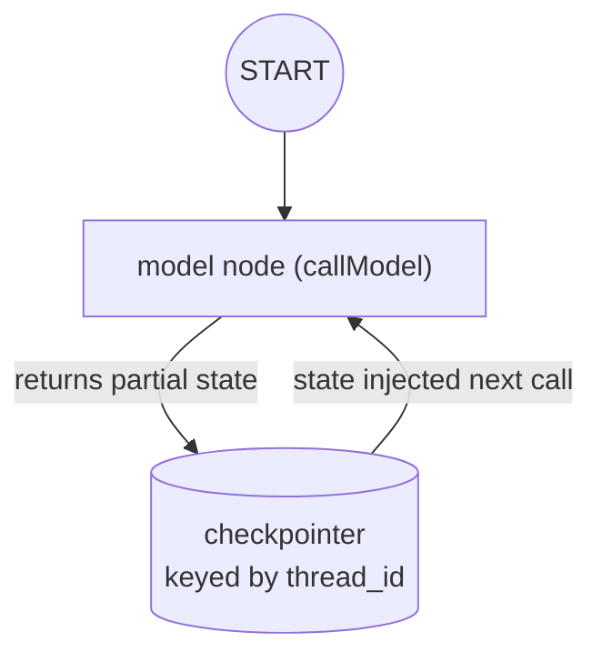
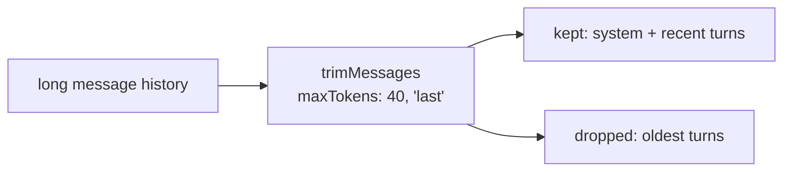

# langchain — Concepts

The concepts behind this project, with diagrams. Read this to understand *what* each major LangChain building block is, *why* it exists, and *how* this project uses it. Each concept lives in its own route, in the same order as the sections below.

> Diagrams are [Mermaid](https://mermaid.js.org/) — rendered automatically on GitHub.
> For the underlying theory (tokens, temperature, context), see [`docs/llm-fundamentals.md`](../../docs/llm-fundamentals.md) at the repo root.

---

## Table of contents

1. [The two models](#1-the-two-models)
2. [Message roles](#2-message-roles)
3. [`PromptTemplate`](#3-prompttemplate)
4. [`ChatPromptTemplate` + `MessagesPlaceholder`](#4-chatprompttemplate--messagesplaceholder)
5. [Structured output](#5-structured-output)
6. [LCEL: `.pipe()` and `RunnableSequence`](#6-lcel-pipe-and-runnablesequence)
7. [Runnable primitives](#7-runnable-primitives)
8. [Streaming](#8-streaming)
9. [Tool calling](#9-tool-calling)
10. [LangGraph state & memory](#10-langgraph-state--memory)
11. [Message trimming](#11-message-trimming)
12. [Concept → code map](#12-concept--code-map)

---

## 1. The two models

The project builds **two** `ChatOpenAI` instances — same model, different temperature. Temperature is the single knob that most shapes output ([llm-fundamentals.md §5](../../docs/llm-fundamentals.md#5-sampling-temperature--friends)):

```ts
const model = new ChatOpenAI({ model: 'gpt-4o', temperature: 0.7 });  // chat — creative
const strictModel = new ChatOpenAI({ model: 'gpt-4o', temperature: 0 }); // tools/structured — deterministic
```

| Model | Temp | Used by | Why |
|---|---|---|---|
| `model` | 0.7 | `/messages`, `/prompt`, `/chat-prompt`, `/memory` | chat should vary in tone |
| `strictModel` | 0 | `/structured`, `/stream`, `/tools` | the *shape* of the output must be stable |

The rule of thumb: anything where **format matters more than wording** (JSON, tool args, extraction) → `temperature: 0`. Anything where **expressiveness matters** → higher.

---

## 2. Message roles

`/messages`

Chat models read a **list of typed messages**, and roles are not cosmetic. The model uses them to know who said what, which changes how it responds.

| Role | Class | Meaning | Used for |
|---|---|---|---|
| `system` | `SystemMessage` | instructions / persona | `"You are a terse, confident senior engineer."` |
| `user` | `HumanMessage` | the person's turns | `"Explain vector DBs..."` |
| `assistant` | `AIMessage` | the model's own turns | fed back as history |
| `tool` | `ToolMessage` | result of a tool call | the observation in the agent loop |



The `/messages` route is the minimal example: a `SystemMessage` plus a `HumanMessage` passed straight to `model.invoke(messages)`. Role boundaries matter because a flattened narrative loses the clue that one sentence is a *question* and another is the model's own answer.

---

## 3. `PromptTemplate`

`/prompt`

The simplest prompt form: a text string with `{variable}` placeholders filled at invoke time.

```ts
const prompt = PromptTemplate.fromTemplate(
  'Write a short intro to {topic} for {audience}. Keep it to three sentences.',
);
const output = await prompt.pipe(model).pipe(new StringOutputParser()).invoke({ topic, audience });
```



Two things to notice:

- **Structural separation** — the template declares *what varies* and the invoke fills it. The same prompt serves any topic.
- **It composes** — `prompt.pipe(model).pipe(parser)` is the LCEL chain (see §6); the route also echoes the rendered prompt via `prompt.format()`.

---

## 4. `ChatPromptTemplate` + `MessagesPlaceholder`

`/chat-prompt`

For chat, `ChatPromptTemplate` builds **role-tagged messages**, and `MessagesPlaceholder` is the seam that injects prior conversation.

```ts
const prompt = ChatPromptTemplate.fromMessages([
  ['system', 'You are a {role} who explains with an analogy.'],
  new MessagesPlaceholder('history'),
  ['user', '{message}'],
]);
```



The `{role}` variable changes the persona — `"tutor"` produces analogies. The `MessagesPlaceholder('history')` is where a list of prior `AIMessage`/`HumanMessage` goes, which is what turns a one-shot prompt into a conversation. `/chat-prompt` passes `history: []` for simplicity; `/memory` (§10) shows it filled for real.

---

## 5. Structured output

`/structured`

`withStructuredOutput` forces the model to return a value matching a **Zod schema** — the most reliable way to get machine-readable output. Prefer it over "please return JSON", which is only valid *most* of the time.

```ts
const schema = z.object({ answer: z.string(), confidence: z.number() });
const structured = strictModel.withStructuredOutput(schema);
const response = await structured.invoke('In one sentence, what is a vector database?');
// => { answer: '...', confidence: 0.95 }
```



Why it works: the model's tool-calling machinery is trained to emit **valid JSON matching a schema**, whereas prose instructions rely on the model's goodwill. This is also the mechanism behind tool calling (§9) — a tool's Zod schema *is* a prompt telling the model exactly what arguments to produce.

---

## 6. LCEL: `.pipe()` and `RunnableSequence`

`/chain`

The LangChain Expression Language (LCEL) is the composition syntax: build a pipeline of runnables with `.pipe()`, then `.invoke()` / `.stream()` it. `RunnableSequence.from` is the explicit, array-based form of the same chain.

```ts
const chain = RunnableSequence.from([prompt, model, new StringOutputParser()]);
const output = await chain.invoke({ topic });
```



`prompt.pipe(model).pipe(parser)` and `RunnableSequence.from([...])` are equivalent — the choice is style. The key idea: **everything is a runnable**, so you compose small pieces into a larger one, and that larger one is itself runnable (you can `.invoke()`, `.stream()`, or `.pipe()` it further).

---

## 7. Runnable primitives

`/lc`

Two composition primitives for building up data inside a chain — no model call involved:

| Primitive | What it does |
|---|---|
| `RunnablePassthrough` | passes a value through unchanged; `.assign()` adds computed fields |
| `RunnableLambda` | wraps your own function as a runnable |

```ts
const echoAndCount = RunnablePassthrough.assign({
  length: RunnableLambda.from((i: { word: string }) => i.word.length),
  upper: RunnableLambda.from((i: { word: string }) => i.word.toUpperCase()),
});
const result = await echoAndCount.invoke({ word: 'synergy' });
// => { word: 'synergy', length: 7, upper: 'SYNERGY' }
```



`.assign()` adds keys to the input dictionary, so you can derive new values alongside the original data. `RunnableLambda` is how you write your own step that participates in the chain.

---

## 8. Streaming

`/stream`

`.stream()` yields tokens as they are generated rather than waiting for the full answer. Because latency is dominated by output tokens (each is a serial step), this is how a response *feels* fast. The chain is identical — only the consumption differs.

```ts
res.setHeader('Content-Type', 'text/plain; charset=utf-8');
res.flushHeaders();
for await (const chunk of await chain.stream({ message })) {
  res.write(chunk);
}
res.end();
```



This route streams plain text (`text/plain`), writing each chunk straight to the HTTP response. For a browser-oriented UI you'd wrap the same chain in SSE/AI-SDK format instead — the point is that streaming is an **output mode**, not a different pipeline.

---

## 9. Tool calling

`/tools`

Tools give the model the ability to *do something* — a function with a name, a description, and a Zod schema for its args. The model decides when to call one and fills the args from natural language. The description is the model's only guide.

```ts
const multiplyTool = tool(
  async ({ a, b }: { a: number; b: number }) => String(a * b),
  { name: 'multiply', description: 'Multiply two numbers...', schema: z.object({ a: z.number(), b: z.number() }) },
);
const toolModel = strictModel.bindTools(tools);
```

Tool calling requires a **loop**: the model returns tool calls (arguments, not results), you execute each, feed the `ToolMessage` back, and the model re-decides — until it produces a final answer with no tool calls.



```ts
for (let i = 0; i < 10; i++) {
  const aiMessage = await toolModel.invoke(messages);
  messages.push(aiMessage);
  if (!aiMessage.tool_calls?.length) return /* done */ aiMessage.content;
  for (const call of aiMessage.tool_calls) {
    const result = await tools.find(t => t.name === call.name)!.invoke(call.args);
    messages.push(new ToolMessage({ tool_call_id: call.id, content: result }));
  }
}
```

Why the loop matters: *"What is 4 plus 6, then double the result?"* needs **two** tool calls (add → multiply). The loop lets the model chain as many calls as the task requires, observing each result before deciding the next. The `steps` count in the response shows how many model turns it took.

---

## 10. LangGraph state & memory

`/memory`

The modern replacement for the deprecated `RunnableWithMessageHistory` is a **LangGraph `StateGraph` with a checkpointer**. Conversation (plus custom fields) is persisted keyed by `thread_id`, so it survives across requests — and across restarts only if you swap the checkpointer.

```ts
const graphState = Annotation.Root({
  ...MessagesAnnotation.spec,        // the standard `messages: BaseMessage[]`
  skill: Annotation<string>(),       // custom input
  message: Annotation<string>(),     // custom input
  lastResponse: Annotation<string | undefined>(), // custom output
});

const workflow = new StateGraph(graphState).addNode('model', callModel).addEdge(START, 'model');
const memoryGraph = workflow.compile({ checkpointer: new MemorySaver() });
```



Two ideas:

- **State** — a node receives the current state and returns a *partial* update; LangGraph merges it and persists. `MessagesAnnotation` provides the messages list; the project extends it with `skill`, `message`, `lastResponse`.
- **Checkpointer** — `MemorySaver` keeps state in-process, so history resets on restart. Swap for `SqliteSaver` / `PostgresSaver` for durability.

```ts
await memoryGraph.invoke({ skill, message }, { configurable: { thread_id } });
```

The `thread_id` is the conversation key: two requests with the same `thread_id` share history; different ids are independent sessions. This is what makes *"My name is Dilum"* followed by *"What is my name?"* recall correctly.

---

## 11. Message trimming

`/trim`

Long conversations overflow the context window. `trimMessages` keeps only the most recent tokens within a budget, optionally preserving the system message and ending on a human turn.

```ts
const trimmed = await trimMessages(messages, {
  maxTokens: 40,
  strategy: 'last',       // keep the most recent tokens
  tokenCounter,           // how to count tokens
  includeSystem: true,    // keep the index-0 SystemMessage
  startOn: 'human',       // drop everything before the first human turn
  allowPartial: true,     // allow a partially-included message
});
```



The route uses a simple `tokenCounter` (chars ÷ 4) as a stand-in for a real tokenizer, and reports `original` vs `remaining` counts. In production you'd use a model tokenizer — see [`ai-agents.md`](../../docs/ai-agents.md) for state management and [`llm-fundamentals.md`](../../docs/llm-fundamentals.md#3-the-context-window) for why the budget exists.

---

## 12. Concept → code map

| Concept | Where |
|---|---|
| Two models (temp 0.7 vs 0) | top of `server.ts` (`model`, `strictModel`) |
| Message roles | `/messages` handler |
| `PromptTemplate` + variable | `/prompt` handler |
| `ChatPromptTemplate` + `MessagesPlaceholder` | `/chat-prompt` handler |
| `withStructuredOutput` + Zod | `/structured` handler + `schema` |
| LCEL `.pipe()` / `RunnableSequence` | `/chain` handler |
| Runnable primitives (`Passthrough`/`Lambda`) | `/lc` handler |
| Streaming (`chain.stream`) | `/stream` handler |
| `bindTools` loop | `/tools` handler + `multiplyTool`/`addTool` |
| `StateGraph` + `MemorySaver` | `callModel`, `graphState`, `workflow` |
| `thread_id` persistence | `/memory` handler |
| `trimMessages` | `/trim` handler |

---

## Further reading

- [langchain-fundamentals.md](../../docs/langchain-fundamentals.md) — prompt templates, messages, LCEL in depth
- [ai-agents.md](../../docs/ai-agents.md) — the ReAct loop this project's tool-calling section scaffolds
- [llm-fundamentals.md](../../docs/llm-fundamentals.md) — tokens, temperature, context window
- `server.ts` — the working implementation of every route
