# langgraph — Concepts

The concepts behind this project, with diagrams. Read this to understand _what_ each major LangGraph building block is, _why_ it exists, and _how_ this project uses it. Each concept lives in its own route, in the same order as the sections below.

> Diagrams are [Mermaid](https://mermaid.js.org/) — rendered automatically on GitHub.
> For the underlying theory (chains vs graphs, agents, multi-agent), see [`docs/langchain-vs-langgraph.md`](../../docs/langchain-vs-langgraph.md) and [`docs/ai-agents.md`](../../docs/ai-agents.md) at the repo root.

---

## Table of contents

1. [The model](#1-the-model)
2. [`StateGraph` — nodes, edges, state](#2-stategraph--nodes-edges-state)
3. [State channels & reducers](#3-state-channels--reducers)
4. [Conditional edges](#4-conditional-edges)
5. [Parallel fan-out / fan-in](#5-parallel-fan-out--fan-in)
6. [Memory & checkpointing](#6-memory--checkpointing)
7. [`createAgent` — the prebuilt ReAct agent](#7-createagent--the-prebuilt-react-agent)
8. [Streaming](#8-streaming)
9. [Human-in-the-loop: `interrupt` & `Command`](#9-human-in-the-loop-interrupt--command)
10. [Subgraphs](#10-subgraphs)
11. [Supervisor / multi-agent](#11-supervisor--multi-agent)
12. [Time travel: replay & fork](#12-time-travel-replay--fork)
13. [Structured output in a node](#13-structured-output-in-a-node)
14. [Concept → code map](#14-concept--code-map)

---

## 1. The model

The project builds one chat model and one deterministic variant, and `agent.ts` builds its own for the prebuilt agent:

```ts
const model = new ChatOpenAI({ model: 'gpt-4o-mini', temperature: 0.7 }); // chat — creative
const strictModel = new ChatOpenAI({ model: 'gpt-4o-mini', temperature: 0 }); // structured — deterministic
```

| Model            | Temp | Used by              | Why                                               |
| ---------------- | ---- | -------------------- | ------------------------------------------------- |
| `model`          | 0.7  | `/memory`, `/stream` | conversational tone should vary                   |
| `strictModel`    | 0    | `/structured`        | the _shape_ of the output must be stable          |
| `agent.ts` model | 0    | `/agent`             | the agent's tool-selection loop wants determinism |

The rule of thumb from the `langchain` project holds: anything where **format matters more than wording** (JSON, tool args, extraction) → `temperature: 0`; anything where **expressiveness matters** → higher.

---

## 2. `StateGraph` — nodes, edges, state

`/graph`

The core primitive. You declare a **state shape** (a set of channels), then a **graph of nodes** (functions that read/write that state) connected by **edges** (who runs after whom). Compile it, invoke it.

```ts
const basicState = Annotation.Root({
  value: Annotation<number>(),
  step: Annotation<string>(),
});

const increment = async (state) => ({
  value: state.value + 1,
  step: 'increment',
});
const double = async (state) => ({ value: state.value * 2, step: 'double' });

const graph = new StateGraph(basicState)
  .addNode('increment', increment)
  .addNode('double', double)
  .addEdge(START, 'increment')
  .addEdge('increment', 'double')
  .addEdge('double', END)
  .compile();

await graph.invoke({ value: 5 }); // => { value: 12, step: 'double' }
```

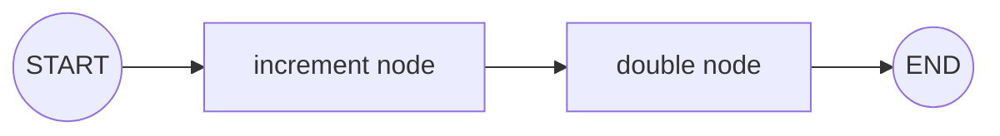

Three ideas to internalize:

- **State** — a plain object of channels that flows through every node. A node receives the current state and returns a _partial_ update; LangGraph merges it and hands it to the next node.
- **Node** — just `(state) => partialState`. No loop, no branching, no persistence yet.
- **Input/output** — `invoke({ value: 5 })` supplies the initial state; the returned object is the final state.

The `/graph` route is deliberately a plain function pipeline — no LLM, no keys — so you can see the runtime exactly. This is the foundation everything else extends.

---

## 3. State channels & reducers

`/reducers`

Each field in the state is a **channel** with a **reducer** that decides how writes combine. The _default_ reducer is **last-write-wins** (replace). Override it to **accumulate**: the reducer receives `(current, update)` and returns the new channel value.

```ts
const reducerState = Annotation.Root({
  last: Annotation<string>(), // default: replace
  items: Annotation<string[]>({
    reducer: (current, update) => current.concat(update), // accumulate
    default: () => [],
  }),
  total: Annotation<number>({
    reducer: (current, update) => current + update, // accumulate
    default: () => 0,
  }),
});
```

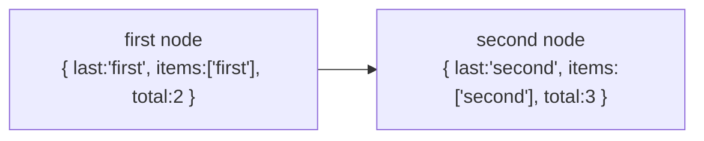

After both nodes run:

| Channel | Reducer           | Result                                    |
| ------- | ----------------- | ----------------------------------------- |
| `last`  | replace (default) | `'second'` — only the last write survives |
| `items` | concat            | `['first', 'second']` — both writes kept  |
| `total` | sum               | `5` — `2 + 3` accumulated                 |

```json
{ "last": "second", "items": ["first", "second"], "total": 5 }
```

This is **the** mechanism that makes stateful graphs work. The same `addMessages` reducer on a `messages` channel is what lets a graph remember a conversation (§6). Reducers also power parallel joins (§5): in a single superstep, multiple nodes writing to one channel are merged through the reducer instead of overwriting each other.

---

## 4. Conditional edges

`/conditional`

`addConditionalEdges` attaches a **router** to a node. Instead of a fixed next node, the router reads state and returns the **name of the next node** (or an array, §5). A third argument maps the router's return value to actual node names.

```ts
const classify = async (state) => ({
  route: state.topic.toLowerCase().includes('history') ? 'history' : 'tech',
});

const graph = new StateGraph(state)
  .addNode('classify', classify)
  .addNode('tech', techAgent)
  .addNode('history', historyAgent)
  .addEdge(START, 'classify')
  .addConditionalEdges('classify', (s) => s.route, {
    tech: 'tech',
    history: 'history',
  })
  .addEdge('tech', END)
  .addEdge('history', END)
  .compile();
```

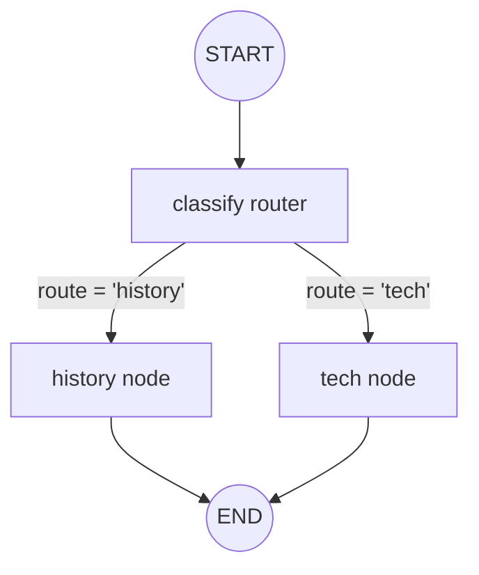

This is the difference between a straight chain and real orchestration: a chain can't choose its next step, but a graph can. Conditional edges are how the model-driven path of an agent is expressed — `createAgent` (§7) wires a router that loops back to the model after each tool observation.

---

## 5. Parallel fan-out / fan-in

`/parallel`

Two `START` edges mean `left` and `right` run **in parallel**. Both write to the same channel, and the reducer merges their writes. `aggregate` only runs after _both_ finish (both edges point to it) — that in-edge is a **barrier**.

```ts
const parallelState = Annotation.Root({
  results: Annotation<string[]>({
    reducer: (current, update) => current.concat(update),
    default: () => [],
  }),
  summary: Annotation<string>(),
});

const graph = new StateGraph(parallelState)
  .addNode('left', () => ({ results: ['left'] }))
  .addNode('right', () => ({ results: ['right'] }))
  .addNode('aggregate', (state) => ({ summary: state.results.join(' + ') }))
  .addEdge(START, 'left')
  .addEdge(START, 'right')
  .addEdge('left', 'aggregate')
  .addEdge('right', 'aggregate')
  .addEdge('aggregate', END)
  .compile();
```

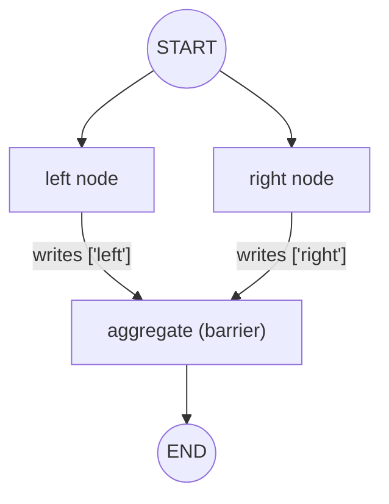

```json
{ "results": ["left", "right"], "summary": "left + right" }
```

Three things happen at once:

- **Fan-out** — one node leads to several nodes run concurrently.
- **Reducer merge** — the two writes to `results` combine via `concat`, so both survive.
- **Barrier** — `aggregate` waits for all incoming edges; only then does it run.

Note the detail in the route: `aggregate` writes to a _new_ channel (`summary`) and does **not** re-write `results`. Re-writing the same accumulated channel would double the list — the barrier merges state from the branches, it doesn't re-emit it. This is the map-reduce pattern you'll use to parallelize sub-tasks or fan out to multiple tools.

---

## 6. Memory & checkpointing

`/memory`

By default a graph invocation is **stateless**. Atop `MessagesAnnotation` (a `messages` channel that appends via the `addMessages` reducer) we compile the graph _with a checkpointer_ that snapshots state keyed by a `thread_id`.

```ts
const memoryGraph = new StateGraph(MessagesAnnotation)
  .addNode('model', async (state) => {
    const response = await model.invoke(state.messages);
    return { messages: [response] };
  })
  .addEdge(START, 'model')
  .addEdge('model', END)
  .compile({ checkpointer: new MemorySaver() });

await memoryGraph.invoke(
  { messages: [new HumanMessage(message)] },
  { configurable: { thread_id } },
);
```

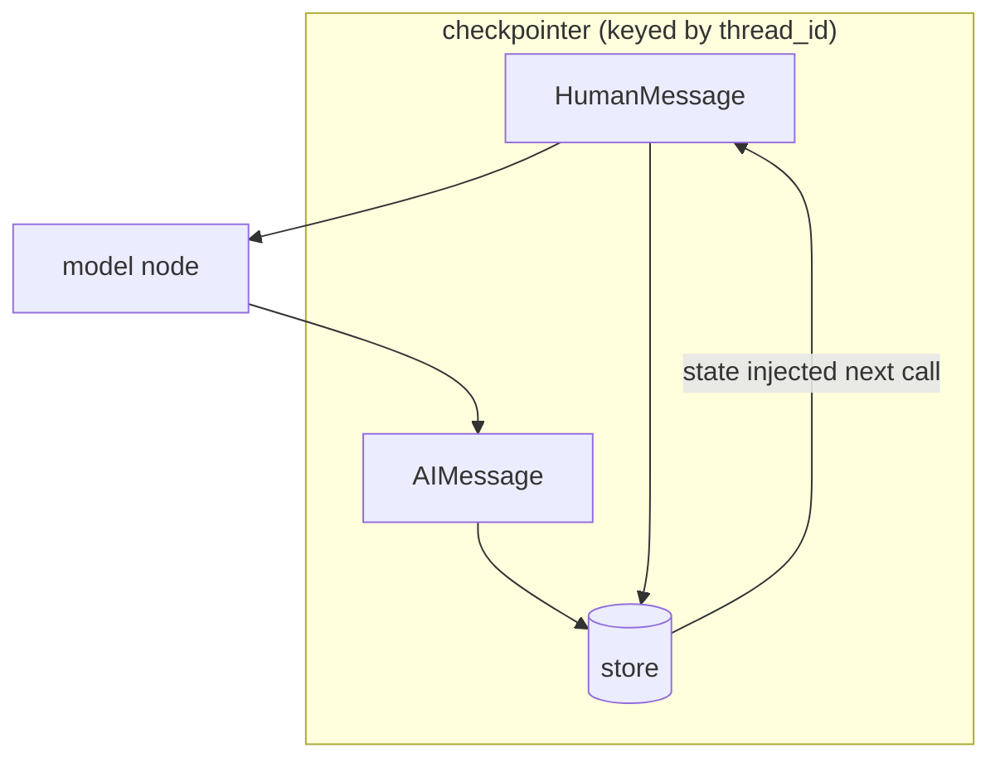

Two ideas:

- **Checkpointer** — `MemorySaver` keeps state in-process, so history resets on restart. Swap for `SqliteSaver` / `PostgresSaver` for durability.
- **`thread_id`** — the conversation key. Two requests with the same `thread_id` share history; different ids are independent sessions.

`/memory` demonstrates this end-to-end: _"My name is Dilum"_ then _"What is my name?"_ on the same thread correctly recalls `"Dilum"`, and `totalMessages` grows with each turn. The route passes only the _new_ turn (plus a one-time system prompt); the checkpointer supplies the prior turns. See also the `langchain` project's `/memory`, which uses the same pattern.

---

## 7. `createAgent` — the prebuilt ReAct agent

`/agent`

`createAgent` (from the `langchain` package, the non-deprecated successor of `createReactAgent`) hides the whole ReAct loop (think → act → observe → repeat) behind one call. Give it a model and a list of tools; it runs the loop for you. The tool set here is defined in `agent.ts`: two local tools plus whatever the GitHub MCP server advertises, all merged into one agent.

```ts
const agent = createAgent({
  model,
  tools: [convertCurrency, getDatabaseSchema, queryDatabase, ...mcpTools],
});

const result = await agent.invoke({ messages: [new HumanMessage(message)] });
// result.messages — the full thought/observation trail; last one is the answer
```

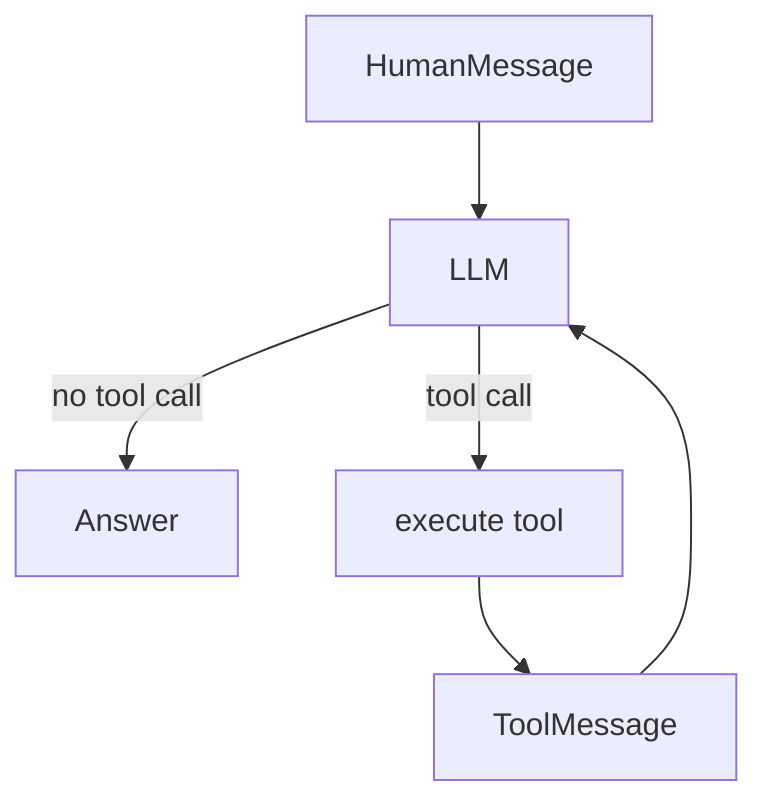

The agent decides which tool to call and with what arguments from natural language. `/agent` exercises it with the real tool set — currency conversion, read-only SQL, and GitHub via MCP. `steps` in the response is the number of model turns it took.

- **Local tools** — declared with `@langchain/core`'s `tool()` + Zod (§5 of [`ai-agents.md`](../../docs/ai-agents.md)).
- **MCP tools** — discovered at startup from `MultiServerMCPClient.getTools()`. If no `GITHUB_AUTH_TOKEN` is present, the code skips the GitHub server and still works with local tools only (see `agent.ts`).

---

## 8. Streaming

`/stream`

`.stream()` (or `.astream()` for the agent) yields values as the graph produces them instead of waiting for the final state. With `streamMode: 'messages'` you get the model's **token chunks** as they arrive — the mode that makes a response feel instant. The graph is identical; only consumption changes.

```ts
const run = await graph.stream(
  { messages: [new HumanMessage(message)] },
  { streamMode: 'messages', configurable: { thread_id: 'stream' } },
);
for await (const event of run) {
  const chunk = Array.isArray(event) ? event[0] : event.message;
  if (typeof chunk?.content === 'string') res.write(chunk.content);
}
```

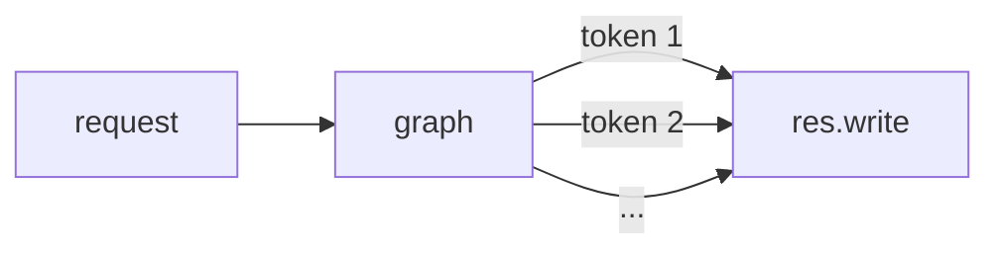

Stream modes are the knobs that decide what you get:

- `'messages'` — token/full-message chunks (best for live text, what this route uses).
- `'updates'` — per-node state updates (best for showing step-by-step progress).
- `'values'` — full state after each superstep (best for replaying a run).

`/stream` writes plain text tokens straight to the HTTP response. For a UI you'd wrap the same stream in SSE/AI-SDK format.

---

## 9. Human-in-the-loop: `interrupt` & `Command`

`/interrupt`

`interrupt()` **suspends** the graph mid-run and returns control to the caller. Nothing is lost — state (and a checkpointer) is kept. A human then sends a `Command({ resume })`, and the graph picks up exactly where it left off, with the resume value handed back to the `interrupt()` call.

```ts
const reviewNode = async (state) => {
  const decision = interrupt<{ message: string }, { approved: boolean }>({
    message: `Approve the request "${state.request}"?`,
  });
  return {
    approved: decision.approved,
    result: decision.approved ? 'Executed' : 'Rejected',
  };
};

const hitlGraph = new StateGraph(reviewState)
  .addNode('review', reviewNode)
  .addNode('finalise', finaliseNode)
  .addEdge(START, 'review')
  .addEdge('review', 'finalise')
  .addEdge('finalise', END)
  .compile({ checkpointer: new MemorySaver() });

// call 1 — suspends:
const suspended = await hitlGraph.invoke({ request }, config); // has __interrupt__
// call 2 — resumes:
const result = await hitlGraph.invoke(
  new Command({ resume: { approved: true } }),
  config,
);
```

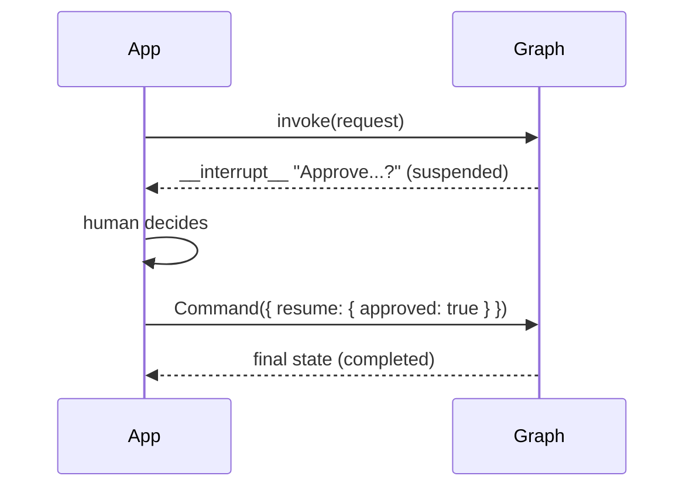

This is the mechanism behind **approval steps** and any long-running job that needs a human decision between nodes. The `interrupt` value is what you show the user; the `Command.resume` value is what you collect from them. The two `interrupt` type params are the _payload you show_ and the _value you get back on resume_.

The route exposes `POST /interrupt` (suspends, returns a fresh `thread_id`) and `POST /interrupt/resume` (resumes with `{ thread_id, approve }`).

---

## 10. Subgraphs

`/subgraph`

A compiled graph is itself a runnable, so it can be dropped into another graph as a **node**. This is composition: build small, testable graphs and compose them into larger ones. The inner graph receives the shared state, does its work, and writes back to the same channels.

```ts
const squareSubgraph = compile(/* a tiny graph: value -> squared */);

const outerGraph = new StateGraph(outerState)
  .addNode('math', squareSubgraph) // the subgraph, used as a node
  .addNode('describe', async (state) => ({
    result: `${state.value} squared is ${state.squared}`,
  }))
  .addEdge(START, 'math')
  .addEdge('math', 'describe')
  .addEdge('describe', END)
  .compile();
```

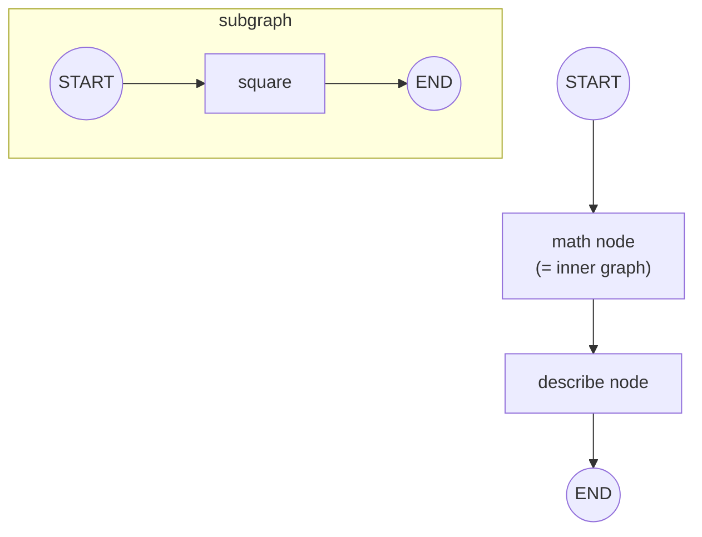

```json
{ "value": 7, "squared": 49, "result": "7 squared is 49" }
```

The subgraph's input/output channels must be a subset of the parent's state — channels the parent doesn't use are just ignored. Subgraphs let you hide complexity behind a named, reusable unit, which is essential as graphs grow.

---

## 11. Supervisor / multi-agent

`/supervisor`

The supervisor pattern: one **supervisor** decides _which_ specialist sub-agent should handle the request, routes to it, and lets it answer. Here routing is a plain function (delegate by keyword); with an LLM supervisor the routing becomes a tool call over "sub-agent as tool" runnables. The point is the same: a router decomposes a request and picks a specialist.

```ts
const supervisorNode = async (state) => ({
  agent: /convert|currency|usd|eur/.test(state.task)
    ? 'currency'
    : /db|table|sql/.test(state.task)
      ? 'database'
      : 'general',
});

const graph = new StateGraph(supervisorState)
  .addNode('supervisor', supervisorNode)
  .addNode('currencyAgent', currencyAgentNode)
  .addNode('databaseAgent', databaseAgentNode)
  .addNode('generalAgent', generalAgentNode)
  .addEdge(START, 'supervisor')
  .addConditionalEdges('supervisor', (s) => s.agent, {
    currency: 'currencyAgent',
    database: 'databaseAgent',
    general: 'generalAgent',
  })
  .addEdge('currencyAgent', END)
  .addEdge('databaseAgent', END)
  .addEdge('generalAgent', END)
  .compile();
```

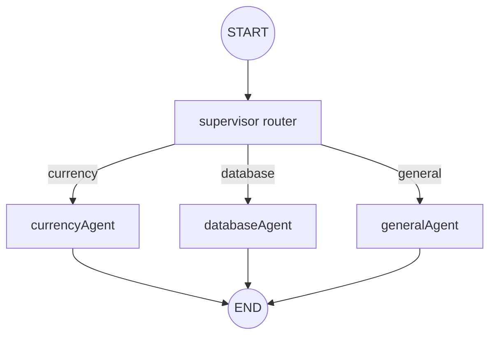

`/supervisor` routes a natural-language task to the matching specialist. `agent.ts` is the same idea in the ReAct form, and the `voltagent` project does it with real sub-agent tools. For a deeper treatment of multi-agent patterns, see [`docs/multi-agent-orchestration.md`](../../docs/multi-agent-orchestration.md).

---

## 12. Time travel: replay & fork

`/time-travel`

With a checkpointer, every superstep is saved as a **checkpoint**. That gives you two superpowers:

- **`getStateHistory(config)`** — walk back through every past state (**replay**).
- **`updateState(config, values)`** — write a checkpoint as if a node had run, then invoke from there (**fork**).

```ts
for await (const snapshot of graph.getStateHistory(config)) {
  snapshot.values; // a past state
}
await graph.updateState(config, { note: 'FORKED' });
await graph.invoke({}, config); // continues from the fork
```

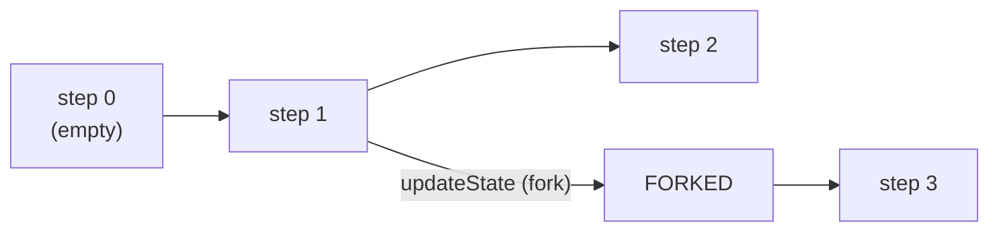

`/time-travel` runs N checkpoints, replays the history, and (optionally) forks. This is the basis of debugging, "undo", and replaying a run. The checkpointer is the only requirement — with no checkpointer there's no history to walk.

---

## 13. Structured output in a node

`/structured`

When a node must return **machine-readable data**, wrap the model with `withStructuredOutput(schema)`. The model uses its tool-calling machinery to emit a value matching the Zod schema, so the node's output shape is guaranteed. The graph then carries that typed object through state.

```ts
const schema = z.object({
  summary: z.string(),
  sentiment: z.enum(['positive', 'negative', 'neutral']),
  keywords: z.array(z.string()),
});
const structuredModel = strictModel.withStructuredOutput(schema);

const analyseNode = async (state) => ({
  analysis: await structuredModel.invoke(state.text),
});

const graph = new StateGraph(structuredState)
  .addNode('analyse', analyseNode)
  .addEdge(START, 'analyse')
  .addEdge('analyse', END)
  .compile();
```

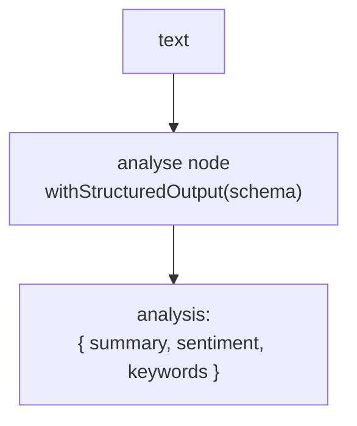

`/structured` returns the validated object. Prefer this over "please return JSON" whenever a consumer is code — see [`docs/prompt-engineering.md`](../../docs/prompt-engineering.md) and the `langchain` project's `/structured`.

---

## 14. Concept → code map

| Concept                        | Where                                                            |
| ------------------------------ | ---------------------------------------------------------------- |
| Model choice (temp 0 vs 0.7)   | top of `server.ts` (`model`, `strictModel`) + `agent.ts`         |
| `StateGraph` nodes/edges/state | `basicState`, `increment`, `double`, `basicGraph` → `/graph`     |
| Channels & reducers            | `reducerState` → `/reducers`                                     |
| Conditional edges              | `classifyTopic`, `addConditionalEdges` → `/conditional`          |
| Parallel fan-out/barrier       | `leftNode`, `rightNode`, `aggregateNode` → `/parallel`           |
| Memory + `thread_id`           | `memoryGraph`, `memoryCallModel` → `/memory`                     |
| Prebuilt ReAct agent           | `agent.ts` `getAgent()` → `/agent`                               |
| Streaming                      | `streamGraph`, `streamMode: 'messages'` → `/stream`              |
| `interrupt` / `Command`        | `reviewNode`, `hitlGraph` → `/interrupt`, `/interrupt/resume`    |
| Subgraphs                      | `squareSubgraph` → `/subgraph`                                   |
| Supervisor multi-agent         | `supervisorNode` + conditional edges → `/supervisor`             |
| Replay & fork                  | `travelGraph`, `getStateHistory`, `updateState` → `/time-travel` |
| Structured output              | `structuredModel`, `analyseNode` → `/structured`                 |
| Tool declarations              | `tools/currencyTool.ts`, `tools/databaseTool.ts`                 |
| MCP integration                | `agent.ts` (`MultiServerMCPClient`)                              |
| Prisma adapter                 | `lib/prisma.ts`                                                  |

---

## Further reading

- [langchain-vs-langgraph.md](../../docs/langchain-vs-langgraph.md) — chains vs graphs, and when to use each
- [ai-agents.md](../../docs/ai-agents.md) — the ReAct loop, tool schemas, agent memory in depth
- [multi-agent-orchestration.md](../../docs/multi-agent-orchestration.md) — supervisor and sub-agents
- [what-is-mcp.md](../../docs/what-is-mcp.md) — the protocol behind the MCP tools in `agent.ts`
- `server.ts` — the working implementation of every route
- [LangGraph docs](https://langchain-ai.github.io/langgraph/concepts/)
