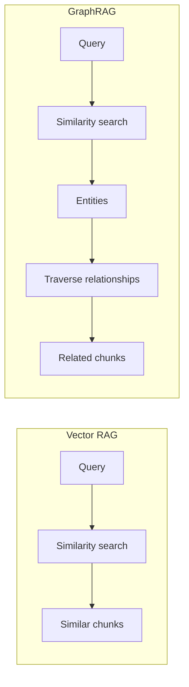
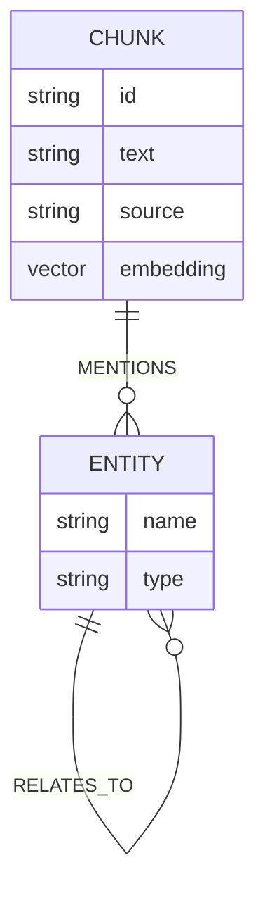
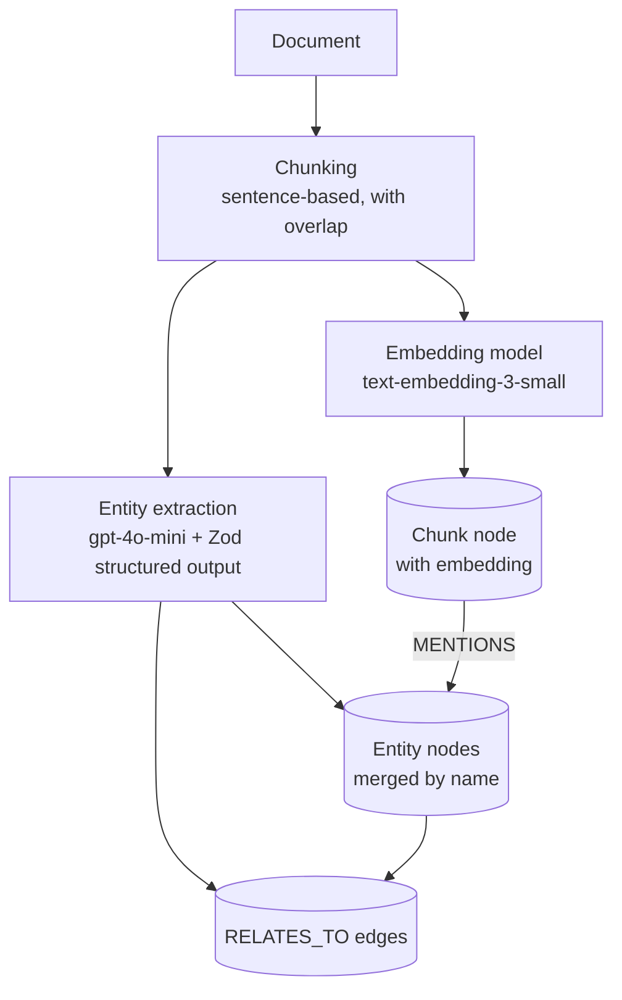
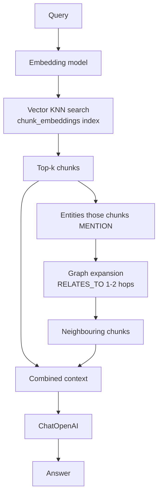

# rag-graph — Concepts

The concepts behind this project, with diagrams. Read this to understand *what* GraphRAG is, *why* we combine a vector index with a knowledge graph, and *how* the pieces fit together.

> Diagrams are [Mermaid](https://mermaid.js.org/) — rendered automatically on GitHub.

---

## 1. GraphRAG in one sentence

**Vector RAG** finds chunks that are *textually similar* to the query. **GraphRAG** additionally extracts the *entities* (people, companies, technologies) and *relationships* between them into a knowledge graph, then answers questions by *traversing* that graph.

---

## 2. The graph model

Three node/relationship types live in Neo4j:

- **`Chunk`** — a sentence-grouped slice of a document, with its OpenAI embedding (1536 dims).
- **`Entity`** — a named thing extracted by the LLM, typed as `Person`, `Company`, `Technology`, `Product`, `Event`, or `Other`.
- **`MENTIONS`** — links a chunk to the entities it mentions (the bridge between vector and graph).
- **`RELATES_TO`** — a typed edge between entities, e.g. `Tom Okafor -[RELATES_TO {type: 'works_on'}]-> Project Borealis`.

---

## 3. Ingestion pipeline

Key ideas:

- **Chunking** — documents are split on sentence boundaries with overlap, so entity mentions spanning chunk edges are still captured.
- **Embedding** — each chunk gets a vector so it can be found by similarity.
- **Structured extraction** — `model.withStructuredOutput(zodSchema)` forces the LLM to return `{ entities: [...], relationships: [...] }` as valid JSON. Entities are `MERGE`d by name so repeated mentions collapse into one node.

---

## 4. Hybrid retrieval

Two independent signals are merged:

| Signal | How | Finds |
|---|---|---|
| **Vector** | `db.index.vector.queryNodes` KNN on `chunk_embeddings` | chunks whose *text* is similar to the query |
| **Graph** | Cypher `RELATES_TO*1..2` traversal from matched entities | chunks *related by entity*, even if textually different |

### Why both?

> "Which technologies does Tom Okafor work with?"

- Vector search finds Tom's chunk (it mentions him).
- Graph expansion follows Tom's `RELATES_TO` edges to `Kubernetes`, `Go`, `Apache Kafka`.
- Those technologies' chunks are pulled in — even though no single chunk contains the full answer.

Pure vector RAG would miss the technologies that only appear in *other* chunks.

---

## 5. Neo4j specifics

- **Vector index** — created at startup with `CREATE VECTOR INDEX chunk_embeddings ... OPTIONS { indexConfig: { vector.dimensions: 1536, vector.similarity_function: 'cosine' } }`. Note: dimensions must be passed as an integer (`neo4j.int()`), not a JS number, or Neo4j rejects the config.
- **Bolt protocol** — the `neo4j-driver` talks to the server over Bolt (port 7687). Driver major version tracks server major (driver 6.x ↔ Neo4j 5.26+).
- **Integer gotchas** — Neo4j returns counts/lengths as `Integer` (BigInt). Convert with `Number()` before arithmetic, and pass `neo4j.int()` for `LIMIT`/`k` params.
- **Cypher limits** — variable-length patterns (`*1..$hops`) can't take parameters; interpolate the safe integer instead.

---

## 6. Concept → code map

| Concept | Where |
|---|---|
| Chunking | `chunkText()` in `ingest.ts` |
| Embeddings | `OpenAIEmbeddings` in `ingest.ts` / `retrieval.ts` |
| Structured extraction | `extractionSchema` + `withStructuredOutput` in `ingest.ts` |
| Graph writes | `storeChunk()` in `ingest.ts` |
| Vector index + driver | `graph.ts` |
| Vector search | `vectorSearch()` in `retrieval.ts` |
| Graph traversal | `graphExpansion()` in `retrieval.ts` |
| Hybrid merge | `hybridRetrieve()` in `retrieval.ts` |
| HTTP API | `server.ts` |