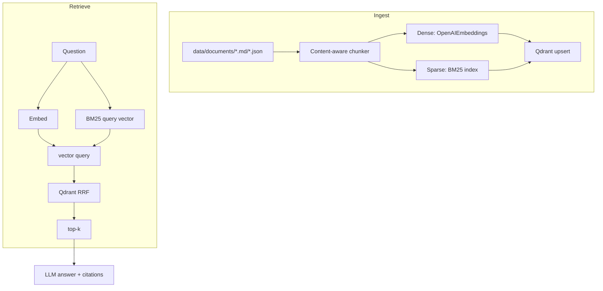
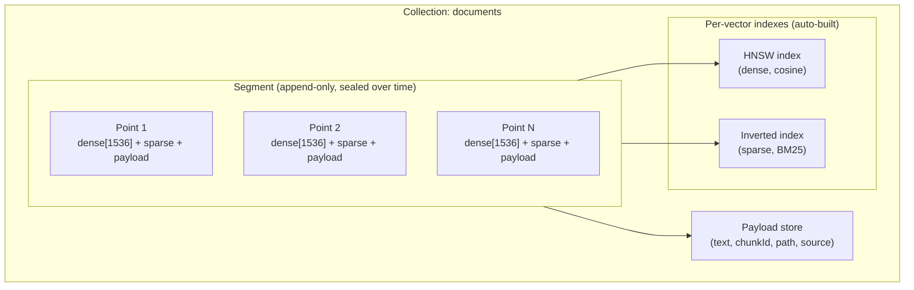

# rag-hybrid-qdrant — Concepts

Express + Qdrant hybrid retrieval. This project is the sibling of `rag-hybrid` (ChromaDB): same dense + sparse + RRF idea, but Qdrant does the fusing natively, and the differentiator is **content-aware chunking** — splitting documents on their structure rather than arbitrary character counts.

## 1. Why content-aware chunking?

Retrieval quality is capped by chunk quality. Two chunkers, same documents:

| Fixed-width chunker | Content-aware chunker |
|---|---|
| 1000 chars, hard cut | splits on headings / paragraphs / rows |
| a chunk can begin mid-sentence | each chunk is a self-contained idea |
| no idea what section it came from | breadcrumb: `Vector Databases > Sparse vectors > BM25` |

A chunk that mixes two unrelated sections embeds badly (the vector averages two meanings) and reads badly in a prompt. Splitting on structure keeps one meaning per chunk, and carrying the heading path gives the LLM **context that isn't in the chunk's body**.

### How the markdown chunker works (`src/chunk.ts`)

1. Walk the lines. On a heading of level N (`#`…`######`), pop the heading stack while the top is at level `>= N`, then push the new heading.
2. The stack is the **current outline position** → the breadcrumb.
3. Body lines accumulate until the next heading; on flush, the section body is joined, trimmed, and optionally split with an overlap if longer than 1500 chars.
4. Each chunk's text is prefixed with the breadcrumb so retrieval sees the context, and the breadcrumb is also stored in `metadata.path` for filtering/sources.

### JSON and plain text

- **JSON array** → one chunk per element ("chunk per row"). Each row is self-contained, and `metadata.title` (from `title`/`name`/`id`) makes the source recoverable.
- **Plain text** → split on blank lines (paragraphs), then by length.
- New formats (PDF/DOCX/HTML) plug into `chunkDocument()` — nothing else changes.

## 2. The two channels

| Channel | How it's produced | What it's good at |
|---|---|---|
| **Dense** | OpenAI `text-embedding-3-small` (1536 dims), cosine | paraphrases, synonyms, semantic intent |
| **Sparse** | BM25 over every chunk (k1=1.2, b=0.75) | exact keywords, codes, identifiers, names |

### BM25 as a sparse vector (`src/sparse.ts`)

Each term becomes a dimension in a huge mostly-empty vector:

```
weight(term) = IDF(term) × [ tf × (k1+1) ] / [ tf + k1 × (1 − b + b × len/avgLen) ]
```

- **IDF** — rarer terms weigh more (discriminative).
- **TF saturation** — a term's weight flattens as it repeats, so one chunk can't dominate.
- **Length normalization** — a keyword buried in a 500-line chunk scores less than the same keyword in a one-liner.

Because IDF and average length are corpus-wide, the index is built at **ingest** over every chunk and reused for queries. Weights already include IDF, so Qdrant's sparse vector is created with `modifier: 'none'` — otherwise Qdrant would apply IDF twice.

## 3. Fusion: Qdrant's native RRF

In Qdrant the two channels are two **named vectors** on the same points (`dense` and `sparse`). Retrieval is a single Universal Query call:

```
prefetch: [ { query: denseVec,   using: 'dense',  limit: 4k },
            { query: sparseVec,  using: 'sparse', limit: 4k } ]
query:    { rrf: { k: 60 } }
```

Reciprocal Rank Fusion ignores the raw (incomparable) scores and ranks by position:

```
score(d) = Σ 1 / (k + rank_i(d))
```

A chunk ranked #1 in *both* channels beats one that's #1 in only one — which is exactly the "neither signal is a single point of failure" property. The prefetch `limit` (4×) exceeds the final `limit` so the fused ranking has enough candidates.

### Why this is simpler than `rag-hybrid`

`rag-hybrid` hand-rolls BM25, tokenization, RRF, and rerank in `src/` because Chroma self-hosted doesn't expose sparse indexes or a fusion API. Qdrant does both natively, so this project ships **no** custom fusion code — `store.ts` is just a thin client over the Universal Query API.

## 4. Observability: `channels`

`/query?mode=hybrid` returns the fused result plus `channels`, the per-channel top-k **before** fusion:

```json
{ "results": [...fused (RRF scores)...],
  "channels": [ [...dense (cosine)...], [...sparse (BM25)...] ] }
```

This is the debugging view from [rag-troubleshooting.md](../../docs/rag-troubleshooting.md#2-answers-suddenly-turn-wrong): did the correct chunk get surfaced by dense, by sparse, or only by the fusion?

## 5. The pipeline



## 6. Qdrant architecture (high level)

This project talks to Qdrant through the Universal Query API, but it helps to know what's happening underneath. Qdrant's storage model is **collection → segments → points**, with a separate index per vector.



- **Collection** — a named set of points with a fixed schema: our `dense` (1536-dim, cosine) and `sparse` named vectors plus arbitrary payload.
- **Segments** — points are grouped into segments. New writes go to an append-only segment; as it grows it's sealed and optimized (merged, indexed). This is why Qdrant handles streaming inserts without blocking reads.
- **Named vectors** — one point can carry several vectors. We store `dense` and `sparse` on the *same* point, which is what lets a single query fuse both channels.
- **Indexes** — Qdrant builds them automatically on ingest:
  - **HNSW** for the dense vector (approximate nearest neighbor, cosine).
  - **Inverted index** for the sparse vector (term → postings, like BM25's own index).
  - **Payload index** only if you create one (`createPayloadIndex`) — we don't, because we never filter on payload fields (see §8 *Extending*).
- **Universal Query API** — the `prefetch` + `query: { rrf }` call we make is compiled by Qdrant into per-index searches (HNSW for dense, inverted for sparse) whose ranked lists are then fused. We never hand-roll the fusion; Qdrant does it server-side.

> **Why no explicit index config?** At 18 chunks the corpus is tiny — Qdrant's default HNSW/inverted indexes are more than enough, and tuning `hnsw_config` or adding payload indexes would be premature. They matter only once you add payload filtering or scale to thousands of points.

## 7. Concept → code map

| Concept | File |
|---|---|
| Content-aware chunking (markdown/JSON/plain) | `src/chunk.ts` |
| BM25 sparse vectors | `src/sparse.ts` |
| OpenAI dense embeddings | `src/embed.ts` |
| Qdrant collection, upsert, fused query | `src/store.ts` |
| Express routes (ingest/query/chat) | `src/server.ts` |
| Shared types | `src/types.ts` |

## 8. Extending

- **New doc formats**: add a case to `chunkDocument()` (PDF/DOCX/HTML). The store and routes never change.
- **Filtering**: ingest richer `metadata` (section numbers, author, dates) and add Qdrant payload `filter`s to the query for permission/date-scoped retrieval ([metadata filtering](../../docs/vector-search.md#10-metadata-filtering)).
- **Reranking**: add a cross-encoder second stage after fusion (as `rag-hybrid` does) for precise top-k — Qdrant's `rrf` returns a candidate pool that can be re-scored.
- **Scaling**: Qdrant shards/quantizes as the corpus grows ([vector-search §11](../../docs/vector-search.md#11-storage-optimization-quantization)).

Further reading: [document-processing.md](../../docs/document-processing.md), [vector-search.md](../../docs/vector-search.md), [rag-hybrid/CONCEPTS.md](../rag-hybrid/CONCEPTS.md).
