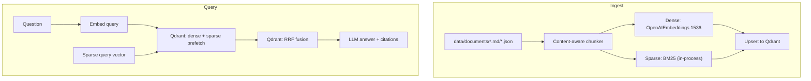

# rag-hybrid-qdrant

`pnpm dev:rag-hybrid-qdrant` — Express + Qdrant hybrid retrieval with **content-aware chunking**, dense vectors, sparse BM25, and native RRF fusion. Port 6300, Qdrant on 6333 (Docker).



## What this demonstrates

1. **Content-aware chunking** (`src/chunk.ts`) — the point of this project vs `rag-hybrid`. Markdown is split on its heading tree; every chunk keeps a breadcrumb (`Vector Databases > Sparse vectors > BM25`) both in its text and its payload metadata. JSON arrays become one chunk per row. This makes each chunk a self-contained unit of meaning rather than an arbitrary byte run.
2. **Hybrid retrieval in one store** — Qdrant natively holds both a dense and a sparse vector per point and fuses them with Reciprocal Rank Fusion via the Universal Query API. There is **no** hand-rolled `fusion.ts`/`bm25 RRF` here (unlike `rag-hybrid`); the store ships it.
3. **Sparse = real BM25** — computed at ingest over every chunk (IDF + TF saturation + length normalization), stored under the `sparse` named vector.
4. **Observability** — `/query?mode=hybrid` returns per-channel top-k so you can see dense vs sparse scores before RRF.

## How to run

```sh
cd ts/rag-hybrid-qdrant
docker compose up -d     # Qdrant :6333
# add OPENAI_API_KEY to .env
pnpm dev:rag-hybrid-qdrant   # from ts/ root, or: npx tsx src/server.ts
curl -s -X POST localhost:6300/ingest
```

**Qdrant Web UI** — browse collections, points, and payloads at <http://localhost:6333/dashboard> (the REST API is on :6333, the dashboard is served from the same port).

## The four retrieval modes in one example

Given the query *"How does BM25 weight terms…?"*:

| Mode | Result | Score source | Why |
|---|---|---|---|
| `dense` | semantic neighbors | cosine similarity | paraphrases, synonyms |
| `sparse` | exact keyword hits | BM25 | identifiers, technical terms |
| `hybrid` | RRF-fused | rank positions | best of both |

| Concept | Project |
|---|---|
| Content-aware chunking | `rag-hybrid-qdrant` |
| Hybrid dense + BM25 + RRF (Chroma) | `rag-hybrid` |
| GraphRAG | `rag-graph` |
| Redis/RediSearch vector | `rag-redis` |

## Concept → code map

| Concept | File |
|---|---|
| Content-aware markdown/JSON chunker | `src/chunk.ts` |
| BM25 sparse vectors | `src/sparse.ts` |
| OpenAI dense embeddings | `src/embed.ts` |
| Qdrant collection, upsert, fused query | `src/store.ts` |
| Express routes | `src/server.ts` |

## Extending

New document formats (PDF, DOCX, HTML) slot into `chunkDocument()` in `src/chunk.ts` without touching the store or routes — that's the pluggable seam. Content-aware **metadata** (e.g. section numbers, author, dates) can go into `metadata` at ingest and be filtered by Qdrant payload filters later.

Further reading: [document-processing.md](../../docs/document-processing.md) §2 (chunking), [vector-search.md](../../docs/vector-search.md) §6 (hybrid), [rag-hybrid/CONCEPTS.md](../rag-hybrid/CONCEPTS.md) (Chroma equivalent).
