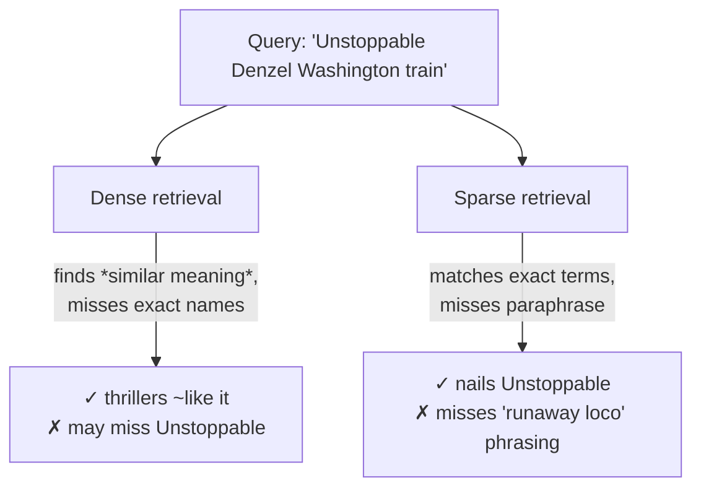
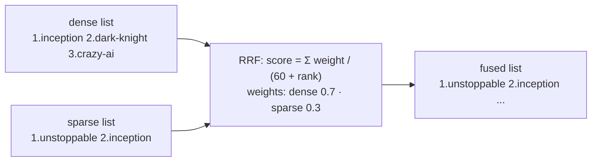
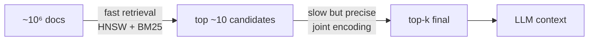

# rag-hybrid — Concepts

The concepts behind hybrid retrieval, with diagrams. Read this to understand *why* one search channel is never enough, *how* dense + sparse fusion works, and *what reranking adds*.

> Diagrams are [Mermaid](https://mermaid.js.org/) — rendered automatically on GitHub.
> Deeper theory: [`docs/vector-search.md`](../../docs/vector-search.md) at the repo root. Sibling guides: [`../chromadb/CONCEPTS.md`](../chromadb/CONCEPTS.md), [`../rag-graph/CONCEPTS.md`](../rag-graph/CONCEPTS.md).

---

## 1. The problem: every retriever has a blind spot

| Query type | Dense | Sparse (BM25) |
|---|---|---|
| "a movie about dreams within dreams" | ✓ (Inception) | ✗ no word overlap |
| "Unstoppable Denzel Washington train" | partial | ✓ exact hit |
| "Denzel Washington action thriller" | ✓ | ✓ |

**Hybrid retrieval** runs both channels and merges their rankings, so each rescues the other's blind spot.

---

## 2. The two channels in this project

### Dense — Chroma HNSW

Documents are embedded with `text-embedding-3-small` (1536 dims) at ingest; queries are embedded the same way; Chroma's HNSW index returns nearest neighbours by cosine distance. Finds *meaning* similarity ("dreams within dreams" → Inception).

### Sparse — hand-rolled BM25

BM25 scores documents by **exact term overlap**, weighted by:

- **TF** — how often a query term appears in the doc (saturating: `tf·(k1+1)/(tf+k1·lenNorm)`)
- **IDF** — how rare the term is across the corpus (`ln(1+(N−df+0.5)/(df+0.5))`) — rare terms like "Bale" count more than "movie"
- **Length normalization** (`b=0.75`) — long docs don't win just for being long

`src/bm25.ts` precomputes a sparse weight vector per document at startup; a query scores each doc via dot product of matched term weights. No stemming — "animated" ≠ "Animation" — which is exactly why §1's third row needs both channels.

---

## 3. Fusion: Reciprocal Rank Fusion

RRF merges ranked lists using only **positions**, not raw scores — so incomparable metrics (cosine distance vs BM25 score) never need normalizing:

A doc appearing high in **both** lists accumulates from both — that's why stable all-rounders surface after fusion while single-channel flukes sink. `k=60` dampens rank-1 dominance; weights tilt the blend toward semantic (0.7) over lexical (0.3).

---

## 4. Reranking: the cross-encoder second stage

Fusion ranks candidates using **independent** encodings (query embedded separately from doc). A **cross-encoder** instead feeds `query ⊕ document` through one transformer that attends across both — far more accurate, but too slow to run over a whole corpus. Hence the classic two-stage pattern:

This project runs `ms-marco-MiniLM-L-6-v2` (22M params) locally via transformers.js as ONNX (q8). Raw logits span roughly −11…+10 and are sigmoid-normalized into 0–1 relevance. Watch it *overrule* the first stage: filler that fusion let through gets scored ≈0.00 while the true match hits ≈0.99.

Two practical notes:

- The model still rewards **lexical overlap** — paraphrase-only matches score lower than you'd intuitively expect.
- transformers.js v4 API: pairs go in tokenizer options — `tok(queries, { text_pair: docs })`.

---

## 5. Two execution paths: local Docker vs Chroma Cloud

Chroma's announcement of sparse vectors / `Search()` / server-side `Rrf` describes **Chroma Cloud** capabilities. Self-hosted single-node (1.5.9) rejects sparse indexes: *"Sparse vector indexing is not enabled in local"* ([chroma-core/chroma#6185](https://github.com/chroma-core/chroma/issues/6185)) — local support needs a storage refactor and is "planned".

This project is **dual-provider** — same API, auto-detected by env vars:

| Stage | Local Docker (default) | Chroma Cloud |
|---|---|---|
| Sparse index | `Bm25Index` in-process | inverted index over per-record vectors under `bm25_vector` key |
| Query embedding | dot products in `bm25.ts` | `Knn({ query: sparseVector })` server-side |
| Fusion | `rrfFuse()` in Node | native `Rrf({ ranks, weights })` in the query |

The BM25 **math is shared** — one `Bm25Index` instance serves both modes: locally it *is* the search engine; on cloud it produces the sparse vectors stored at ingest and embeds queries into that space. Only where matching and fusion execute differs.

Cloud-mode lessons encoded in the code (each cost a debugging round-trip):

- Collection-level config and `schema` are mutually exclusive → embedding function lives inside `VectorIndexConfig`.
- Sparse vector indices must be sorted ascending or upsert validation rejects the record.
- Search API scores come back distance-like (lower = better) → negated to preserve the higher-is-better contract.
- A collection handle from `createCollection()` returns rows without documents on cloud → always re-fetch via `getOrCreateCollection()` after creating.

---

## 6. Concept → code map

| Concept | Where |
|---|---|
| Dense retrieval (HNSW cosine) | `searchDense()` in `retrieval.ts` |
| BM25 scoring (TF·IDF·length-norm) | `Bm25Index` in `bm25.ts`, tokenizer in `tokenize.ts` |
| RRF fusion with weights | `rrfFuse()` in `fusion.ts` |
| Cross-encoder reranking | `rerank()` in `rerank.ts` |
| Two-stage retrieve→rerank pipeline | `/query` handler in `server.ts` |
| RAG answer with cited sources | `/chat` handler in `server.ts` |
| Idempotent ingestion (deterministic ids) | `/ingest` handler + `movieId()` in `store.ts` |
