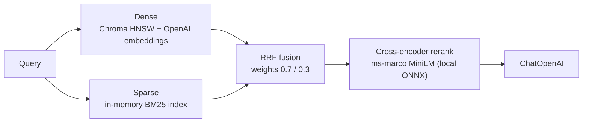

# rag-hybrid

Express + ChromaDB hybrid retrieval: dense vectors + sparse BM25 + RRF fusion + cross-encoder reranking.

## Architecture



| Stage | Engine | Where it runs |
|---|---|---|
| Dense retrieval | Chroma HNSW (cosine), `text-embedding-3-small` | Chroma server (`:8100`) |
| Sparse retrieval | Hand-rolled BM25 (k1=1.2, b=0.75) | In-process, over `data/movies.json` |
| Fusion | Reciprocal Rank Fusion | In-process (`src/fusion.ts`) |
| Reranking | `Xenova/ms-marco-MiniLM-L-6-v2` cross-encoder | Local ONNX via transformers.js |

> **Why is BM25 client-side?** Chroma's sparse vector indexes and server-side `Search()`/`Rrf` API are **Chroma Cloud only** — self-hosted 1.5.9 rejects them with "Sparse vector indexing is not enabled in local" ([issue #6185](https://github.com/chroma-core/chroma/issues/6185)). This project implements the same pipeline app-side instead.

## Dual provider: local Docker or Chroma Cloud

The same API runs against either backend — pick with env vars (see `.env_example`):

| Provider | Trigger | Sparse channel | Fusion |
|---|---|---|---|
| **Local** (default) | no cloud vars set | hand-rolled BM25, dot products in Node | app-side RRF (`fusion.ts`) |
| **Cloud** | `CHROMA_API_KEY` + `CHROMA_TENANT` + `CHROMA_DATABASE` set | native inverted index; BM25 vectors stored per-record under a schema-declared key | server-side `Search(Rrf(Knn(dense), Knn(sparse)))` |

In both modes the BM25 math is identical (`src/bm25.ts`) — only where matching and fusion execute differs. `/health` reports which provider is active.

Cloud-mode gotchas baked into the code:

- Collection config and `schema` are mutually exclusive — the embedding function must live inside `VectorIndexConfig`.
- Sparse vector indices must be **sorted ascending** or upsert validation fails.
- The Search API scores are distance-like (lower = better); they're negated to keep the higher-is-better contract.
- Use a freshly re-fetched collection handle after create — `createCollection()`-returned instances return rows without documents.

## Run

```sh
# From workspace root
pnpm dev:rag-hybrid          # Express on :6200 (tsx watch)

# One-time: start Chroma on :8100
cd ts/rag-hybrid && docker compose up -d
```

`.env` needs `OPENAI_API_KEY` (see `.env_example`). The reranker model downloads (~90MB) on first rerank/chat call and caches in `.cache/`.

## API

| Method | Endpoint | Description |
|---|---|---|
| `GET` | `/health` | Chroma status, doc count, BM25 index size, reranker load state |
| `POST` | `/ingest` | Recreate collection + upsert movies (idempotent, deterministic ids) |
| `POST` | `/query` | `{ query, mode?: "dense"\|"sparse"\|"hybrid", k?, rerank?, topN? }` |
| `POST` | `/chat` | `{ query, k? }` — hybrid retrieve → fuse → rerank → GPT answer with sources |

`/query` responses include per-channel breakdowns (`channels.dense` / `channels.sparse`) for hybrid mode, and when reranking: `rerankScore` per result plus `orderBefore` / `orderAfter` id lists.

## Testing

Use `test.rest` (VS Code REST Client). Suggested comparison queries:

- Paraphrase ("dreams within dreams") → dense wins
- Exact names ("Unstoppable Denzel Washington train") → sparse wins
- Both signals ("Denzel Washington action thriller") → fusion merges channels
